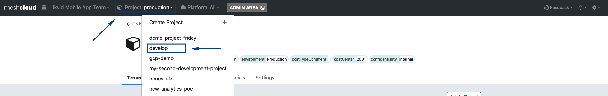
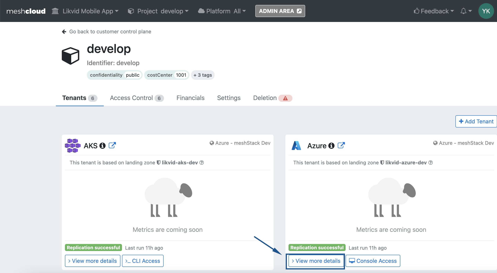
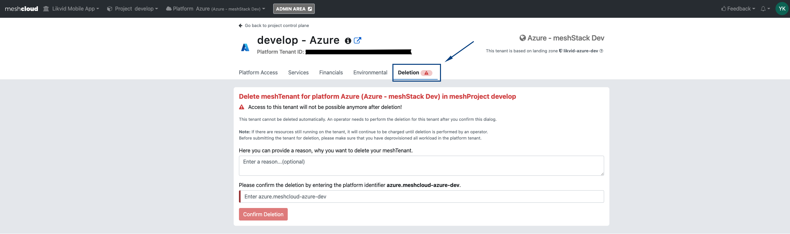
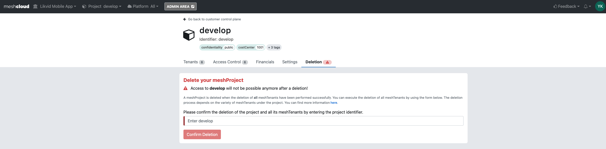
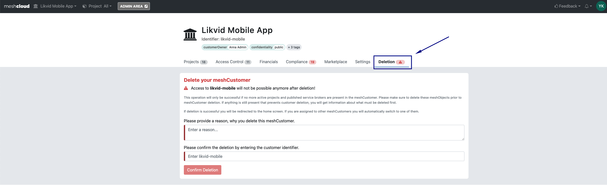
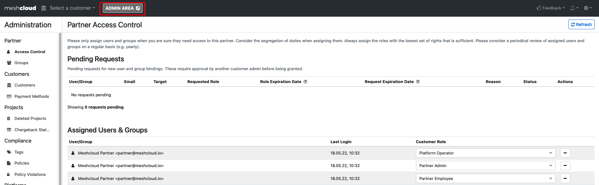
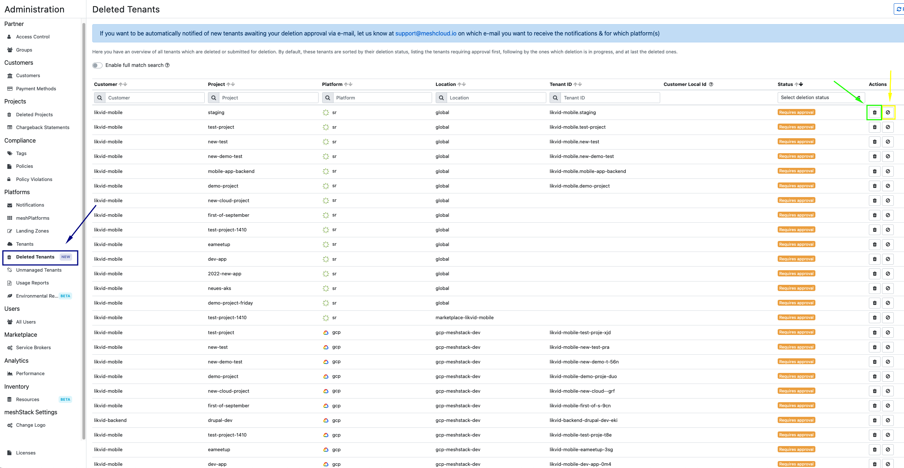

Part of the cloud lifecyle inside meshStack is the deletion of meshCustomers, meshProject and meshTenants.
The following guide provides insight for users and admins how to proceed the deletion of their cloud accounts and meshObjects via the meshPanel

## Step-by-Step Guide

## Delete meshTenant from my meshProject

If you want to delete just a meshTenant e.g. AWS Account without deleting your complete meshProject you can use the meshTenant deletion.

The following step-by-step guide shows how to successfully request the deletion of an meshTenant:

1. Go to your meshCustomer where the meshProject is located in the meshPanel 
2. Go to your meshProject in which you want to delete the meshTenant 
3. Click on "View more details" for the meshTenant you want to delete 
4. Click on the "Deletion" tab and follow the deletion instusction for the meshTenant 

## Delete meshProjects

The deletion of an meshProjects is quite similar to the meshTenant deletion.
The following step-by-step guide shows how to successfully request a meshProject deletion:

1. Go to your meshCustomer where the meshProject is located in the meshPanel 
2. Go to your meshProject in which you want to delete the meshTenant 
3. Click on the "Deletion" tab and follow the deletion instusction for the meshProject 

## Delete meshCustomer

Your user needs the "Customer Owner" role to proceed with the deletion of the meshCustomer.

1. Go to your meshCustomer where the meshProject is located in the meshPanel 
2. Click on the "Deletion" tab and follow the deletion instusction for the meshCustomer 

## Admin action

The meshTenant deletion requires follow up action from Cloud Foundation administrators (Partner Admins or similar).
Cloud Foundation or Cloud Platform administrators can either confirm or decline the deletion after checking the meshTenant.

> Please reach out to us if you are interessted in deletion request notifications. Deletion request notifications will inform you via Email or Slack if a new deletion request arrives.

### Confirm or delcine a meshTenant deletion

1. Go to the Admin Area 
2. Navigate to Platforms -> Deleted Tenants 
2.1. Click on the bin icon (green) to confirm the meshTenant deletion. The meshTenant will than be deleted from meshStack. 

2.2. Click on the stop icon (yellow) to decline the meshTenant deletion. The meshTenant will re-appear in the meshCustomers meshProject.
