## Introduction

Building Blocks are a feature in meshStack that enables end users to automate resource provisioning through self-service. It also assists cloud engineers in creating pre-configured cloud resources by enforcing the use of Building Blocks assigned to Landing Zones. This document provides a step-by-step guide for users on the efficient setup of meshStack Building Blocks.

## Terminology

The Building Block *definition* is the template/blueprint of Building Blocks. It describes what piece of e.g. Terraform or other infrastructure has to be rolled out.

A Building Block is an *instance* of a Building Block Definition.

In the marketplace, users can find *building block definitions,* and based on these, they can add them as a *building block* to their tenants.

## Overview

The diagram below illustrates the key components addressed in this document:

- A Provider oversees the management of Building Block definitions that are made available to users through the Marketplace.
- A User adds Building Blocks to existing or new projects.
- The meshStack front end offers a user interface for both Providers and Users, enabling Providers to create and maintain Building Block definitions, and Users to add these Building Blocks to their projects.
- The terraform runner executes the code defined in the Building Block, thereby provisioning platform resources.
- A GIT repository contains the terraform code, which is maintained by the provider and utilized in the Building Block definition. This code specifies the resources that need to be provisioned on the platform.
- A Platform represents a target private or public cloud environment to provision resources described in the terraform code.

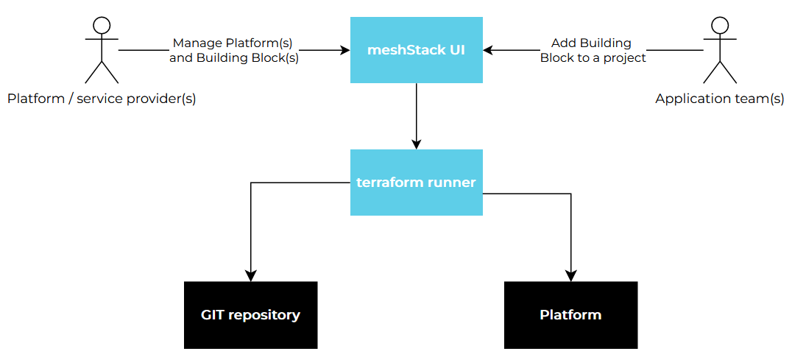

## Setup

To create a new Building Block definition, from Admin Area navigate to “Marketplace > Building Block definitions” and then select “Create new Definition”. The configuration process is divided into multiple steps as outlined below.

Alternatively, you can switch to “Service Management” UI and navigate to “Building Blocks > Definitions” and then select “Create new Definition”.

### General

In the initial user interface for Building Block definition, the user is required to assign a **Definition name** to the Building Block, which will be displayed in the Marketplace. The **Description** field offers more detailed information about the Building Block, assisting users in comprehending its purpose and advantages.

In certain cases, newly created Tenants may require the automatic execution of a configuration routine, like setting up a VPN connection to an on-premises network. For these situations, a Building Block assigned to a Landing Zone can be utilized. This Building Block will execute each time a tenant is established in the Landing Zone, carrying out the required updates. To enable use of Building Block in a Landing Zone, toggle the switch “**Use in Landing Zone only**”. Subsequently, the Building Block will not be available in the Marketplace.

**Notification User** field lets you define mail addresses to send a notification in case of failed Building Block execution or whenever a Building Block requires platform operator input.

The **Support** and **Documentation** fields are designed to direct Building Block users to supplementary documentation, providing them with additional information and support.

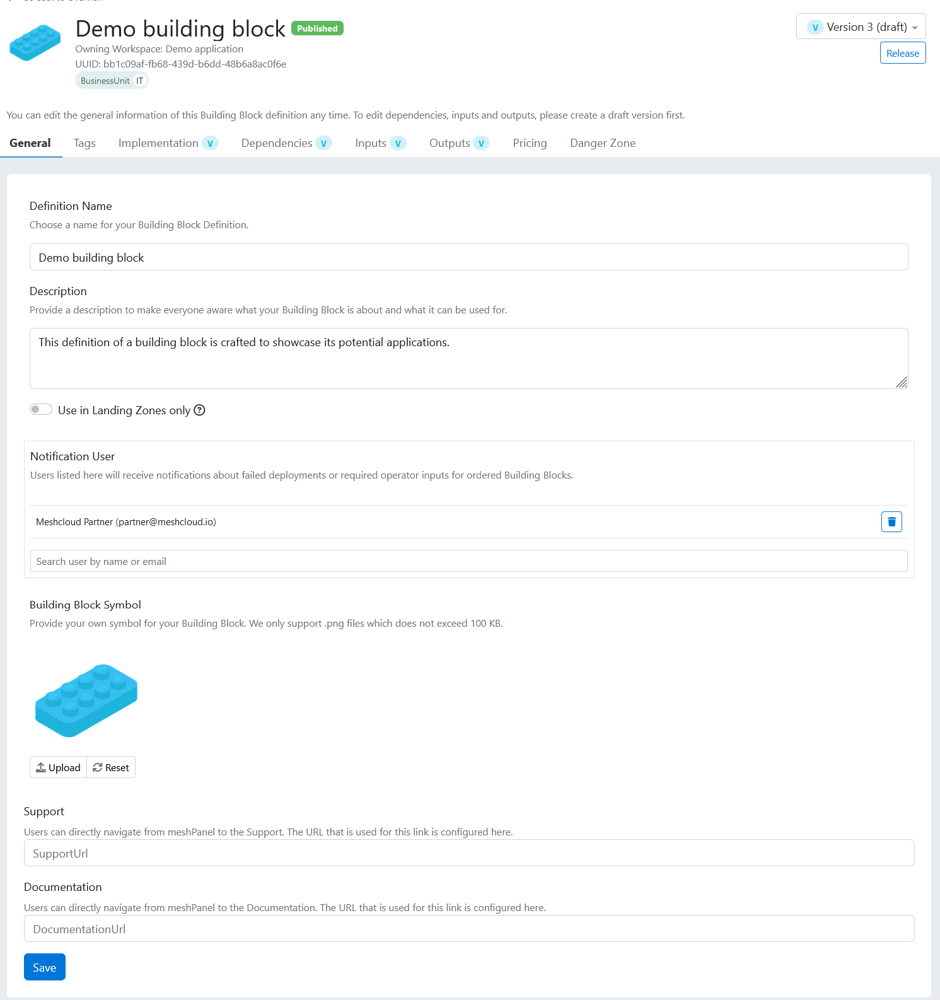

### Tags

Like other meshStack objects, tags could be assigned to Building Block definitions. These tags can be used to establish compliance rules, for example, allowing only users from specific Workspaces to execute the Building Block. Matching values for Building Block and Workspace tags facilitate such scenarios.

### Implementation

#### Supported platforms

A Building Block is created to operate on one or several Platforms. This selection allows users to determine which Platforms qualify for the Building Block. Only projects with tenants on the corresponding platform will qualify for Building Block assignment.

#### Assignment

How often can the same Building Block be allocated to a particular project? Choose "One" for a single assignment, or "Multiple" for more than one.

#### Terraform vs manual

The building block definition has two implementation types: Terraform and manual. Using Terraform, the building block can automatically provision the infrastructure resources. This gives engineers and DevOps the ability to use the full power of IaC (Infrastructure as Code) to create self-service products available in the Marketplace.

Manual implementation is beneficial when the Building Block provider wants to gather end-user information (through inputs) and process it outside of meshStack.

#### Git repository authentication

When the implementation type is configured as Terraform, meshStack offers two methods for retrieving your code from a remote Git repository of your choice:

- HTTPS
- SSH using deploy keys

If you opt for SSH, please use the command below to create an SSH deploy key. Please do not set a password for the private key and replace `your_email@example.com` with appropriate value.

```bash
ssh-keygen -t ed25519 -C "your_email@example.com"
```

After generating the SSH key, upload the private key to meshStack using the "Upload" feature. Then, consult your repository's documentation for instructions on setting up SSH deployment keys.

Finally, if you are using a private Git repository, you should import the public portion of the SSH host keys into meshStack. To gather the public SSH host keys, run the command below, replacing 'GIT_HOST' with the hostname or IP address of your private repository.

```bash
ssh-keyscan GIT_HOST
```

Paste the command output into the text fields below.

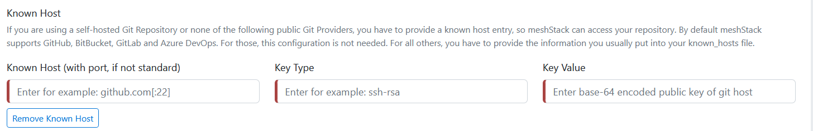

### Dependencies

Optionally, a user can specify relationships between the Building Blocks, making sure that Building Blocks designated as “prerequisites” are assigned to the Tenant prior to assignment of the current Building Block. By chaining the Building Blocks it is possible to use Building Block outputs as inputs for the dependent Building Block.

### Input

A Building Block input is used to supply configuration parameters to Terraform code. Each input has following settings:

- The input N**ame** must correspond to the Terraform variables.
- While the **Display Name** field is optional, it enables the provision of a user-friendly name for the Building Block requester, distinguishing it from Terraform's naming conventions.
- **Source** defines how the input is provided to the terraform: by the requester, platform operator, static value or generated by meshStack
- **Type** specifies the input format: String, Number, Boolean or Single select
- **Default value** provides a predefined value for the given input
- **Regular expression** and **Message on Regular expression failure** are utilized to define the data format of the input and guarantee the quality of the information provided.
- **Provide as** feature enables users to specify the method of input delivery to the Terraform code, either as an environment variable or as a regular variable (typically defined in the `variables.tf` file)
- Finally, users can choose to encrypt the input's value by toggling the corresponding switch on, which is particularly useful when supplying credentials to Terraform.

#### Credentials management

In most cases, Terraform code requires credentials to provision the infrastructure. Consider an example of a Terraform building block for AWS. The AWS provider typically looks as follows, assuming credentials are provided by an AWS profile named `demo-profile` stored on the same device where Terraform operates:

```json
provider "aws" {
 profile    = "demo-profile"
}
```

However this code cannot run on the meshStack Terraform runner for clear reasons. The runner starts from a fresh environment and does not have any preconfigured AWS profiles.

More optimal solution would be to rely on environment variables `AWS_ACCESS_KEY_ID` and `AWS_SECRET_ACCESS_KEY`. In that case the Terraform configuration for AWS provider could look like:

```json
 provider "aws" {}
```

These variables must be passed by meshStack to the Terraform runner as input variables created in the Building Block definition as following:

- **Source**: Static (in case you would like to use the same credentials to run the building block)
- **Input type**: String
- **Provided as**: Environment
- **Encryption**: enabled

The screenshots below provide examples of Building Block Input configurations.

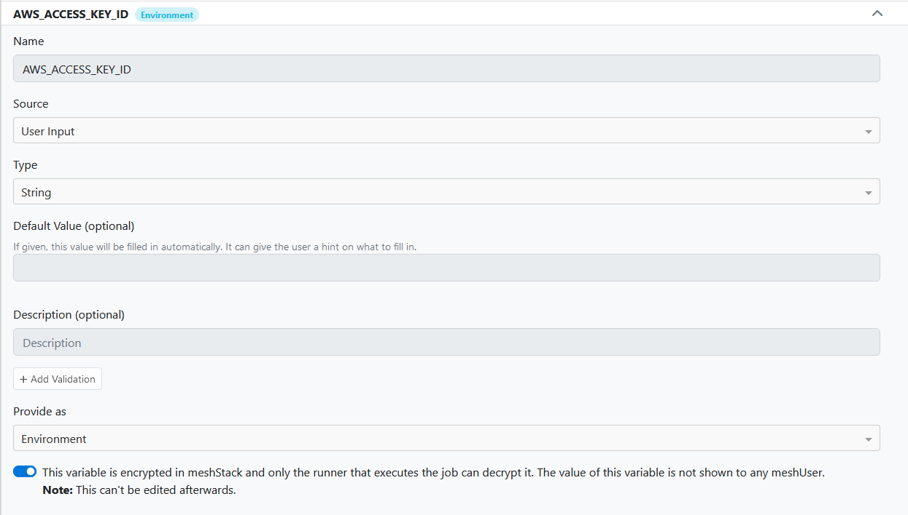

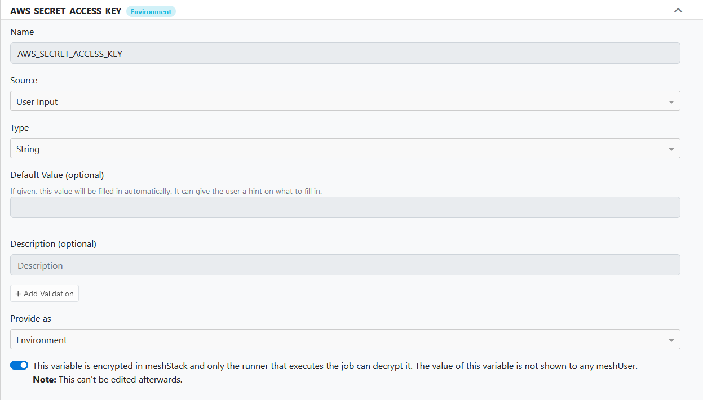

This concept is not only limited to AWS, but applies to many Terraform providers that can use environment variables as credentials. Another example is the Datadog provider, which is configured similarly. The credentials are passed to the Terraform runner as Building Block Input environment variables, `DD_API_KEY` and `DD_APP_KEY`. Please refer to [https://registry.terraform.io/providers/DataDog/datadog/latest/docs](https://registry.terraform.io/providers/DataDog/datadog/latest/docs) for more details.

For implementing Terraform, meshStack will provide pre configured inputs for setting up credentials, depending on the platform you've chosen for the Building block. For instance, if your building block runs on the AWS platform, select "Generate AWS auth inputs" from the "Generate Input" menu, as shown.

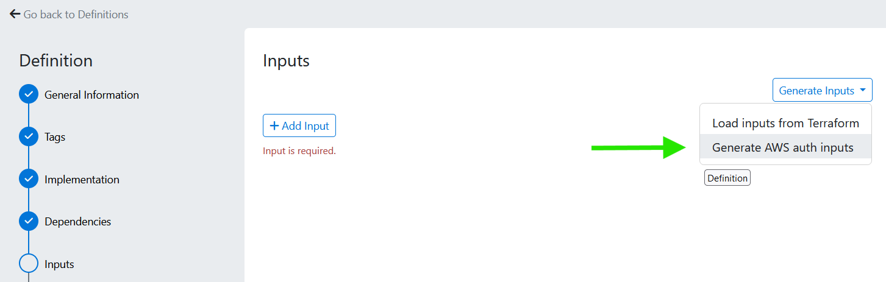

It will automatically generate two inputs corresponding to the AWS credentials. You only need to assign the appropriate static values to these inputs or allow the end user to supply them at runtime as “User input”. Similar applies to GCP and Azure.

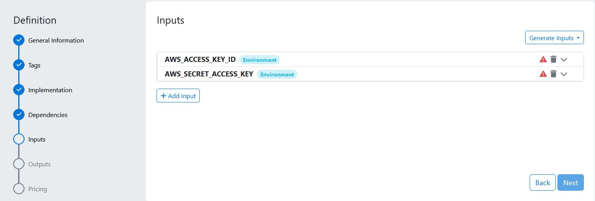

#### User permissions

User permissions is a special type of input. It provides to the Terraform runner the list of all users assigned to the project including their mail address, first/last name and respective roles. The permissions are passed as JSON list as shown on the example below:

```json
[
  {
    "meshIdentifier": "bebeb91e-3bf8-11ec-8fcd-0242ac110002",
    "username": "one-user@mydomain.lo",
    "firstName": "One",
    "lastName": "User",
    "email": "user@mydomain.lo",
    "euid": "user@mydomain.lo",
    "roles": [
      "admin"
    ]
  },
  {
    "meshIdentifier": "fe4d0c65-955c-4dc9-a780-f1fdd5f93e25",
    "username": "second-user@mydomain.lo",
    "firstName": "Second",
    "lastName": "User",
    "email": "second-user@mydomain.lo",
    "euid": "second-user@mydomain.lo",
    "roles": [
      "reader"
    ]
  }
]
```

To handle such list in your Terraform code, define the following variable, usually in `variables.tf` file:

```json
variable "users" {
  type = list(object(
    {
      meshIdentifier = string
      username       = string
      firstName      = string
      lastName       = string
      email          = string
      euid           = string
      roles          = list(string)
    }
  ))
  description = "Users and their roles provided by meshStack"
}
```

Finally, to process this variable use the Terraform code below in `main.tf` file. It defines three lists corresponding to each default project role:

```json
locals {
  admins  = { for user in var.users : user.username => user if contains(user["roles"], "admin") }
  editors = { for user in var.users : user.username => user if contains(user["roles"], "user") }
  readers = { for user in var.users : user.username => user if contains(user["roles"], "reader") }
}
```

The following example demonstrates how to create a list of user identities with only admin roles. This list can subsequently be utilized to grant permissions on resources provisioned through Terraform:

```json
data "project_users" "admins" {
  for_each = local.admins
  email    = each.value.username
}
```

### Output

Generally, any output generated by Terraform code can be accessed by meshStack if required. A common example might be when Terraform creates a resource on a custom platform, which is considered a tenant for meshStack. In such a case, meshStack would need to know the tenant's ID. This can be done by creating a new output with the name that match Terraform output variable and having the following characteristics:

- **Type**: String
- **Assignment Type**: Platform Tenant ID

The example below demonstrates an output variable `tenant_id`. It will be initialized to the Terraform output of the same name following successful execution.

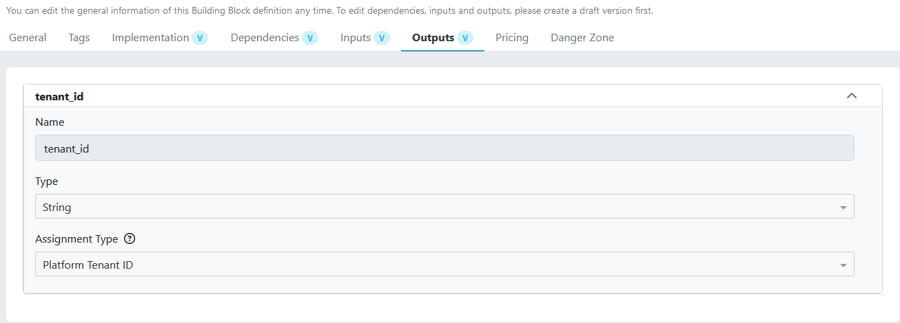

### Pricing

Recurring fees, which can be set on a monthly or daily basis, are an option. These fees will be charged to each project that has a Building Block assignment.

### Publish Building Block definition

Once you select "Create definition," the building block is recorded as a draft and is not yet eligible for the Marketplace.

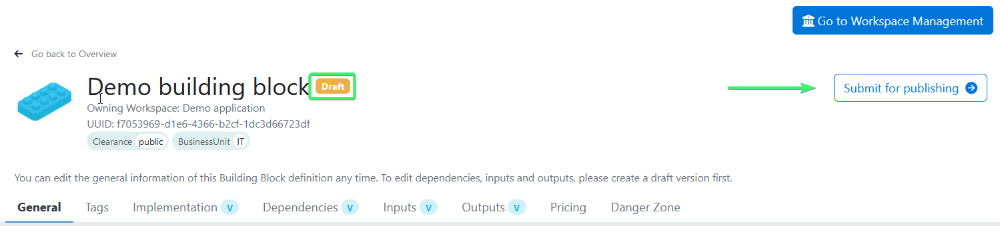

To alter this status, meshStack users with the Admin role must review the new definition. You should click "Submit for publishing" and then confirm with "Yes, submit for review" in the subsequent pop-up window.

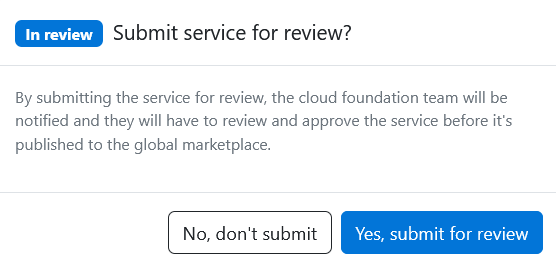

The status of the definition will be set to “in review”. Once approved, the status will change to “Published”.

## Building Block instances

meshStack enables Administrators and Platform owners to identify the tenants to which a Building Block has been added, that includes the versions used and the status of the Building Block, such as whether the run was successful or failed.

To view this, from the Admin View, go to “Marketplace > Building Blocks” and enter the name of the Building Block in the search field. The list of added Building Blocks will be displayed as illustrated in the screenshot below.

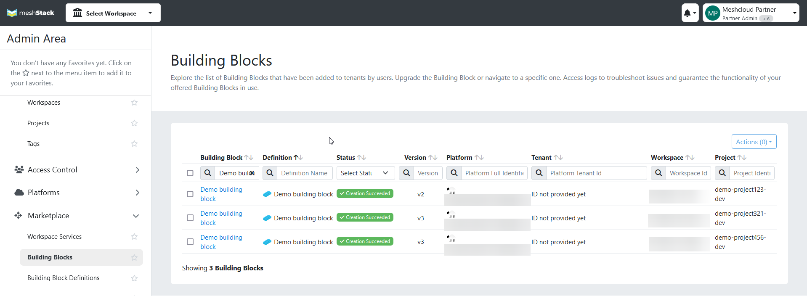

## Change management

To apply changes to an existing Building Block, navigate to the Building Block definitions and select the required Building Block. Select "Create draft" to generate a new version of the building block. Afterward, the Building Block definition will switch to edit mode, allowing you to apply the necessary changes.

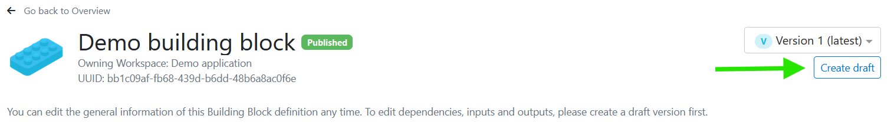

After applying the changes, select "Release" to publish a new version of the building block. This latest version will now be the default for users selecting this building block from the Marketplace. Users who have previously selected that building block continue to rely on the prior version.

The current instances of Building Blocks are not impacted by updates to the Building Block definition; thus, the provisioned resources stay unchanged. If necessary, you can force an upgrade of the instances. To do this, navigate to the Admin Area, then go to "Marketplace > Building Blocks". From the list of Building Blocks, check the box next to the ones you want to upgrade. Then, select “Upgrade,” as shown in the image below. This action will upgrade the selected Building Block definitions and **force a new run**, ensuring that end-users are using the latest version.

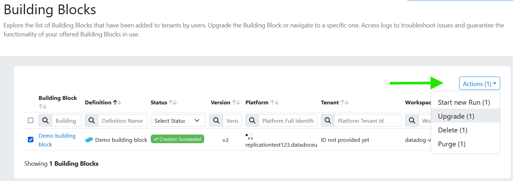

The diagram illustrates the lifecycle of a Building Block definition. It indicates that only the initial version (V 1) necessitates approval before the definition can be published.

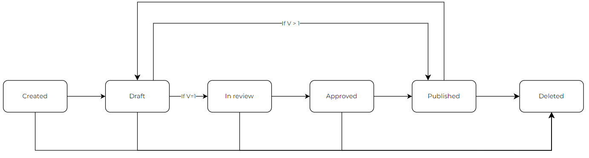

## Execution logs

Building Blocks with "Terraform" as the implementation type produce logs when they are added to a project by an end-user. These logs provide details on the resources provisioned or any errors if the execution is unsuccessful. Both Admins and owners of the Building Block definitions can access these logs. As an Admin, you can view them by going to the Admin Area, proceeding to "Marketplace > Building Block overview," and choosing the desired Building Block from the list of executed instances. On the next screen, you will find one or more "Runs," depending on the number of times the user has executed this specific Building Block. By selecting a Run, you can inspect the associated Terraform logs.

The owner of the Building Block definition can access the logs by switching to “Service Management” view and navigating to "Building Blocks > Overview".

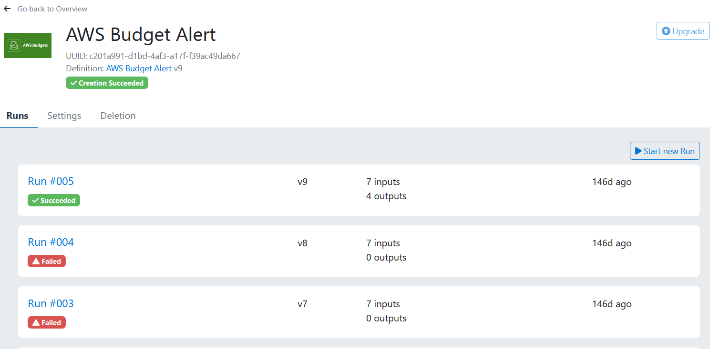
