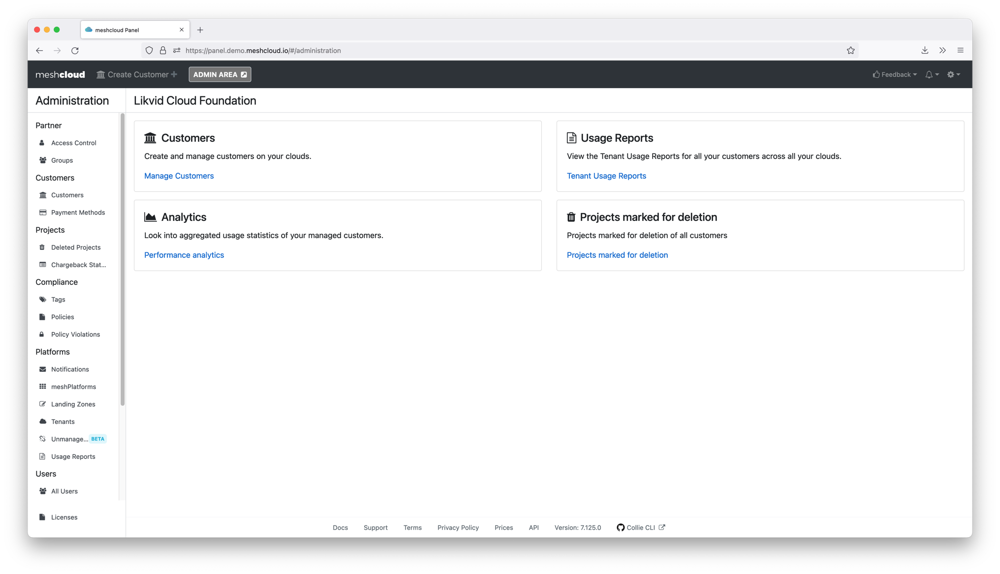
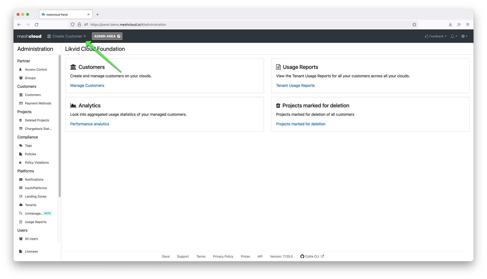

This how-to guide is targeted at Cloud Foundation Partners that are starting out with a brand new meshStack. It is intended to be the first resource you read. You need to be able to log into your meshStack to follow this guide.

## Step 1: Log into your meshStack

As a cloud foundation team member you are directly on the admin area view of meshStack. This is the cockpit that helps you stay in control of everything happening in meshStack.

This it what it looks like.

To return to this view, you can always press the "Admin Area" button in the top bar.

If you do not see this screen, you are missing partner level rights. This can be fixed by any other partner level user.

## Step 2: Create your first meshCustomer

The customers of your Cloud Foundation are represented by meshStack as meshCustomers.

To experience what this feels like, create your first customer via the panel. To open the wizard, click on "customer +" as shown in the picture below.

Of course, this can also be achieved via API. Take a look [here](./meshstack.how-to.create-customer.html) for a short intro into the API.

## Step 3: Create your first meshPlatform

As a cloud foundation platform, meshStack allows you offer self-service tenant management, chargeback and much more to your customers.

To start managing a cloud platform with meshStack, follow [How to integrate a meshPlatform into meshStack](./meshstack.how-to.integrate-meshplatform.html).
