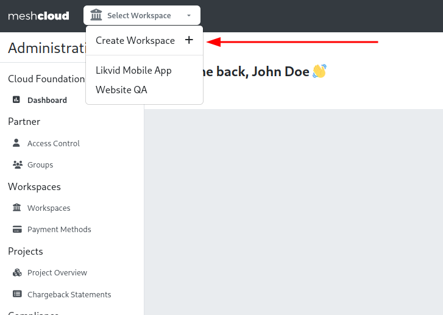

This guide accompanies you to get started setting up a Internal Developer Platform with meshStack.

> **Prerequisites:**
> 1. Your new meshStack is set up and the link to the meshPanel was provided to you.
> 2. You need to be able to log into your meshStack and have admin area access.

## Step 1: Access the Admin Area of Your meshStack

The Admin Area is the central place to setup, customize and operate your very own Internal Developer Platform via meshStack.
To return to this view at a later point in time, you can always press the "Admin Area" button in the top bar.

## Step 2: Create Your First Workspace

Workspaces provide you the opportunity to onboard and structure your use cases. Those workspaces can act as consumers and/or providers of services within the marketplace. The marketplace is 
the central place in meshStack to offer services that others consume. 

Now lets get started by creating the first workspace in your meshStack. To open the wizard, click on "Create Workspace +" as shown in the picture below.

## Step 3: Create your First Service 

The most central aspect of an Internal Developer Platform is offering services to other teams in your organization to jumpstart their projects, secure their application or extend their environments with additional resources.

In order to start the step by step guide for you first building block, access the created workspace and click on Platform Builder on the top right corner.
To offer your first service with meshStack, follow [AWS S3 Quickstart Guide](./meshstack.building-aws-quickstart-guide.md).
