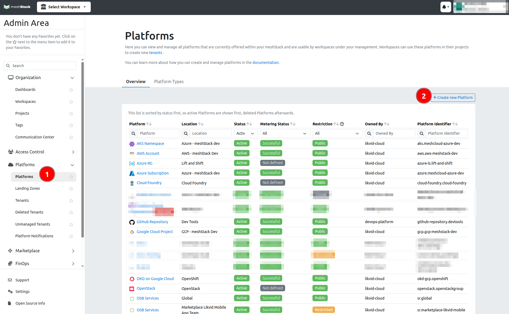

A meshPlatform describes a deployment of a cloud platform (e.g. GCP, AWS, Azure, Openstack, etc.). In order to leverage meshcloud's functionalities for a particular cloud platform, a meshPlatform needs to be integrated into meshStack. Below is a step-by-step guide to integrate your desired meshPlatform.

> For more details on the integrations please visit the integration page of the specific cloud platform in the [Operator Docs](meshstack.index.md).

## Step 1: Set up the meshPlatform in the panel

Open the admin area of the panel and navigate to meshPlatform view. Choose "Create a meshPlatform"

The required credentials for the platform configuration are created in the following step. 

## Step 2: Set up platform permissions using Infrastructure as Code (recommended)

> You do not have to be familiar with terraform to execute the integration. All commands are outlined in the module instructions.

Open the official meshcloud terraform module for the target platform and follow the instructions.

- [AWS meshPlatform Module](https://github.com/meshcloud/terraform-aws-meshplatform)
- [Azure meshPlatform Module](https://github.com/meshcloud/terraform-azure-meshplatform)
- [GCP meshPlatform Module](https://github.com/meshcloud/terraform-gcp-meshplatform)

### Alternative to Step 2: Set up platform permissions manually

Follow the instructions for the target public cloud platform.

- [How to manually integrate AWS as meshPlatform](meshstack.how-to.integrate-meshplatform-aws-manually.md)
- [How to manually integrate Azure as meshPlatform](meshstack.how-to.integrate-meshplatform-azure-manually.md)
- [How to manually integrate GCP as meshPlatform](meshstack.how-to.integrate-meshplatform-gcp-manually.md)

For private cloud platforms, you can find integration information here:

- [Integration of CloudFoundry](meshstack.cloudfoundry.index.md)
- [Integration of Kubernetes](meshstack.kubernetes.index.md)
- [Integration of OpenShift](meshstack.openshift.index.md)
- [Integration of meshMarketplace](meshstack.meshmarketplace.index.md)

## Step 3: Complete the meshPlatform configuration in the panel

Enter the credentials from Step 2 in the platform configuration.

## Step 4: Try out your new platform!

Try out the new meshPlatform by configuring a new Landing Zone in the admin area and using the Landing Zone to create a meshProject.
