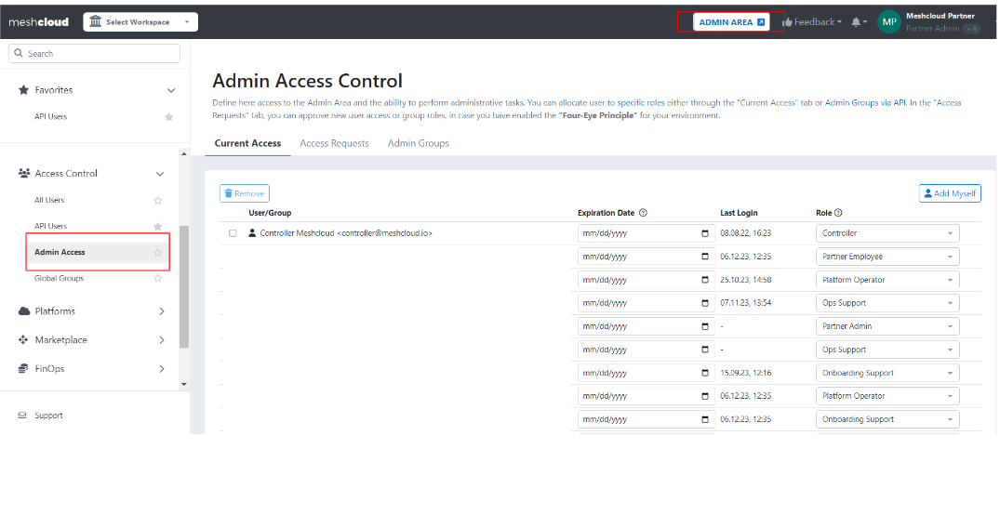

If you are not familiar with what an admin user is, please check the [official meshcloud documentation](administration.index).

## Pre-Requisites

- Permissions: Your user needs the organization admin role in the admin area to assign administrative users and roles administration

## Step to Step Guide

1. Login into the meshPanel and navigate to the Administration Area. Open the Admin Area by clicking on the `ADMIN AREA` button in the top navigation and go to the Admin Access page in the Access Control section where you can onboard further privileged users

2. At the end of the `Current Access` list will be a input field. Type in the first-, last-name or email address to find and select the user you want to ad and dadicated role form the list.
