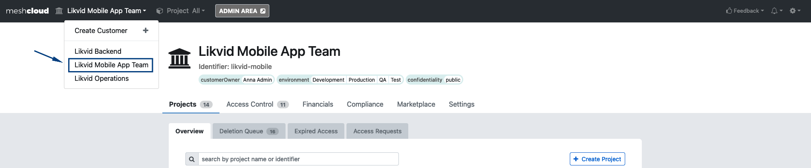

If you are not familiar with what a meshProject is, please check the [official meshcloud documentation](meshcloud.project).

## Pre-Requisites

- Users you want to add to an meshProject needs to be added to the meshWorkspace first. Check out the `Onboarding your team to your meshWorkspace` guide.
- Permissions: Your user needs either the Workspace Manager or Workspace Owner role in the meshWorkspace

## Step to Step Guide

- Make sure you are in the meshWorkspace you want to add further users. Do this by checking the drop-down in the upper-left corner.

- You need to navigate to the meshProject where you want to onboard your project team members.

- Select the meshProject using the top navigation bar

- Select the meshProject from the meshWorkspace overview

- Go to the access control panel by clicking on the `Project Access` tab
- At the end of the `Current Access` list will be an input field. Type in the first-, last-name or email address to find and select the user you want to add. Choose a Project Role and press the `+` button.

### Optional

meshStack enterprise supports 4-eyes access controls.
Please check the [official meshcloud documentation](meshcloud.project#access-control-on-a-meshproject).

- A second user with Workspace Manager or Workspace Owner permission needs to approve the access request. The second user must also navigate to the specific meshWorkspace (see step 1.), select the meshProject (see step 2.), go to the `Workspace Access` tab (see step 3.) and then click on the `Access Requests` tab in the second tab-row.

