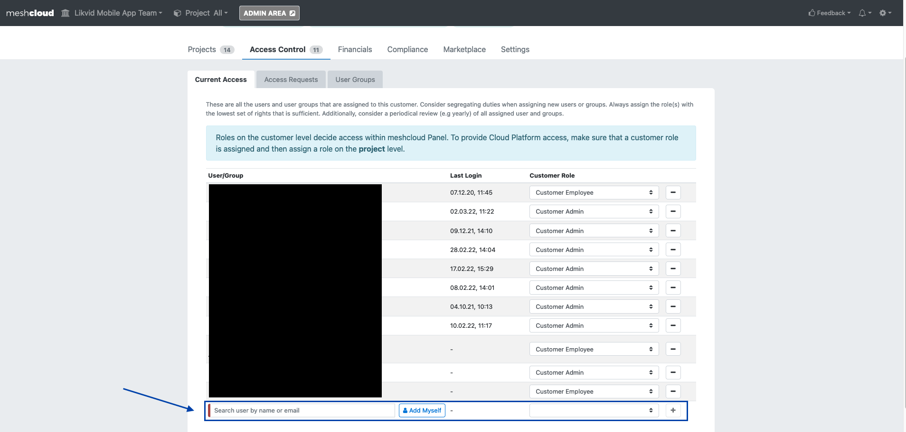

If you are not familiar with what a meshWorkspace is, please check the [official meshcloud documentation](meshcloud.workspace.md).

## Pre-Requisites

- Permissions: Your user needs either the Customer Admin or Customer Owner role in the meshWorkspace where you want to add further users

## Step to Step Guide

- Make sure you are in the meshWorkspace you want to add further users. Do this by checking the drop-down in the upper-left corner.

- Go to the access control panel by clicking on the `Access Control` tab

- At the end of the `Current Access` list will be an input field. Type in the first-, last-name or email address to find and select the user you want to add. Choose a Workspace Role (Customer Owner, Admin or Employee) and press the `+` button.

- Customer Owner can only be granted to max. 2 users per Worksace. Also, only a Customer Owner can grant another user the Owner role - except there is no Customer Owner at all.

### Optional

meshStack provides the optional configuration for 4-eyes access controls.
Please check the [official meshcloud documentation](meshcloud.workspace.md#invite-users-to-a-meshworkspace-team).

- A second user with Customer Admin or Customer Owner permission needs to approve the access request. The second user must also navigate to the specific meshWorkspace (see step 1.), go to the `Access Control` tab (see step 2.) and then click on the `Access Requests` tab in the second tab-row.

