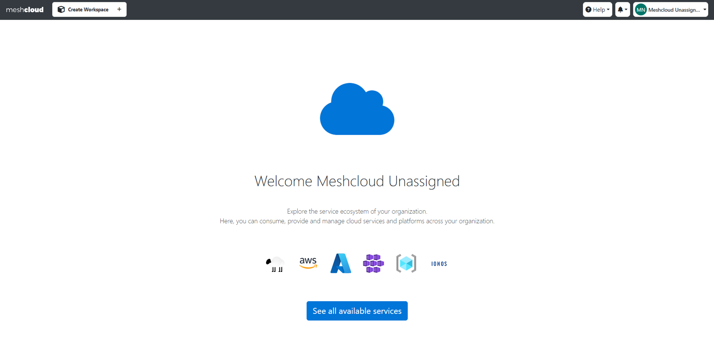
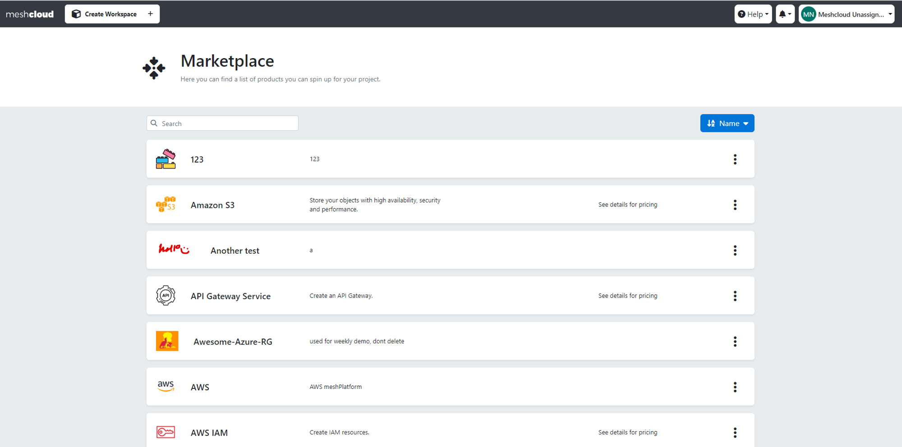
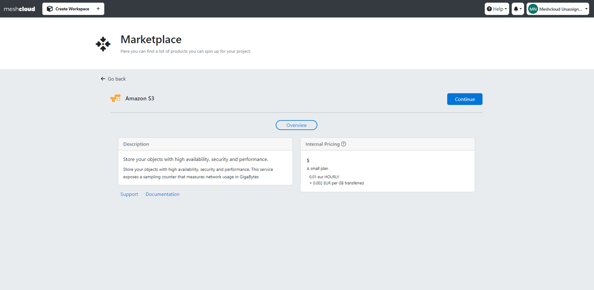
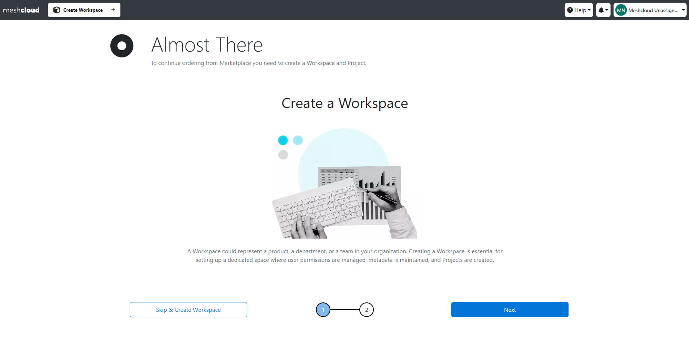
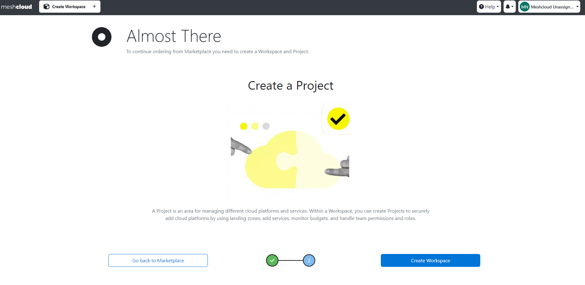
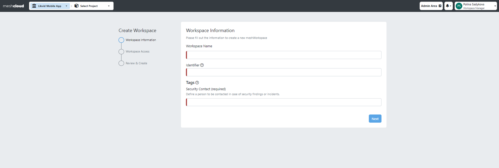
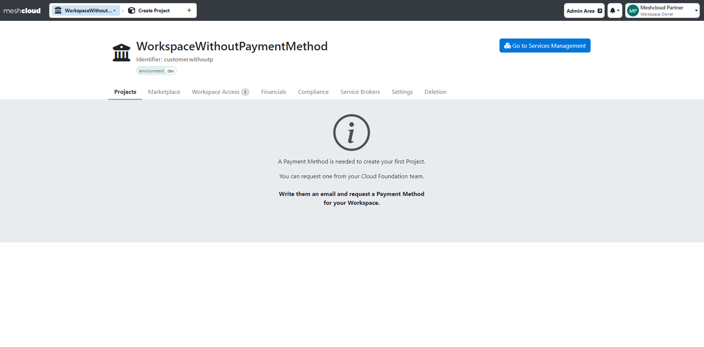
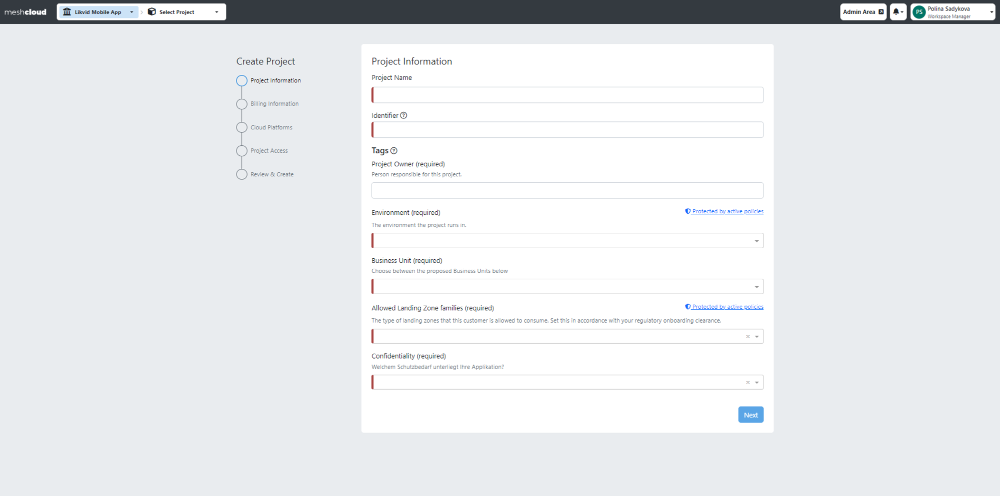

This guide is designed for application team members who are not yet assigned to any Workspaces and aim to independently create their first Workspace in meshStack. meshStack also has an in-product guide that includes navigation steps for users. Admins of meshStack can customize the Landing Page and experience this onboarding flow by Navigating to the Landing page tab of the Settings page.

> Please be aware that if the cloud foundation team handles the creation of Workspaces or if Workspaces have already been created through alternative means, this guide is not applicable in those scenarios.

**Pre-Requisites:**

- Valid credentials to log in to meshStack

**Step-by-Step Guide:**

**1. Log in to meshStack**

- Access the meshStack platform using your credentials.
- If you don't have any Workspaces yet, you'll be greeted with an introduction to meshStack, where you can click on "See All Available Services" to access the Service Catalog.

**2. Explore Available Services**

- The Service Catalog provides an overview of all **Platform Services** available within your company.
- Select a Platform Service you want to start with from the Service Catalog.
- Click on its details and then click "Continue" to proceed.
    
    
    
    
    

3. **Short Introduction to meshStack**

- After clicking "Continue," you'll receive a brief intro to meshStack, explaining what Workspaces and Projects are.
    
    
    
    
    
1. **Create Workspace**

yellow Please note that if you have an external service like ServiceNow or any other external solutions to create a Workspace, you'll be redirected directly there, and the next steps are not relevant to your case.

- Begin the process of creating a Workspace, by filling in all fields in the meshStack panel to create a Workspace. Amount of tags varies from organization to organization.

1. **Payment Method (if applicable)**
- If a valid payment method for your Workspace is not available, creating a Project is prevented. Please request one from your cloud foundation team following the instructions on the screen.
    
    
    
1. **Create a Project**
- Once the Workspace is set up, you can create a Project.
- The selected Platform Service from the beginning will be preselected, but you can add more or change the selection during Project creation.
 