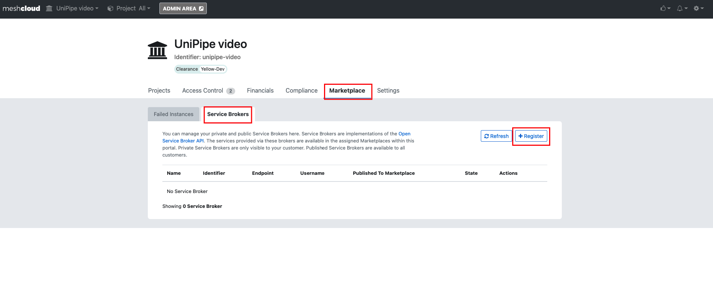
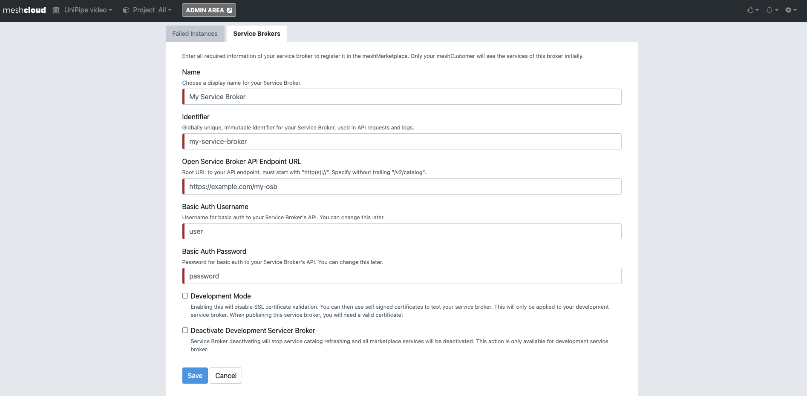

## Overview

The Marketplace Catalog enables you to provide all type of Platfrom Services including OSB Services

Offering your Services in the meshStack has the following benefits:

- easier reach users which already are approaching cloud services
- out-of-the-box billing capabilities
- (optional) user assignment through the meshStack

We suggest you to set up your Service Broker using meshcloud's open-source [UniPipe Service Broker](https://github.com/meshcloud/unipipe-service-broker). UniPipe will enable you a quick setup, development and time-to-market.
UniPipe will reduce your own code development efforts as it provides the basic functionality required by the [Open Service Broker API](https://www.openservicebrokerapi.org/) reference.

## Requirements

If you want to offer an OSB service in the Marketplace you have to meet the following requirements:

- You have your own meshWorkspace in the meshPanel where you can add your Open Service Broker
- You have OSB platform to offer your OSB Services trhought it
- You have a running Service Broker that implements the [Open Service Broker API](https://www.openservicebrokerapi.org/).
  - To learn more about the OSB API, read the complete the [API spec](https://github.com/openservicebrokerapi/servicebroker/blob/master/spec.md).

## How to start using UniPipe

### UniPipe Wiki

The [UniPipe Wiki](https://github.com/meshcloud/unipipe-service-broker/wiki) will provide you most information to start and set up your own service broker in a short time.

### How to deploy UniPipe

Once you implemented your service broker, you can deploy it. The UniPipe Wiki has a detailed description on [how to deploy UniPipe](https://github.com/meshcloud/unipipe-service-broker/wiki/How-To-Guides#-how-to-deploy-unipipe-service-broker)

## How to set up your Service Broker in the OSB Services Platform

Service development in the OSB Services Platform is documented in [meshcloud docs](meshstack.OSBServicesPlatform.development.md).

- Log in into the meshPanel.
- Open the Workspace Overview.
- Select the Service Broker tab and dadicated subtub.
- Click on '+ Register'

- Register the Service Broker by entering the required parameters.

You can now start booking and using your OSB services within your own meshWorkspace. This is useful for testing and verifying whether your service broker works as intended.

Once you are ready for other teams to book your offered services, you can [publish](meshstack.OSBServicesPlatform.development.md#publish-your-service-broker) your service broker.
