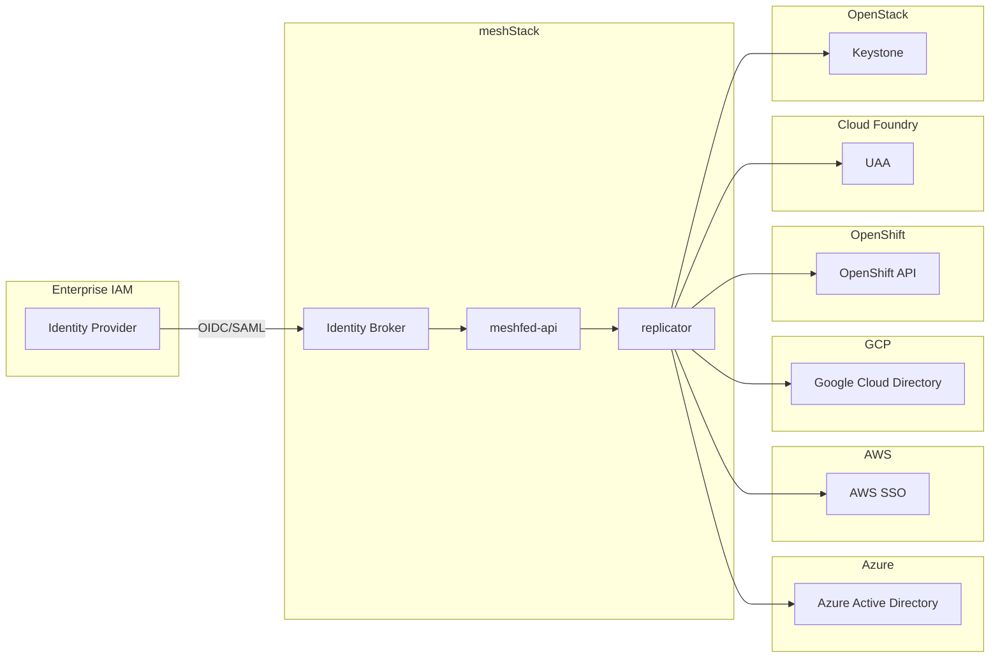
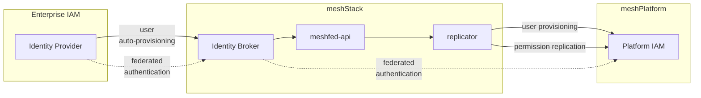
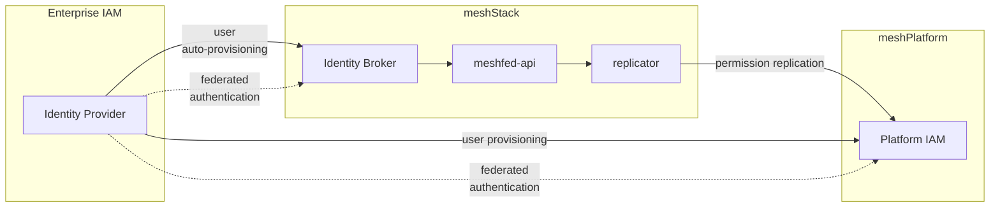
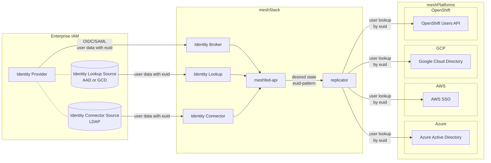
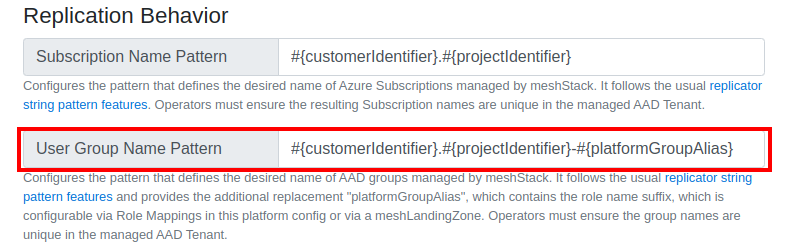

meshStack supports a central Identity Provider architecture across multiple cloud and container platforms. Therefore, meshStack contains a full-featured Identity Broker (meshIdB) which consumes identities from company directories and adds authorization information for the specific cloud platforms.

Identity Federation enables enterprises to integrate corporate SSO systems at a single point (the **mesh Identity Broker**). meshStack then uses it's desired-state replication to ensure correct configuration of identity and authorization information into all connected **meshPlatforms**. The diagram below depicts the principal components involved.

> To get a more fundamental understanding of doing IAM in the cloud, look into the IAM Building Blocks in the [Cloud Foundation Maturity Model](https://cloudfoundation.meshcloud.io/maturity-model/iam/).



## Designing Multi-Cloud Identity and Access Management

Designing an effective multi-cloud identity and access management strategy is no small feat. This guide describes the
most important considerations that enterprise architects and IAM specialists need to be aware of when designing
a multi-cloud IAM strategy for their organisation. Wherever applicable, it will link to sections that describe relevant configuration options in detail.

## Federated Multi-Cloud Identities

meshStack enables multi-cloud identity federation so that end-users of the system like developers can access all their cloud environments using a single user identity. This allows enterprises to easily retain full control over identities and credentials.

The identity provisioning mechanism and the resulting federation setup depends on the type of cloud platform and its specific configuration. For in-depth details Please consult the respective platform's operator documentation for more configuration details.

### meshStack-provisioned Identities

In this mode meshStack provisions identities used in meshProjects on the respective cloud platform. The lifecycle of the identity is automatically managed via meshStack, including [revocation and deprovisioning](./meshstack.user-revocation.md). In this mode, identity federation involves the meshIdB and meshcloud can provide all necessary configuration and setup assistance. This is only available for Cloud Foundry.



### Externally-provisioned Identities

Some public cloud platforms like [Microsoft Azure](./meshstack.azure.index.md) or [Google Cloud Platform](./meshstack.gcp.index.md) feature their own directory services for cloud-based or hybrid user identities. Enterprises provision cloud identities by synchronizing an on-premise directory to the cloud. These setups are especially common for enterprises using Office 365 or Google Google Workspace.

meshStack supports using user identities from these cloud directories for the resepective cloud [meshPlatform](./meshcloud.platforms.md). meshStack calls these **externally provisioned user identities** because provisioning and identity federation between on-premise and cloud-directory happens outside of meshStack.



### Choosing an identity provisioning strategy

The next subsections discuss important considerations for choosing the right identity provisioning strategy for your cloud platforms.

#### Platform Support

The cloud platforms supported by meshStack offer different technical IAM integration capabilities.
While it's a key consideration for meshStack to deliver a unified multi-cloud IAM control plane,
architects need to consider the unique capabilities of cloud platform IAM systems (e.g. AAD vs. Google Cloud Identity) and of their organizations' IAM architecture. Based on the platform's native capabilities,
meshStack supports the following identity provisioning strategies:

|               |   [meshStack-provisioned](#meshstack-provisioned-identities)   |        [externally-provisioned](#externally-provisioned-identities)        |
| :-----------: | :------------------------------------------------------------: | :------------------------------------------------------------------------: |
|   OpenStack   |                               -                                |   [supported](./meshstack.openstack.index.md#access-control-integration)   |
| Cloud Foundry |                                                                | [supported](meshstack.cloudfoundry.index.md#uaa-configuration)             |
|  Kubernetes   |                               -                                |  [supported](./meshstack.kubernetes.index.md#access-control-integration)   |
|   OpenShift   |                               -                                |       [supported](./meshstack.openshift.index.md#idp-configuration)        |
|      AWS      |   [deprecated](./meshstack.aws.index.md#meshidb-deprecated)    |               [supported](./meshstack.aws.index.md#aws-sso)                |
|     Azure     |   [AAD B2B](./meshstack.azure.index.md#workload-aad-tenant)    | [supported](./meshstack.azure.index.md#azure-active-directory-integration) |
|      GCP      |                               -                                |     [supported](./meshstack.gcp.index.md#cloud-identity-configuration)     |

#### Availability of Users and Atttributes

In order to use externally-provisioned identities, Platform Operators need to set up the necessary user provisioning
routines outside of meshStack. Depending on the existing IAM landscape in your organization, this can require
setting up synchronization to on-premise directories and other IAM systems.

In order to correctly replicate user permissions, meshStack needs to map meshUser objects with permissions on a meshProject
to "platform user" objects in a platform's IAM system (e.g. an AAD user object). To perform this mapping, meshStack requires an `external user id` (shorthand `euid`) attribute that needs to be present on all user objects and in all cloud platforms. This attribute can typically be an existing `email` or `username`, however it needs to be unique, stable and available on all systems.

> meshStack will log replication warnings when it fails to replicate permissions for externally provisioned user identities, e.g. because a user could not be located on the platform.

#### High availability

meshStack features a carefully designed high-availability architecture. A potential loss of meshStack availability as the multi-cloud "control plane" is tolerable for the "data plane" used by developers to authenticate and work with cloud platforms. This means that developers' work can continue uninterrupted while meshStack availability is restored. Only operations that modify desired state like managing cloud permissions via [meshProjects](./meshcloud.project.md) are temporarily unavailable in this case.

User can still authenticate and work with cloud platforms using [meshStack-provisioned identities](#meshstack-provisioned-identities), as long as the meshIdB is available. meshcloud therefore supports deploying the meshIdB in a data-center redundant HA setup.

Availability of the meshIdB does not affect cloud platforms using [externally-provisioned identities](#externally-provisioned-identities). These platforms can tolerate a full loss of meshStack availability.

## Configuring externally-provisioned identity federation

As described above in [Availability of Users and Atttributes](#availability-of-users-and-atttributes), choosing a suitable euid attribute is crucial when designing an IAM architecture leveraging externally-provisioned identity federation.
The diagram below explains the components involved in an `euid` configuration and how attribute values propagate through the connected systems.



Note that the diagram shows IAM systems by their "role". It is possible that a solution IAM architecture
uses the same IAM system in multiple roles simultaneously. For example, it's common to use the same AAD tenant as an Identity Provider, Identity Lookup Source and as a target IAM system for an Azure meshPlatform.
Nonetheless, operators need to configure each of these roles individually. The following sections provide links to the appropriate configuration references and summarises
euid attributes supported for the particular component or system.

### Identity Provider

meshStack auto-provisions meshUsers from valid, federated login tokens provided by an [Enterprise Identity Provider](./meshstack.identity-provider.md).
In essence, any user attribute that the Identity Provider is capable to provide in a SAML assertion or OIDC token claim can be used as an `euid`.
However, some identity providers only support a restricted set of user attributes.

| Identity Provider | euid attributes supported                   |
| ----------------- | ------------------------------------------- |
| AD FS             | every attribute available via claims mapper |
| AAD               | `userPrincipalName`, `mailNickName`         |
| GCP               | `primaryEmail`                              |

For further details, please consult the [Identity Provider configuration reference](./meshstack.identity-provider.md).

meshStack updates the `euid` of a user with the latest value passed from the IdP on every log in of the user into meshPanel.
In case Platform Operators do not configure an identity lookup (see next section), this allows meshStack to retrieve an `euid` that is not an email from the IdP. However, Platform Operators need to be aware that
users that have never logged in to meshStack will not have an `euid` set and can thus not be replicated
to cloud platforms configured to use externally-provisioned identities.

### Identity Lookup

meshStack allows Workspace Managers to [quickly onboard team members](./meshcloud.workspace.md#invite-users-to-a-meshworkspace-team) with an assisted onboarding workflow.
This onboarding workflow features an autocomplete and search for user identities in an enterprise user directory. This search process is called identity lookup.

meshStack supports configuration of an optional identity lookup source. When possible, IAM architects should give preference to using the configured identity provider also as as an identity lookup source.

Since email is a fundamental attribute of every meshUser, every identity lookup source is capable
of providing this attribute.
If an operator does not configure an identity lookup source, meshStack will use the email address entered by the inviting user.
This email address can also be used to set a user's `euid`, see the [user onboarding configuration reference](meshstack.onboarding.md#workspace-user-invitations) for details.

| Identity Lookup Source | euid attributes supported                                               |
| ---------------------- | ----------------------------------------------------------------------- |
| none                   | email (manual input)                                                    |
| AAD                    | email, any user attribute, incl. SchemaExtensions and Custom Attributes |
| GCP                    | email, any Schema Extension attribute                                   |

For further details, please consult the [Identity Lookup configuration reference](./meshstack.identity-lookup.md).

### Identity Connector

The [Identity Connector](meshstack.workspace-group-sync.md) can automatically provision meshUsers via the meshObject API.
As a part of this process, the identity connector can also set the `euid` attribute.

| Identity Connector Source | euid attributes supported                                 |
| ------------------------- | --------------------------------------------------------- |
| LDAP                      | every attribute available via LDAP query on a User entity |

If the identity connector is used, see the [Identity Connector](./meshstack.workspace-group-sync.md) configuration reference.

### Platform Configuration

When meshStack generates the desired state for a [meshTenant](./meshcloud.tenant.md), it uses the
assigned [meshProject roles](meshstack.authorization.md#meshproject-roles) together with the meshPlatform and meshLandingZone configuration to compute the desired IAM configuration in the cloud platform.

As a part of this process, meshStack has to map each meshUser to a native platform user object using the meshUser's `euid` attribute and matching it with a configurable attribute of the native platform user object. Platform Operators can configure this process in two steps.

#### Transforming euids with patterns

Some common cloud IAM architectures require using different user account for test and production workloads (e.g. `user@test.example.com`, `user@example.com`) or using a different user account for private and public clouds (`example-corp\user`, `user@example.com`). In order to allow support these setups, Platform Operators can configure this transformation of the meshUser `euid` individually for each meshPlatform.

<!--snippet:meshfed.platform#type-->

<!--DOCUSAURUS_CODE_TABS-->
<!--Dhall Type-->

```dhall
let Platform =
      let Platform =
          {-
            platform-identifier:
              Full identifier in the form <platform>.<location> for the platform this config relates to.

            euid-pattern:
              Format string for translating generic user euids for specific platforms.
              This is only required if euids differ accross platforms. Use '%s' to leave euids unchanged
              or '%S' to convert it to uppercase.
          -}
            { platform-identifier : Text, euid-pattern : Text }

      let examplePublicCloud =
              { platform-identifier = "azure.azure-prod"
              , euid-pattern = "%s@example.com"
              }
            : Platform

      let examplePrivateCloud =
              { platform-identifier = "openstack.internal"
              , euid-pattern = "example.com/%S"
              }
            : Platform

      in  Platform
```

<!--END_DOCUSAURUS_CODE_TABS-->

#### Looking up transformed euids

In order for the replicator to map the transformed `euid` to a cloud platform's native user object, operators must configure which platform user attribute to use for this lookup.

> IAM architects need to ensure that any external user provisioning processes outside of meshStack fill platform user object
> attributes with the correct euid values.

The cloud platforms supported by meshStack have different capabilities to query user attributes via API.
meshStack can thus only support lookup in one or two platform user attributes.

| Platform           | platform user object attributes supported |
| ------------------ | ----------------------------------------- |
| Azure              | `userPrincipalName`, `mail`               |
| AWS                | `userName`                                |
| GCP                | `primaryEmail`                            |
| OpenShift          | `User.metadata.name`                      |
| Kubernetes         | `User.metadata.name`                      |
| OpenStack          | `User.name`                               |
| Cloud Foundry      | `User.username`                           |
| meshMarketplace\*  | `userPrincipalName`, `mail`               |

\*_with AAD permission Replication_

At the moment only AAD offers a choice of user lookup attributes. Platform Operators can configure these globally for all meshPlatforms.

<!--snippet:mesh.replicator-->

The following configuration options are available at `mesh.replicator`:

<!--DOCUSAURUS_CODE_TABS-->
<!--Dhall Type-->

```dhall
let Replicator =
    {-
      aadUserLookupStrategy:
        Determines the attribute used for looking up users in AADs.
        This setting is shared across all Azure and meshMarketplace platforms configured to use an AAD
        for user permission replication.
    -}
      { aadUserLookupStrategy : Platform.Azure.AzureLookupStrategy }
```

<!--END_DOCUSAURUS_CODE_TABS-->

<!--snippet:replicator.platform.azure.AzureLookupStrategy#type-->

<!--DOCUSAURUS_CODE_TABS-->
<!--Dhall Type-->

```dhall
let AzureLookupStrategy =
    {-
      Determines how meshStack which AAD user object attribute meshStack will use to map a meshUser by its euid.

      UserByMailLookupStrategy:
       compares the meshUser's euid to the 'mail' attribute on the AAD User.

      UserByUsernameLookupStrategy:
         compares the meshUser's euid to the 'userPrincipalName' attribute on the AAD User.

      Both strategies use case insensitive comparison.
    -}
      < UserByMailLookupStrategy | UserByUsernameLookupStrategy >
```

<!--END_DOCUSAURUS_CODE_TABS-->

## Group Cleanup

For the platform listed below user access is given by assigning groups with the apropriate users inside to the platform tenant. The naming of these groups can be customized by setting the `User Group Name Pattern` in the appropriate meshPlatform Configuration. See the image below.



Additionally added group permissions are discouraged, but possible for some platforms. For other platforms additional added permissions are removed during a replication run. This currently is a slight inconsistent behavior that will be unified in the future. Below is a table to see in which platform externally added permissions are kept on their usergroups during project replication.

| Platform               | Additional Permission Possible |
| ---------------------- | :----------------------------: |
| AWS (meshIdB)          |               ✅                |
| Azure                  |               ❌                |
| GCP                    |               ✅                |
| OpenStack              |               ✅                |
| OpenShift              |               ✅                |
| AKS (AAD Permissions¹) |               ❌                |
| CloudFoundry²          |               ✅                |

¹: This applies only the the user group permissions that are applied in the AAD to give the users general access to the AKS cluster. The cluster role assignments in the cluster are not affected.

²: In Cloud Foundry the permissions are handled by the IDP and no direct group permissions replication is happening on the platform.

When the name of a group has changed by a user initiated config change e.g. when modifying the group name pattern inside the platform config or by changing the meshRole to Platform Role Mapping inside a Landing Zone as long as the parameter `#{platformGroupAlias}` is used in the User Group Name Pattern, the group is deleted and re-created with a different name.
The deletion is done because certain cloud platforms don't support group renaming
If additional tenant access permissions were attached to this group by an external system, these permissions are lost and not carried over.

Automatic group cleanup is available for GCP, AWS, Azure, Azure Kubernetes Service, and OpenShift.
