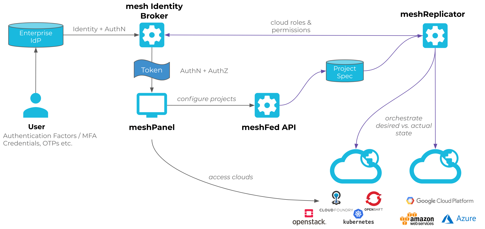

One of meshStacks main features is to provide single identities across multiple cloud and container platforms. Therefore, meshStack contains a full-featured **Identity Broker** (meshIdB) which consumes identities from company directories and adds authorization information for the specific cloud platforms.

Identity Federation enables enterprises to integrate corporate SSO systems at a single point (the **mesh Identity Broker**). meshStack then automatically ensures identity and authorization federation into all connected **Platform Instances** as depicted below by issuing tailored tokens for the meshProject in focus.

## Federated Multi-Cloud Identities

meshStack enables multi-cloud identity federation so that end-users of the system like developers can access all their cloud environments using a single user identity. This allows enterprises to easily retain full control over identities and credentials.

The identity provisioning mechanism and the resulting federation setup depends on the type of cloud platform and its specific configuration. Please consult the respective platform's operator documentation for more configuration details.

### meshStack-provisioned Identities

In this mode meshStack identies used in meshProjects on the respective cloud platform. The lifecycle of the identity is automatically managed via meshStack, including [revocation an deprovisioning](./meshstack.user-revocation.md). In this mode, identity federation invoves involves the meshIdB and meshcloud can provide all necessary configuration and setup assistance.

### Externally-provisioned Identities

Some public cloud platforms like [Microsoft Azure](./meshstack.azure.index.md) or [Google Cloud Platform](./meshstack.gcp.index.md) feature their own directory services for cloud-based or hybrid user identities. Enterprises provision cloud identities by synchronizing an on-premise directory to the cloud. These setups are especially common for enterprises using Office 365 or Google G-Suite.

meshStack supports using user identities from these cloud directories for the resepective cloud [meshPlatform](./meshcloud.platform-location.md). meshStack calls these **externally provisioned user identities** because provisioning and identity federation bebtween on-premise and cloud-directory happens outside of meshStack. In order to use the right externally provisioned user identity when provisioning permissions, meshStack needs to map a federated user identity used in meshStack to its corresponding externally provisioned user identy. This mapping is based on the `external user id` or `euid` in short.

When using externally provisioned user idenitites, IdPs must also provide a stable and immutable `euid` claim or user property that is also present in the cloud directory. meshStack will use the `euid` to map identities from meshStack to their respective cloud identity. Most setups use an existing `email` or `username` property as the `euid`.

> Operators need to ensure that all user identities available to meshStack are also provisioned on the cloud platform.
> meshStack cannot provision permissions for user identities missing on the cloud platform. Failure to replicate permissions for externally provisioned user identities will be logged as replication warnings.

In this mode, identity federation does not involve the meshIdB. Platform Operators have to setup identity sync and federated authentication between the cloud platform and on-premise IdPs themselves.

## Requirements for Identity Providers

Operators must be aware of the following requirements and limitations for IdPs serving as identity sources for meshStack.

### Supported Federation Technologies

The main supported technologies for Identity Federation with meshStack are

- LDAP
- Open ID Connect
- SAML
- Azure AD

meshStack supports the simultaneous integration of multiple [Enterprise Identity Providers (IdPs)](https://en.wikipedia.org/wiki/Identity_provider) at the Identity Broker. This allows operators to combine identities from different sources in the platform and unify management of multi-cloud access in meshStack.

### User Attributes

- IdPs must provide
  - a stable and immutable user identifier (e.g. an OIDC `sub` claim)
  - a human-readable, unique username*
  - an email address
  - an `euid` when using [externally-provisioned identities](#externally-provisioned-identities)
- IdPs should provide name (first name, given name) information to improve user experience

> \* Please note that meshStack currently only offers limited support for propagation of changed usernames from IdPs.

## Concerns for High Availability

meshStack features a carefully designed high-availability architecture. A potential loss of meshStack availability as the multi-cloud "control plane" is tolerable for the "data plane" used by developers to authenticate and work with cloud platforms. This means that developers' work can continue uninterrupted while meshStack availability is restored. Only operations that modify desired state like managing cloud permissions via [meshProjects](./meshcloud.project.md) are temporarily unavailable in this case.

User can still authenticate and work with cloud platforms using [meshStack-provisioned identities](#meshstack-provisioned-identities), as long as the meshIdB is available. meshcloud therefore supports deploying the meshIdB in a data-center redundant HA setup.

Availability of the meshIdB does not affect cloud platforms using [externally-provisioned identities](#externally-provisioned-identities). These platforms can tolerate a full loss of meshStack availability.

## Identity Provider Configuration Tutorials

### Active Directory Federation Services (AD FS)

Initially provide the URL of your AD FS to meshcloud, so a Identity Provider can be configured in the meshIdB. meshcloud will then provide a SAML descriptor URL, that can be used to configure AD FS.

With AD FS 3.0 (2012 R2) and newer, a Relying Party Trust must be created in AD FS. As OIDC Support is limited in AD FS 3.0, SAML should be used in that case and is described here. For newer AD FS versions you may also define an OIDC client, which is not part of this documentation.

In AD FS Management console, right-click "Trust relationships → Relying Party Trusts" and select "Add Relying Party Trust" from the menu. At the beginning of the wizard, enter the SAML descriptor URL that will be provided by meshcloud (it is individual per meshcloud installation) into the Federation metadata address field. Let AD FS import the settings. Proceed with the wizard, and adjust the settings where appropriate. Here we use only the default settings. Note that you will need to edit the claim rules so when asked to do so at the last page of the wizard, you can leave the checkbox checked on.

Now the SAML protocol would proceed correctly, AD FS would be able to correctly authenticate the users according to requests from Keycloak, but the requested name ID format is not yet recognized and SAML response would not contain any additional information like e-mail. It is hence necessary to map claims from AD user details into SAML document.
We will set up three rules: one for mapping user ID, second for mapping standard user attributes, and optionally third for a user group, if needed.

#### Rule for Mapping user ID

1. Open the `Edit Claim Rules` dialog.
2. In the `Add Transform Claim Rule` dialog, select `Transform an incoming claim`.
3. Map the following attributes:
    - `Name ID` as `rule name`
    - `Windows account name` for property `Incoming claim type`
    - `Name ID` for property `Outgoing claim type`
    - `Windows qualified Domain Name` for property `Outgoing name ID format`
4. Click Finish to add the rule.

#### Rule for Mapping the Attributes of the Standard User

1. Open the `Edit Claim Rules` dialog.
2. In the `Add Transform Claim Rule` dialog, select `Send LDAP attributes as Claims rule`.
3. Map the following attributes:
    - `E-Mail-Addresses` to `E-Mail Address`
    - `SAM-Account-Name` to `Subject Name`
    - Your LDAP attributes for `surname` and `given name`

#### Rule for Mapping AD groups

If meshcloud shall restrict access via certain AD groups, you can define another claim.

1. Start again in the `Edit Claim Rules` dialog.
2. Select `Send Group Membership as a Claim` rule type.
3. Usually two groups should be defined via this. They should result in Outgoing claim type `Group` with Outgoing claim values `meshUser` and `meshManager`. A `meshUser` can login to meshcloud and be invited to existing meshCustomers. A `meshManager` is allowed to create new `meshCustomers`.

#### Azure AD (AAD)

- Create a new App registration in AAD. You can choose a display name like `meshcloud SSO`. Define the redirect URI that will be provided by meshcloud. It is individual per meshcloud installation.
- Provide "Application (client) ID" and "Directory (tenant) ID", that is shown in the Overview screen of your new app registration, to meshcloud.
- Create a Client secret via "Manage -> Certficates & secrets". This secret must be provided to meshcloud.

### Google Cloud Directory (GCD)

The setup of the GCD Federation is quite straight forward. The easiest way to do is to setup a SAML login federation between meshstack and Google. To do so follow these steps (for more detailed steps you can also follow the [SAML guide](https://support.google.com/a/answer/6087519?hl=en) from Google):

1. Login into the GCD Admin area ([admin.google.com](https://admin.google.com)).
2. Click on `SAML Apps` and create a new SAML app by clicking on the plus button bottom right, then `Setup my own custom app`
3. In the upcoming windows please download the IDP metadata. This data is important for setting up the Keycloak. Also copy the `SSO URL` and provide both to meshcloud.
4. Chose a name (e.g. `meshstack sso`), a picture and description as you like.
5. You probably need to input first a placeholder for the `ACS URL` and `Entity ID`, as meshcloud can only provide you these values when we setup the SSO with the data you gathered in the earlier steps. When this was done and we notified you about the correct `ACS URL` and `Entity ID` you can edit this SAML App again and finalize its setup with the information we provided you.
