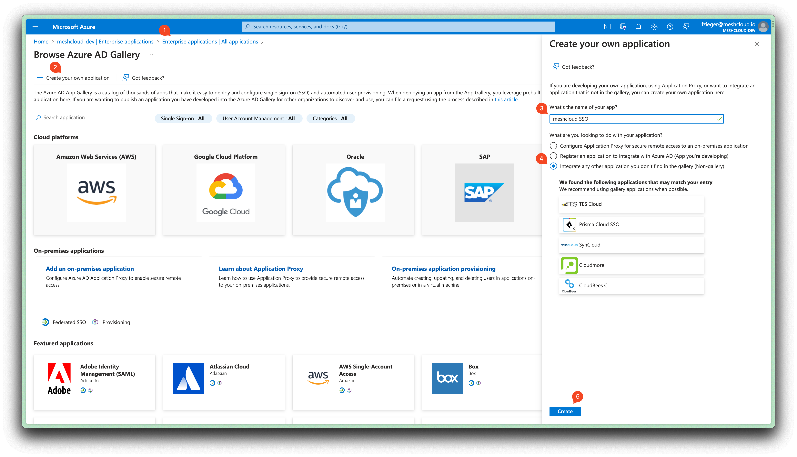
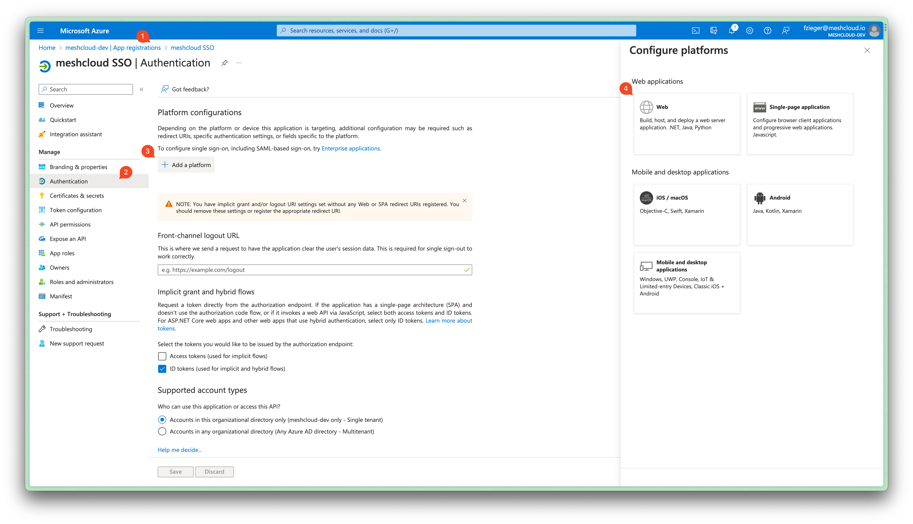
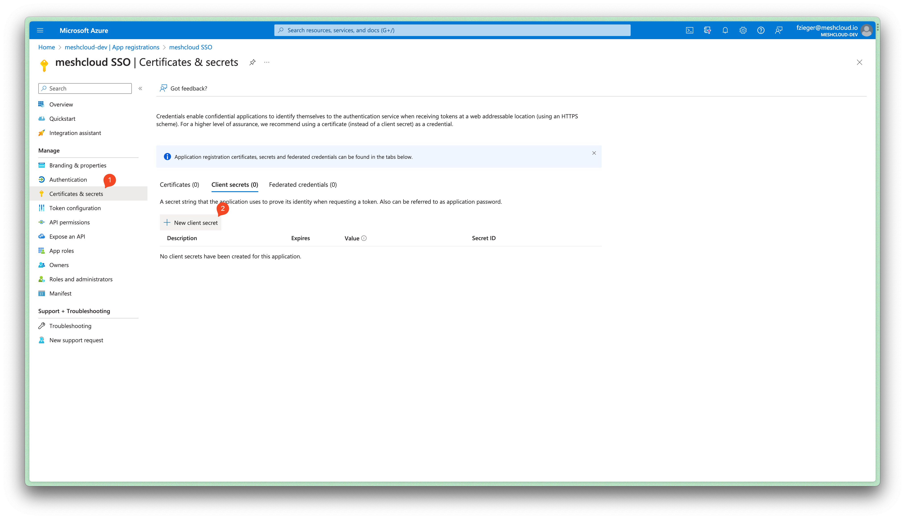
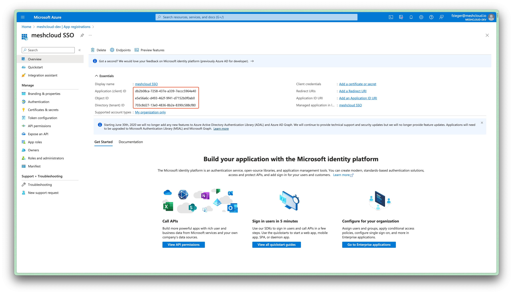
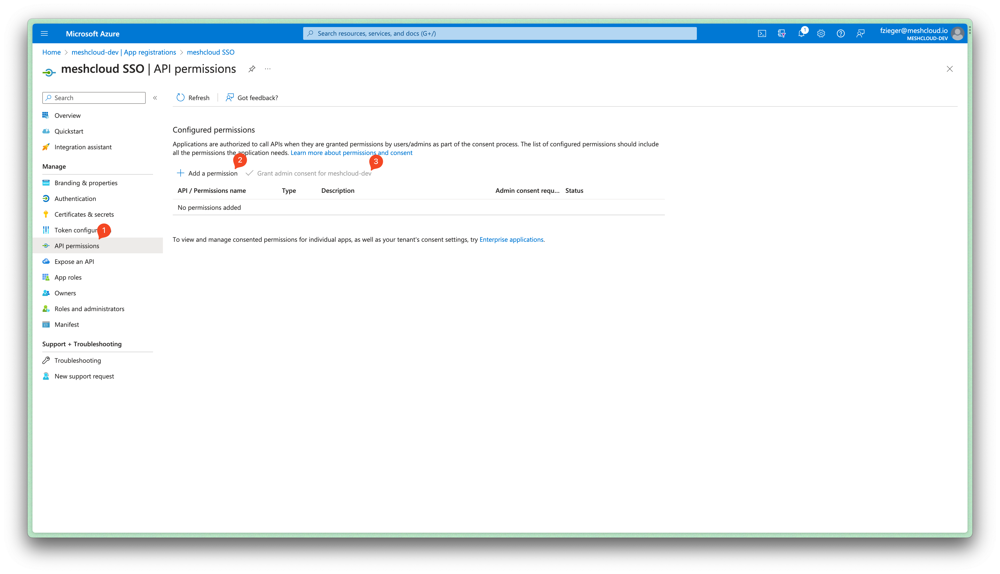

Partners must be aware of the following requirements and limitations for IdPs serving as identity sources for meshStack.

## Supported Federation Technologies

The main supported technologies for Identity Federation with meshStack are

- LDAP
- Open ID Connect
- SAML
- Azure AD

meshStack supports the simultaneous integration of multiple [Enterprise Identity Providers (IdPs)](https://en.wikipedia.org/wiki/Identity_provider) at the Identity Broker. This allows Partners to combine identities from different sources in the platform and unify management of multi-cloud access in meshStack.

## User Attribute Requirements

- IdPs must provide
  - a stable and immutable user identifier (e.g. an OIDC `sub` claim)
  - a human-readable, unique username*
  - an email address
  - an `euid` when using [externally-provisioned identities](#externally-provisioned-identities)
- IdPs should provide name (first name, given name) information to improve user experience

> \* Please note that meshStack currently only offers limited support for propagation of changed usernames from IdPs.

## Identity Provider Configuration Tutorials

### Active Directory Federation Services (AD FS)

Initially provide the URL of your AD FS to meshcloud, so a Identity Provider can be configured in the meshIdB. meshcloud will then provide a SAML descriptor URL, that can be used to configure AD FS.

With AD FS 3.0 (2012 R2) and newer, a Relying Party Trust must be created in AD FS. As OIDC Support is limited in AD FS 3.0, SAML should be used in that case and is described here. For newer AD FS versions you may also define an OIDC client, which is not part of this documentation.

In AD FS Management console, right-click "Trust relationships → Relying Party Trusts" and select "Add Relying Party Trust" from the menu. At the beginning of the wizard, enter the SAML descriptor URL that will be provided by meshcloud (it is individual per meshcloud installation) into the Federation metadata address field. Let AD FS import the settings. Proceed with the wizard, and adjust the settings where appropriate. Here we use only the default settings. Note that you will need to edit the claim rules so when asked to do so at the last page of the wizard, you can leave the checkbox checked on.

Now the SAML protocol would proceed correctly, AD FS would be able to correctly authenticate the users according to requests from Keycloak, but the requested name ID format is not yet recognized and SAML response would not contain any additional information like e-mail. It is hence necessary to map claims from AD user details into SAML document.
We will set up three rules: one for mapping user ID, second for mapping standard user attributes, and optionally third for a user group, if needed.

#### Rule for Mapping user ID

1. Open the `Edit Claim Rules` dialog.
2. In the `Add Transform Claim Rule` dialog, select `Transform an incoming claim`.
3. Map the following attributes:
    - `Name ID` as `rule name`
    - `Windows account name` for property `Incoming claim type`
    - `Name ID` for property `Outgoing claim type`
    - `Windows qualified Domain Name` for property `Outgoing name ID format`
4. Click Finish to add the rule.

#### Rule for Mapping the Attributes of the Standard User

1. Open the `Edit Claim Rules` dialog.
2. In the `Add Transform Claim Rule` dialog, select `Send LDAP attributes as Claims rule`.
3. Map the following attributes:
    - `E-Mail-Addresses` to `E-Mail Address`
    - `SAM-Account-Name` to `Subject Name`
    - Your LDAP attributes for `surname` and `given name`

#### Rule for Mapping AD groups

If meshcloud shall restrict access via certain AD groups, you can define another claim.

1. Start again in the `Edit Claim Rules` dialog.
2. Select `Send Group Membership as a Claim` rule type.
3. Usually two groups should be defined via this. They should result in Outgoing claim type `Group` with Outgoing claim values `meshUser` and `meshManager`. A `meshUser` can login to meshcloud and be invited to existing meshWorkspaces. A `meshManager` is allowed to create new `meshWorkspaces`.

### Azure AD (AAD)

To set up Azure Active Directory for IDP authentication follow these steps:

1. Create a new non-gallery Enterprise Application in AAD ([Microsoft Documentation](https://docs.microsoft.com/en-us/azure/active-directory/app-provisioning/use-scim-to-provision-users-and-groups#getting-started)) with display name `meshcloud SSO` or similar.

    

    > We create a non-gallery Enterprise Application (that creates an App Registration) instead of directly creating an App Registration here because [provisioning via SCIM](meshstack.user-group-provisioning.html#aad-configuration) will be set up later with this Enterprise Application.

2. Open the App Registration for `meshcloud SSO`. Navigate to Authentication and add a new Platform of Type Web. Enter the redirect URI for your meshStack that was provided by meshcloud.

    

3. Create a client secret via "Manage -> Certficates & Secrets". This secret must be shared with meshcloud.

    

4. Share "Application (client) ID" and "Directory (tenant) ID", that is shown in the Overview screen of your new app registration, with meshcloud.

    

5. Provide delegated admin consent for the `User.ReadAll` permission of the app registration.

    

### Google Cloud Directory (GCD)

The setup of the GCD Federation is quite straight forward. The easiest way to do is to setup a SAML login federation between meshstack and Google. To do so follow these steps (for more detailed steps you can also follow the [SAML guide](https://support.google.com/a/answer/6087519?hl=en) from Google):

1. Login into the GCD Admin area ([admin.google.com](https://admin.google.com)).
2. Click on `SAML Apps` and create a new SAML app by clicking on the plus button bottom right, then `Setup my own custom app`
3. In the upcoming windows please download the IDP metadata. This data is important for setting up the Keycloak. Also copy the `SSO URL` and provide both to meshcloud.
4. Chose a name (e.g. `meshstack sso`), a picture and description as you like.
5. You probably need to input first a placeholder for the `ACS URL` and `Entity ID`, as meshcloud can only provide you these values when we setup the SSO with the data you gathered in the earlier steps. When this was done and we notified you about the correct `ACS URL` and `Entity ID` you can edit this SAML App again and finalize its setup with the information we provided you.

You must also add three mappers so essential user information to identify the user is transferred to meshcloud during the SAML handshake. The attribute name must match exactly. The attributes are:

| Attribute Name |            Source Property            |
| -------------- | :-----------------------------------: |
| email          | Basic Information -&gt; Primary Email |
| firstName      | Basic Information -&gt; First Name    |
| lastName       | Basic Information -&gt; Last Name     |
