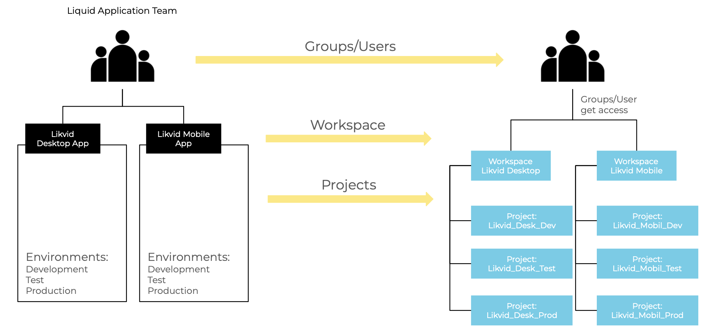
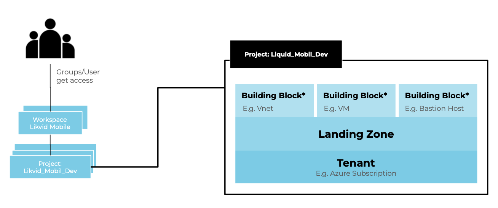

<h3 style="margin-top: 0">Welcome to the meshStack Documentation!</h3>

meshStack is the name of our technology that powers the meshcloud solution. This document is targeted at cloud architects and SREs and introduces the components of meshStack and their interaction.

It is a modular software platform solution that connects organizational processes like project and access management with cloud technology. It provides a unified administration interface to the organization while replicating configuration into attached cloud platforms.

It is NOT a meta-layer across clouds. Users access native cloud APIs for their deployments, but meshStack helps them to ensure a proper and common configuration across cloud technologies with additional functionality such as metering, billing, surveillance and others.

## Central Concepts

meshStack uses the concepts of Workspaces and Projects to represent the structure of existing application teams in the meshStack platform. Application Team can manage Tenants inside Projects. 

In order to reflect the organization's compliance and security standards in the cloud a Landing Zone is applied to every Tenant. Building Blocks can be leveraged either as part of a modular Landing Zone or additionally on top of a Tenant. Building Blocks are deployed based on the configuration provided in the Building Block definition. 
meshStack supports the management of multiple platforms of the same or different type. Below you can see an overview of the relations between the individual elements in meshStack as objects.

## Integrations

Integrating a cloud platform with meshStack generally consists of these steps:

- prepare the cloud platform for integration (Service Accounts, [Identity Federation](meshstack.identity-federation.md))
- configure & [register the platform](administration.platforms.md) in meshStack
- provide Landing Zone implementations
- configure [Metering & Billing](meshstack.billing.md)

Please review the detailed documentation for each cloud platform type in the sidebar for more details.

### meshModel mapping to Cloud Platform Concepts

Different Cloud technologies often introduce their own terms for similiar technological principles. In order to match them against each other and also show how this namings and technologies map to meshcloud's terminology of business entities.
These mappings can be customized. For more details, please consult documentation of the platforms.

The connections are shown in the following matrix table:

|               | [meshWorkspace](meshcloud.workspace.md) | [meshProject](meshcloud.project.md) | [meshUser](meshcloud.profile.md) | [meshLandingZone](meshcloud.landing-zones.md) |
| :-----------: | :---------------------------------------: | :-----------------------------------: | :--------------------------------: | :------------------------------------------: |
|   OpenStack   |             Domain (optional)             |                Project                |        Keystone Shadow User        |                    Quota                     |
| Cloud Foundry |               Organization                |                 Space                 |              UAA User              |                    Quota                     |
|  Kubernetes   |                     -                     |               Namespace               |            Rolebinding             |                YAML Templates                |
|   OpenShift   |                     -                     |                Project                |                User                |                YAML Templates                |
|      AWS      |                     -                     |                Account                |              IAM Role              |      Organization Units / CF StackSets       |
|     Azure     |                     -                     |             Subscription              |              AAD User              |        Management Groups / Blueprints        |
|      GCP      |                     -                     |                Project                |              GCD User              |           Folders / GDM Templates            |

## Operations

meshcloud will typically operate your meshStack installation as a [managed service](meshstack.managed-service.md) for you. As a managed service, all configuration and validation is done by meshcloud. Nonetheless, we make references to configuration options in the documentation so that Partners get a better understanding of meshStack's capabilities. The configuration references also simplify examples and communicate the exact parameters that may need to be supplied by Partners.

### Configuration

Most of meshStack's configuration can be done in self-service via the meshPanel in the Administration area.

meshStack also supports advanced configuration options. Please see [managed service](meshstack.managed-service.md) for more details.

