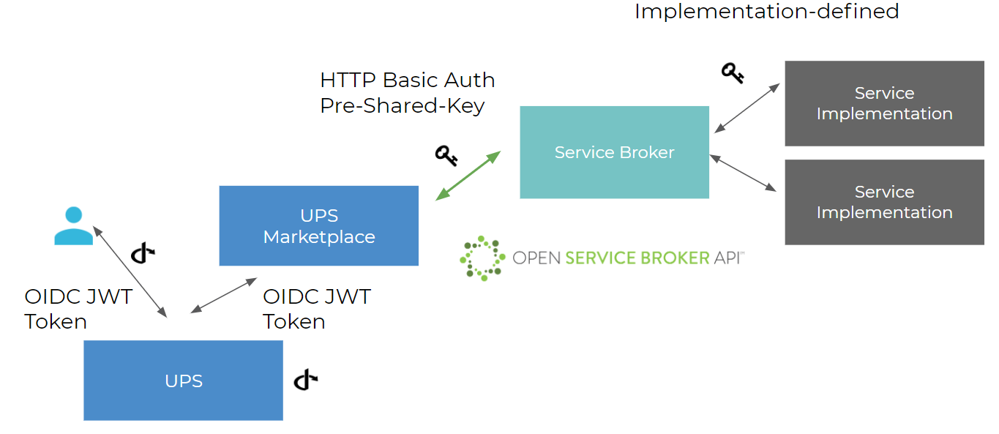

The Open Service Broker (OSB) Marketplace provides a common integration point for any remote service which can be provisioned by an API (e.g. a database). A lightweight service broker component implementing the [Open Service Broker API Specification](https://github.com/openservicebrokerapi/servicebroker/blob/v2.14/spec.md) allows such services to become a resource within a meshProject and be included in the project lifecycle management at the meshStack platform.

## meshMarketplace

The meshMarketplace allows users to manage service instances attached to a meshProject. The meshMarketplace uses the official Open Service Broker API standard to communicate with Service Brokers, which are responsible for the actual provisioning of service instances through their service implementation. This guide aims to provide a quick overview of the Open Service Broker API and implementation specific topics. It is required that service implementers study the Open Service Broker API specification for in-depth information.

## Authentication

The Marketplace authenticates users using the meshIdB and the OIDC protocol. All communication between the Marketplace and the Service Broker is secured using HTTPS Basic Auth and a Pre-Shared Key.

## Locality of Services

The meshMarketplace provides support for global and local services. Service Providers must choose which type of Service they want to offer so that the service is appropriately integrated into the user interface.

### Global Service

- global entry point for consumers (API), reachable from all networks
- Service is provided in a location agnostic manner
- Service may offer configuration of data locations etc. through configuration/dashboards
- Examples: CDN, DNS, Backup

### Local Service

- Local entry point for consumers (API), may be reachable only within a specific location
- Service is provided from a single location only
- Location of data etc. is important
- Examples: DBaaS

## OSB API Profile

meshcloud implements an extended [meshMarketplace OSB API Profile](./meshstack.meshmarketplace.profile.md) that allows brokers a deeper integration with meshStack. Please review the documentation to learn more about the use-cases this API profile enables.
