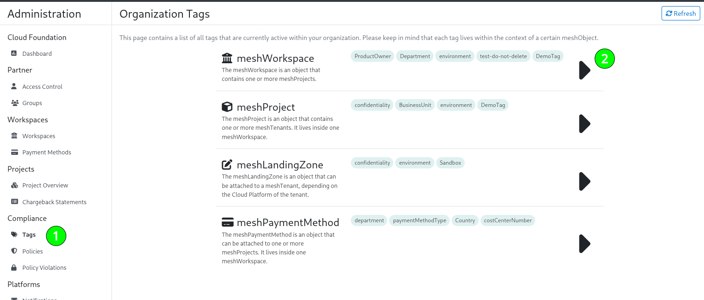
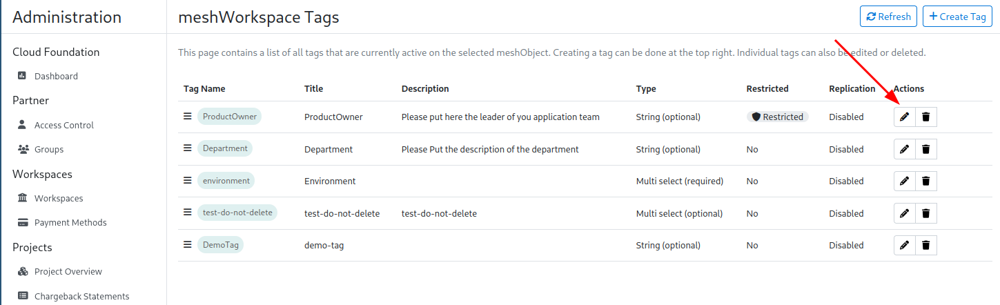

Operators can configure meshStack to collect, attach and distribute organization-specific metadata to various [meshModel](meshcloud.index.md) objects using [metadata tags](./meshcloud.metadata-tags.md).

## Use Cases for Tags

> meshStack currently supports tags on [meshCustomers](meshcloud.customer.md), [meshProjects](meshcloud.project.md), [meshLandingZones](meshcloud.landing-zones.md) and [meshPaymentMethods](meshcloud.payment-methods.md).
> Additionally, it is also possible to supply [default tags on meshUsers](#tags-on-meshusers) and [meshCustomerUserGroups](meshstack.customer-group-sync.md) are freely taggable via the meshStack API.

meshStack often acts as an organization's central registry of cloud environments and services. It therefore needs to cover
a wide range of use cases for orchestrating organizational processes across multiple clouds, including;

- centralized management and configuration of [cloud platforms](./meshcloud.platforms.md)
- life-cycle management for [cloud tenants](meshcloud.tenant.md) and [security policy automation](./meshcloud.landing-zones.md)
- centralized Identity and Access Management (IAM) via [multi-cloud identity federation](meshstack.identity-federation.md)
- unified [chargeback process](./meshcloud.project-metering.md) across all cloud platforms and services

Many of these use cases can require organizational metadata to be shared across different systems. Common examples of
such metadata include:

- IT System identifiers that can link cloud tenants to an enterprise configuration management database
- Cost Center and department information
- Security and Operations contacts for a project
- Data Confidentiality Levels
- Project Staging Environment, e.g. QA or production

## How to view and define available tags

> Note: doing the actions below will require the Partner Admin role.

Navigate to the Tags page which is available in the Administration area:



This page will show you all tags that are currently active on supported meshObjects. If you would like to know more details about a tag, or create, edit, or delete a tag, you can do so by clicking on the large arrow ▶️ on the right for a meshObject.
This next page will show you more details about a tag such as the title, description or data type of the tag and allow you to modify existing and define new tags.

### How to modify an existing tag

Click on the edit button for the tag you want to modify.




### How to define a new tag

You can define a new tag by clicking '+ Create' when you navigate to one of the specific meshObject pages.

You will be prompted with a new page where you can enter a lot of information. We will briefly explain what each fields means and why you should use it.

> Hint: after entering a name, you can view the tag input as if it were shown to the end user. You can do this on the right-side of the screen where it says 'Tag Preview'.
> This can help you get an idea of how it will look when end-users fill in the tag value.

- **Display Name**: This is the text that will be shown above the input field which the user reads. Note that is **not** the name of the tag itself.
- **Name**: This is the actual name of the tag as it will be displayed in the green bubble. It is also the name that is used for uniquely identifying the tag and when exporting it or when [using it within a landing zone](#exposing-tags-via-landing-zones). This name cannot be changed later (at the moment). We recommend using a name that is similar or the same as the Display Name. Keep in mind that the use of spaces is not allowed since the tag name is used for technical purposes.
- **Description (optional)**: This is the description of the tag that will be displayed in small grey text above the tag input. It is useful for giving extra information to the user when the name of the tag is not explanatory enough.
- **Tag Type**: This is the data type of the tag and also decides what kind of input the user will see. It will depend what you will fill in here depending on your needs. You can see the actual input in the Tag Preview on the right if you are curious how it looks.
- **Regular Expression (optional)**: This is only available for `e-mail` and `string` tag types and can be used to enforce that users enter a certain data format. Also make sure to mention this in the description to help users what to enter.
- **Default Value (optional)**: This can be used to give a default value to the user for contextual help or for filling in a default.
- **Mandatory**: If a tag is mandatory, it means the user cannot create a new meshObject without first filling in this tag value.
- **Restricted**: If a tag is restricted, it means only Partner users can enter this tag value. The input will also not be shown to the end-user when creating a new meshObject. This is useful if an organization doesn't want users to edit these values in self-service. For example, an organization can use restricted tags to implement a "segregation of duty" control to ensure that a partner user confirmed a project's data classification.

> Note: replication is not supported for meshLandingZones

- **Replication**:  If a tag has replication enabled, it will be used to tag an actual tenant in the cloud platform.
  - **Replication Tag Key**: Although we recommend using the exact same value as **Name** here, it's possible to use a slightly different tag key when it is used for replication. Also, keep in mind that the tag key will be prefixed, depending on what is configured for [tenant tags](#tags-in-cloud-tenants). When a tag key or value does not meet the cloud platforms' requirements, it will automatically be [sanitized](#tag-sanitization)

## Tags on meshUsers

meshUsers are defined globally in meshStack and therefore their tags are identical within all meshCustomers. As described in [meshPolicies](meshcloud.policies.md#meshpolicies-for-meshUsers/Groups) there are use cases where it makes sense to just apply a set of default tags to all meshUsers. I.e. you want to allow to assign all users to "dev" and "qa" projects, but not to "prod" projects.

<!--snippet:mesh.web.user-->

The following configuration options are available at `mesh.web.user`:
<!--DOCUSAURUS_CODE_TABS-->
<!--Dhall Type-->
```dhall
let UserTagsConfig =
    {-
          tags:
            Default tags will be applied to every active user in meshStack on every startup of meshStack and
            whenever a new user is added to a meshCustomer or imported via API
    -}
      { tags : List { mapKey : Text, mapValue : List Text } }
```
<!--Example-->
```dhall
let example
    : UserTagsConfig
    = { tags = [ { mapKey = "environment", mapValue = [ "dev", "qa" ] } ]
      }
```
<!--END_DOCUSAURUS_CODE_TABS-->

## Exposing tags via landing zones

meshStack makes metadata available to [Landing Zones](./meshcloud.landing-zones.md), for example by providing it as parameters to an [Azure Blueprint](meshstack.azure.landing-zones.md). The Landing Zone documentation for each of meshStack's supported platforms describes how meshStack makes **meshTenant metadata** available.

### meshTenant Metadata

> meshTenant metadata is part of a tenant's desired state. meshStack will therefore automatically reconcile any change to metadata with the actual tenant state.

meshStack automatically derives [metadata tags](./meshcloud.metadata-tags.md) for [meshTenants](./meshcloud.tenant.md) based on the metadata tags set on the [meshProject](./meshcloud.project.md), the [payment method](./meshcloud.payment-methods.md) configured on the meshProject and
the [meshCustomer](./meshcloud.customer.md) it belongs to.

It's possible that these objects have tags with the same tag key. For example, both the meshCustomer and
meshProject could contain a `cmdb-id` tag. Setting the `cmdb-id` tag value on the
meshCustomer provides it as a "default" value to all tenants owned by that meshCustomer. A user can then override
this default value on an individual meshProject by providing a value for the optional `cmdb-id` tag on the meshProject.

When merging the tag sources for a meshTenant, meshStack therefore applies the following precedence rule:

```text
meshProject tags > payment method tags > meshCustomer tags
```

You can find an example in the table below which explains this behavior:

| meshObject        | Tag Name | Tag Value |
| ------------      | -------- | --------- |
| meshCustomer      | cmdb-id  | 12        |
| meshPaymentMethod | cmdb-id  | 34        |
| meshProject       | cmdb-id  | 56        |

This example would result in `cmdb-id` being equal to `56` as the meshProject has the highest priority.

### HTTP Header Interface

Some Landing Zone assets like [GCP Cloud Functions](meshstack.gcp.landing-zones.md) or [Azure Functions](./meshstack.azure.landing-zones.md) receive metadata tags from meshStack using HTTP Headers. meshStack invokes these Landing Zone assets using the following HTTP headers:


| HTTP Header Name                 | Description                                                                                                                                                      |
| -------------------------------- | :--------------------------------------------------------------------------------------------------------------------------------------------------------------- |
| `x-mesh-customer-identifier`     | meshCustomer Identifier                                                                                                                                          |
| `x-mesh-project-identifier`      | meshProject identifier                                                                                                                                           |
| `x-mesh-costcenter` *deprecated* | If available, ID of the CostCenter selected for this meshProject. Please use `x-mesh-tag-cost-center` or another tag instead.                                    |
| `x-mesh-tag-${format(tagName)}`  | metadata tags as defined in the tags screen in the admin area                                                                                                    |

Headers for *metadata tags* are formatted to an http-header name by converting `camelCase` tag names into a dashed string i.e. `camel-case` and prefixing them with `x-mesh-tag-`.
As a full example, a tag named `myCustomerTag` would be provided as an HTTP header with name `x-mesh-tag-my-customer-tag`.

## Tags in Cloud Tenants

Certain cloud platforms allow you to tag resources in order to help organize them. It is possible to use the metadata tags from meshStack to control how these resources are tagged during project replication. The whole lifecycle of these tags is managed. This means tags on the cloud platform are updated and removed depending on the underlying metadata of the replicated meshProject. In order to properly track meshStack managed tags, every tag is usually prefixed with a tag prefix (e.g. the `meshstack_` prefix in the tag label `meshstack_costcenter:12345`).

<!--snippet:mesh.platform.tenantTags#type-->


<!--DOCUSAURUS_CODE_TABS-->
<!--Dhall Type-->
```dhall
let TenantTags =
    {-
      namespace-prefix:
        Every tag managed by meshstack is prefixed so meshstack can detect deleted tags and clean them up.
        Using a prefix to identify this enables the customer to use own tags on resources which are not touched
        by meshstack.

      tag-mappers[].key:
        The name of the tag on the target platform. Every platform might have different limitations about the
        tag names.

      tag-mappers[].value-pattern:
        Define a pattern which is used to generate the tag value on the platform. Every platform might have different
        limitations about the tag values. For a list about the placeholder you can use please check the meshstack
        documentation. Currently its not possible to use more then one identifier per valuePattern.
    -}
      { namespace-prefix : Text
      , tag-mappers : List { key : Text, value-pattern : Text }
      }
```
<!--Example-->
```dhall
let example =
        { namespace-prefix = "meshstack_"
        , tag-mappers =
          [ { key = "cident", value-pattern = "prefix-\${customerIdentifier}" }
          ]
        }
      : TenantTags
```
<!--END_DOCUSAURUS_CODE_TABS-->

The tag definition configuration describes on a per platform basis how these tags are extracted and transformed into cloud platform tags.
The following tag values can be used in such a tag definition configuration:

| Tag Key                    | Description                                                                                                                                                     |
| -------------------------- | :-------------------------------------------------------------------------------------------------------------------------------------------------------------- |
| `${projectIdentfier}`      | The meshProject identifier                                                                                                                                      |
| `${customerIdentifier}`    | The meshProject's customer identifier                                                                                                                           |
| `${projectName}`           | The meshProject display name                                                                                                                                    |
| `${customerName}`          | The meshProject's customer name                                                                                                                                 |
| `${landingzone}`           | The name of the applied [Landing Zone](meshcloud.landing-zones.md). It contains `no-landingzone` in case the meshProject does not have a Landing Zone applied.  |
| `${paymentIdentifier}`     | The identifier of the payment method that is assigned to the meshProject                                                                                        |
| `${paymentName}`           | The display name of the payment method that is assigned to the meshProject                                                                                      |
| `${paymentExpirationDate}` | The expiration date of the payment method that is assigned to the meshProject. It contains `none` if no expiration date is set for the payment method.          |

### Tag sanitization

Depending on the platform some limitations apply for maximum tag length or legal characters. You can learn more about these restrictions on [our blog post](https://www.meshcloud.io/2020/09/29/tags-and-labels-on-cloud-platforms-cheat-sheet-2020/).
To ensure that no replication fails because of these restrictions we automatically adapt the tags to ensure they comply with platform requirements. The following behavior happens for the cloud platforms:

### Azure Tags

The following resources are tagged:

- Subscriptions

During replication non conform tag keys and values are possibly adapted to the platform limitations by:

- If tag names are longer then 512 characters, the remaining characters are discarded
- If tag values are longer then 256 characters, the remaining characters are discarded
- Illegal characters are replaced with a `_`
- If a configuration would force a tag key to start with a forbidden prefix we signal an error and won't replicate this project

### AWS Tags

The following resources are tagged:

- Accounts

During replication non conform tag keys and values are possibly adapted to the platform limitations by:

- If tag names are longer then 128 characters, the remaining characters are discarded
- If tag values are longer then 256 characters, the remaining characters are discarded
- Illegal characters are replaced with a `_`

### GCP Tags

The following resources are tagged:

- Projects

During replication non conform tag keys and values are possibly adapted to the platform limitations by:

- If tag names are longer then 64 characters the remaining characters are discarded
- If tag values are longer then 64 characters, the remaining characters are discarded
- Keys and values are forced to be lowercase
- Illegal characters are replaced with a `_`

## Tags in Reports

meshStack includes meshCustomer, meshProject and Payment Method metadata tags as extra columns in relevant reports, e.g. [Chargeback Statements](./meshstack.billing-configuration.md#chargeback).
