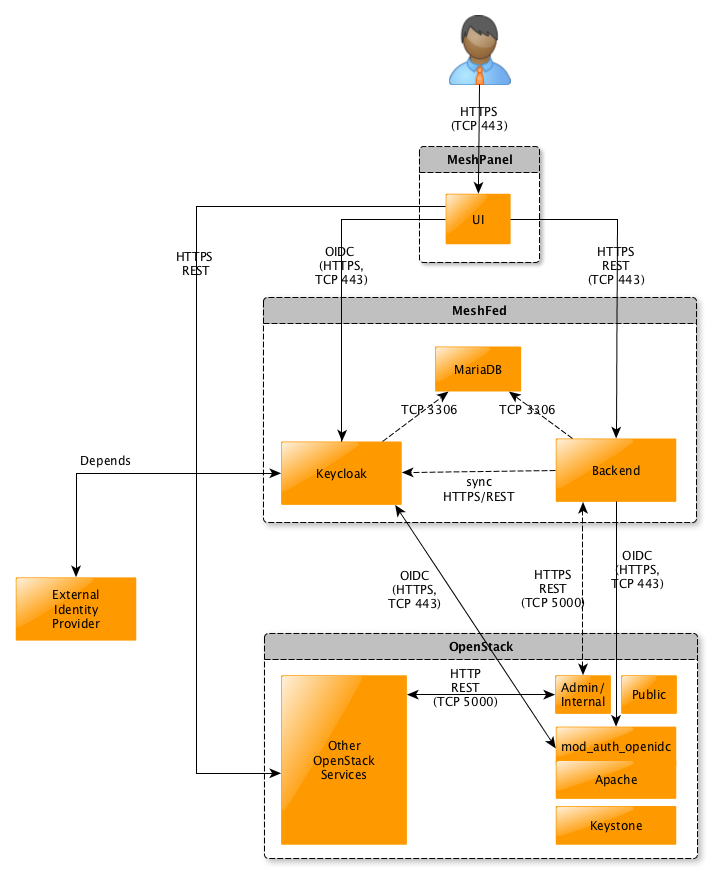
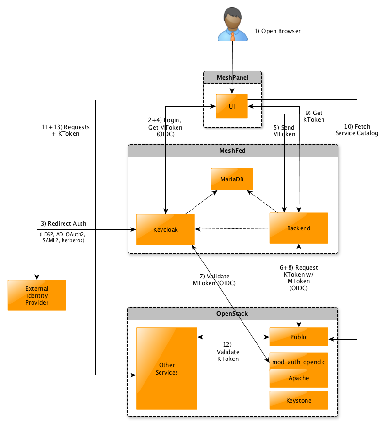

## Architecture

Access to OpenStack platforms takes place via a federated identity, i.e. there is a relationship of trust between the Auth service Keystone responsible for the cloud and the IdP of the meshStack (Keycloak). Within OpenStacks, Keystone then determines the permitted accesses.

OpenStack Keystone delegates the authentication in the federated case to an Apache module, in our case `mod_auth_openidc`, which among other things implements the OpenID Connect protocol for distributed authentication. When accessing the cloud, the user brings a token (JWT) with him, which was issued by the meshStack Keycloak and provided with the necessary access information and is validated by `mod_auth_openidc` (see access procedure). The meshStack Keycloak in turn accesses an external identity source (e.g. LDAP, central IdP).

The Meshpanel frontend also validates the JWT tokens against Keycloak in order to grant the user the necessary access.

The backend also uses the JWT token to check the user's permissions. If the permissions to the cloud for users are changed via the meshStack, the backend updates the permissions stored in Keycloak for this user.

## OpenStack Access

1. The user accesses the meshStack via the browser.
2. In the logged out state the user is forwarded to Keycloak to enter his credentials.
3. These credentials are compared with the connected external IdP (e.g. LDAP) if necessary.
4. On successful login Keycloak issues an OIDC token (JWT, here MToken) to the user and gives it to the user in the meshPanel, so that the user is logged in and can work with it.
5. For cloud access via the panel, a corresponding request is made to the backend with the OIDC token.
6. The backend uses the OIDC token sent with the panel to obtain a Keystone token (KToken) from Keystone (at the cloud). A token exchange therefore takes place. The user could also go directly to the cloud with the OIDC token, e.g. via CLI tools or similar.
7. The Token Exchange Request against Keystone leads `to mod_auth_openidc` becoming active and validating the OIDC token (temporal validity, signature of the keycloak).
8. If the OIDC token is valid, `mod_auth_openidc` forwards the request including user attributes to Keystone, which issues and returns a Keystone token (KToken) for valid token data.
9. The backend sends the received KToken to the panel so that it can directly access the respective OpenStack services.
10. First, the Panel fetches the Keystone Service Catalog to know which OpenStack services are available.
11. When accessing other OpenStack services, the KToken is now used against the other OpenStack services.
12. The other services in turn validate the KToken against Keystone.
13. If it is valid, the requested requests are answered and access to the OpenStack services is completed.

If the KToken expires, the OIDC/Keystone Token Exchange (steps 6-8) must be executed again. Once the OIDC token has expired, the user must authenticate again to the keycloak.

