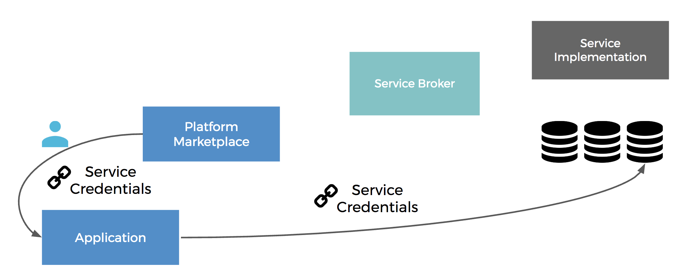

The Open Service Broker (OSB) Marketplace provides a common integration point for any remote service which can be provisioned by an API (e.g. a database). A lightweight service broker component implementing the [Open Service Broker API Specification](https://github.com/openservicebrokerapi/servicebroker/blob/v2.14/spec.md) allows such services to become a resource within a meshProject and be included in the project lifecycle management at the Meshstack platform.

The following image illustrates how the integration of Service Brokers into a Platform Marketplace works.

Access to the Service Instance is executed via the URL, that is provided by the Service Broker. How to actually access the instance depends on the credentials provided by the Service Broker during a provisioning request. In general the application accesses the Service Instance directly without any communication via the meshStack.

## Definitions

### Service Broker

A *service broker* is a component that creates an instance of a specific service and allows management of such service instances via the OSB API. An example would be a service broker for MariaDB services which allows you to request a MariaDB instance, potentially from a range of different sizes.

### Service Instance

A *service instance* is a specific deployed service that you can include in your application, e.g. a database created by the service broker.

### Service Binding

A *service binding* is a set of credentials you need to access your service instance, e.g. the connection string to access your database instance.

### Marketplace

The Marketplace of a platform lists all service brokers available to you and allows you to inform yourself about available plans and request service instances to be used in your application.

Usually, you do not need to care where and how a service instance is deployed as long as its accessible via networks your deployment can connect to. For a more detailed classification of service provisioning models read [this blogpost](https://www.meshcloud.io/en/2018/08/30/platform-services-model-classification/).
