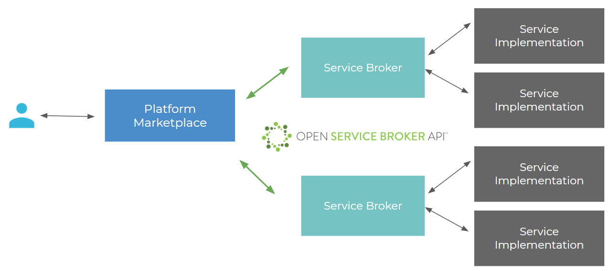

The Open Service Broker (OSB) Marketplace provides a common integration point for any remote service which can be provisioned by an API (e.g. a database). A lightweight service broker component implementing the [Open Service Broker API Specification](https://github.com/openservicebrokerapi/servicebroker/blob/v2.14/spec.md) allows such services to become a resource within a meshProject and be included in the project lifecycle management at the meshStack platform.

The meshMarketplace allows users to manage service instances attached to a Project. The meshMarketplace uses the official Open Service Broker API standard to communicate with Service Brokers, which are responsible for the actual provisioning of service instances through their service implementation. This guide aims to provide a quick overview of the Open Service Broker API and implementation specific topics. It is required that service implementers study the Open Service Broker API specification for in-depth information.

A [self-service registration](marketplace.development.md) of your Service Brokers in the meshMarketplace is also available.

## Definitions

Service Brokers may offer one or more services, which may have one or more plans each.  A service plan captures a variation of a service offering. Taking a MySQL service as an example, an “S” plan could offer 50GB of database storage whereas an “L” plan could offer 500GB. The Marketplace needs to provide a catalog of all available services and their various plans to the user. For this purpose, the Platform Marketplace periodically polls catalog information from registered Service Brokers and aggregates it.

Users never directly interact with a Service Broker. Instead, they  manage service instances through the meshMarketplace. Users can provision service instances in the context of a Project through the Marketplace. When a user requests the provisioning of a new service instance, the marketplace makes a provisioning request to the service broker and attaches the returned service instance information to the user’s chosen Project.

### Service Broker

A *service broker* is a component that creates an instance of a specific service and allows management of such service instances via the OSB API. An example would be a service broker for MariaDB services which allows you to request a MariaDB instance, potentially from a range of different sizes.

### Service Instance

A *service instance* is a specific deployed service that you can include in your application, e.g. a database created by the service broker.

### Service Binding

A *service binding* is a set of credentials you need to access your service instance, e.g. the connection string to access your database instance.
Service bindings can come with an expiration in which case they will be deleted after a set amount of days.

### Marketplace

The Marketplace of a platform lists all service brokers available to you and allows you to inform yourself about available plans and request service instances to be used in your application.

Usually, you do not need to care where and how a service instance is deployed as long as its accessible via networks your deployment can connect to. For a more detailed classification of service provisioning models read [this blogpost](https://www.meshcloud.io/en/2018/08/30/platform-services-model-classification/).

## Authentication

The Marketplace authenticates users using the meshIdB and the OIDC protocol. All communication between the Marketplace and the Service Broker is secured using HTTPS Basic Auth and a Pre-Shared Key.

## Locality of Services

The meshMarketplace provides support for global and local services. Service Providers must choose which type of Service they want to offer so that the service is appropriately integrated into the user interface.

### Global Service

- global entry point for consumers (API), reachable from all networks
- Service is provided in a location agnostic manner
- Service may offer configuration of data locations etc. through configuration/dashboards
- Examples: CDN, DNS, Backup

### Local Service

- Local entry point for consumers (API), may be reachable only within a specific location
- Service is provided from a single location only
- Location of data etc. is important
- Examples: DBaaS

## Implementation Recommendations

This section has some implementation recommendations based on experience:

- Follow the specification closely
- Use consistent Ids for services and plans, do not change them after announcing them from the catalog
- Implement proper error handling for all operations, return the correct response codes
- Properly implement synchronous/asynchronous operations
- Deal with orphaned Service Instances
- “The platform marketplace is the source of truth for service instances and bindings. Service brokers are expected to have successfully provisioned all the service instances and bindings that the marketplace knows about, and none that it doesn't.”
- Consider supporting multiple service bindings per service instance, prefer to create separate credentials for each binding
- Consider checking your service implementation using the official [checker tool (experimental)](https://github.com/openservicebrokerapi/osb-checker)
- We also provide an [example implementation](https://github.com/Meshcloud/generic-osb-api) of a Service broker, that can provide you some guidance for your own implementation
