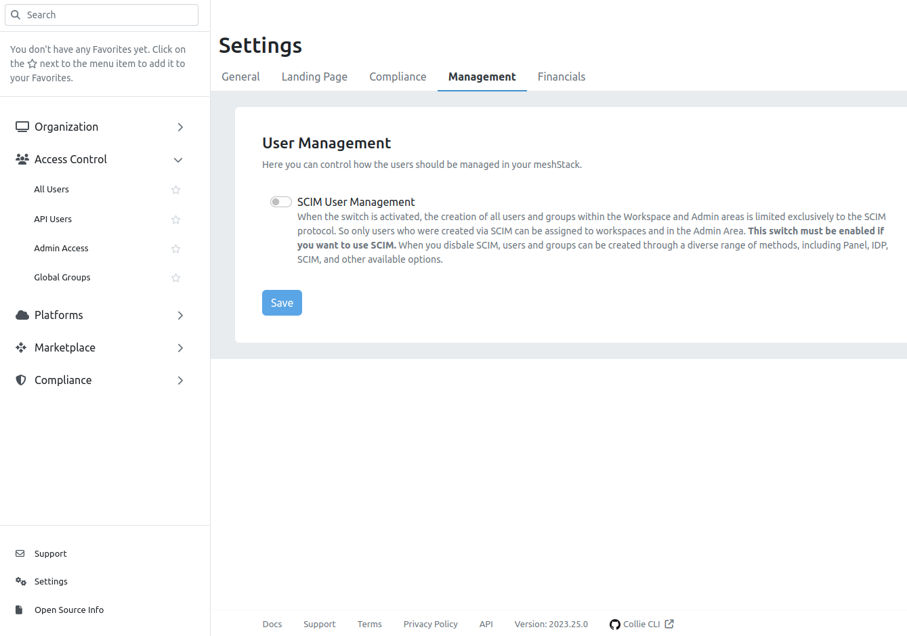

Provisioning users and groups to meshStack works based on the [SCIM 2.0](https://en.wikipedia.org/wiki/System_for_Cross-domain_Identity_Management) standard.
We provide an SCIM API that enables external systems such as an Azure Active Directory (AAD) to directly
manage up-to-date user and group information within meshStack. `Provisioning` means changes about users and groups
in the external system are automatically mirrored to the provisioned equivalents in meshStack. For example, when
the members of a certain AAD group are changing and provisioning is set up, those changes will be reflected in the group within meshStack as well
without additional effort. That way we can model the complete lifecycle of users and groups automatically.

## Enable SCIM

By default, in meshStack, users can be created using a variety of methods such as the Panel, IDP, and other available options. If you prefer to manage
your users exclusively via SCIM, you need to enable this setting in the Admin area. This disables all other methods to prevent conflicts and double
assignments. To enable SCIM, go to the Settings page in the Admin area, and in the 'Manage' tab, turn on the 'SCIM only user management' button.
By default, this button is turned off, allowing users and groups to be created through other means.



## Provisioning with SCIM

SCIM clients are the source for users and groups. They need to address users and groups in order to manage the creation,
updates and deletion. Because they cannot know user or group identifiers in advance they will attempt to find a user or
group by a unique attribute: for users it selects the `userName`, for groups it uses the `displayName`. As a result these fields need to be unique.
To support a wider range of userName formats, meshStack will look up users by their username and uses the email
as a fallback.

**Attention** Each SCIM client handles requests a bit differently. The way the scope of the synchronization is specified plays a huge role when it comes to load and performance. Because of this we specify the officially supported amount of groups and users for each client for now. For the AAD SCIM client we support the synchronization of an unlimited amount of groups with a maximum of 250 users each at the moment. If you want to sync more users please reach out to us via <support@meshcloud.io>.

### Example

The AAD as an SCIM client looks up an existing user by calling:

```sh
GET .../api/scim/v2/Users?filter=userName+eq+"johndoe@company.com"
```

Let's assume there is a user with the username `johndoe@company.com`, then meshStack will then answer with an SCIM ListResponse containing
the matching UserResource, e.g. like this:

```json
{
  ...
  "Resources": [
    {
      "schemas": [
        "urn:ietf:params:scim:schemas:core:2.0:User"
      ],
      "id": "54fbbbaa-c80c-49df-b13d-27133cb81740",
      "userName": "johndoe@company.com",
      ...
    }
  ],
  ...
}
```

From that response the AAD retrieves the user's id and can from now on refer to this user with the identifier `54fbbbaa-c80c-49df-b13d-27133cb81740`.
Let's further assume that the AAD wants to update the members of a group with the identifier `d90c1657-63b1-44be-8cdc-e3a8ffc5a7d1` and the aforementioned user
is the only member, then the AAD will send the following PatchOperation:

```sh
PATCH .../api/scim/v2/Groups/d90c1657-63b1-44be-8cdc-e3a8ffc5a7d1
{
    "schemas": [
        "urn:ietf:params:scim:api:messages:2.0:PatchOp"
    ],
    "Operations": [
        {
            "op": "Add",
            "path": "members",
            "value": [
                {
                    "value": "54fbbbaa-c80c-49df-b13d-27133cb81740"
                }
            ]
        }
    ]
}
```

## SCIM API limitations

The SCIM standard introduces comprehensive functionality to work with user and group resources.
The implementation of meshStack's SCIM API does not support all features of SCIM. Here is a list of current limitations:

- SCIM endpoints on `/ResourceTypes` and `/Schemas` are not supported
- Filtering options to search resources are reduced:
  - For users: only simple equals filters on *one* of the following fields: `id`, `userName`, `externalId`
  - For groups: only simple equals filters on *one* of the following fields: `id`, `displayName`
- The parameter for excluded attributes in the search endpoints is limited:
  - For users to: `name`, `userName`, `emails`
  - For groups to: `members`, `displayName`

## Global Groups

The established concept of a group in meshStack is called a "meshWorkspaceUserGroup". Those are always related to a meshWorkspace,
so they exist with a relation to one.  With the provisioning of users and groups to meshStack we introduce a new type of
groups called "global groups". Those are not owned by a meshWorkspace but are rather available to all of them.
They cannot be modified manually or programmatically but are synced only via an external system, in this case an Azure AD.
Assignment of global groups to meshWorkspaces and meshProjects within the meshPanel works the same way as it does for meshWorkspaceUserGroups.

## AAD Configuration

The following guide shows how an AAD can be configured to enable SCIM user and group provisioning to meshStack. In order
to connect to meshStack you will need a Basic Authentication user with permissions to access the SCIM Api. Please refer
to the [Authentication](/api/#authentication) section within the API Docs for the credentials configuration.

### General Setup Steps

To set up the provisioning on AAD side, have a look at [Microsoft's guideline](https://docs.microsoft.com/en-us/azure/active-directory/app-provisioning/configure-automatic-user-provisioning-portal) and please follow these steps:

1. Create a new non-gallery Enterprise Application (EA) in your AAD that is dedicated to the provisioning. A step-by-step guide is available [here](https://docs.microsoft.com/en-us/azure/active-directory/app-provisioning/use-scim-to-provision-users-and-groups#getting-started).
2. In the EA set up the meshStack endpoint as target API:
   1. Go to the "Provisioning" section and then to "Admin Credentials"-
   2. Use your meshStack's backend URL as endpoint: `https://meshfed.<meshStack>/api/scim/v2/`.
   3. Create an [API user](administration.apiusers.md) with permission `Use all SCIM endpoints provided by meshStack` in meshStack.
   
   4. Set the base64 encoded Basic Auth Credentials as "Secret Token".
   
3. Go to "Settings" menu within "Provisioning" and configure which users and groups should be provisioned. You can either:
   1. Sync only users and groups that are assigned to your EA.
   2. Sync all users and groups from your AAD. This option should always be combined with Scopes as described in the step below.
4. To fine-tune which users and groups are synced go to "Provisioning", then "Mappings" and then to "Users" / "Groups". For users and groups you can separately define Scoping Filters as described in the [official guidelines](https://docs.microsoft.com/en-us/azure/active-directory/app-provisioning/define-conditional-rules-for-provisioning-user-accounts#create-scoping-filters) from Microsoft.
    - Add filter rules by navigating to the `Attribute Mapping`, then go to `Source Object Scope` and select `Add scoping filter`. This applies for both groups and users.
    

5. In the Mapping for Users make sure that you have the mappings configured as described in the [user mappings table](#user-mappings-table) and remove all other mappings. Note that the externalId attribute should be mapped to the AAD Attribute that is used as the euid in meshStack.
6. Start the provisioning process and regularly monitor the provisioning logs.

### User Mappings Table

| AAD Attribute                                                 | SCIM app attribute (meshStack)             |
|---------------------------------------------------------------|--------------------------------------------|
| userPrincipalName                                             | userName                                   |
| Switch([IsSoftDeleted], , "False", "True", "True", "False")   | active                                     |
| displayName                                                   | displayName                                |
| mail                                                          | emails[type eq "work"].value               |
| givenName                                                     | name.givenName                             |
| surname                                                       | name.familyName                            |
| Join(" ", [givenName], [surname])                             | name.formatted                             |
| Attribute which is used as euid in your meshStack             | externalId                                 |

### How to map attributes via expressions

In various scenarios, modifying user attributes before synchronizing them with meshStack can be beneficial. For instance, certain organizations require the utilization of specialized user accounts for administrative tasks. These "admin users," in contrast to "normal users" employed for daily office activities, frequently lack email attributes. The following is a method to establish a mapping that assigns the email attribute using an expression.

Navigate to the enterprise application and open the expression builder.
Use the expression builder to build the desired expression.


In this example, the expression is `IIF(Left([userPrincipalName], 4) = "sadm", [otherMails], [userPrincipalName])`.
When a user's userPrincipalName begins with `sadm`, the otherMails attribute is retrieved. If it does not begin with `sadm`, then the userPrincipalName itself is returned.

After finalizing the expression, proceed to open the user mapping settings.


Within the user mappings table, edit the attribute you want to modify.


Choose Mpaping type Expression and insert the expression you have built earlier.


The synchronisation will now use the expression to map values from Entra ID to meshStack users.


## User Lifecycle with AAD and SCIM

The following section describes how users are created and removed from meshStack when you have Azure Active Directory
(AAD) configured as described above.

### Creation

AAD sends a request to create a user via SCIM if that user is in the provisioning scope of the Enterprise Application.

### Deactivation

SCIM deactivation requests are sent, for example, in the following cases:

- A user has moved out of the provisioning scope.
- A user was explicitly disabled in AAD.
- A user was removed in AAD, but not permanently deleted yet: If the user is still visible in the "Deleted users"
  section in AAD, then the user is deactivated, but not deleted.

Deactivating a user via SCIM has the following consequences in meshStack:

- The user will have their access rights revoked from all platforms.
- The user will be unable to log in to meshPanel. This is also the case when federated authentication is used with an
  IdP other than AAD. For example, if AAD is used to synchronize users to meshStack, but Google SSO is used for
  authentication, users are unable to login if AAD deactivated them via SCIM, regardless of their activation status in
  Google.

User deactivation is reversible: If meshStack subsequently receives an SCIM request to activate this user, then the user
will regain their previous access rights on all platforms as well as the possibility to log in to meshPanel.

### Deletion

SCIM deletion requests are sent, for example, in the following cases:

- The user was *permanently* deleted in AAD.
- The user was previously deleted in AAD, and has now automatically been permanently deleted in AAD after a given
  period (usually 30 days) has passed.

**Attention**: A previous version of this guide has explicitly demanded to configure AAD such that user deletion via
SCIM is disabled, because previous versions of meshStack did not support deletion. With the current version of
meshStack, deletion is supported. If you have previously disabled user deletion and now want to enable it, please
proceed as follows:

In the Azure portal, visit the service "Azure Active Directory" and the section "Enterprise Application". Then, navigate to
"Provisioning" → "Edit attribute mappings" to see the user mapping. Below "Target Object Actions", three checkboxes are
displayed: "Create", "Update" and "Delete". Ensure that all three checkboxes are checked.

Deleting a user via SCIM has the following consequences in meshStack: The user will be irrevocably deleted and only the
bare minimum of information required for GDPR compliance is retained. After deletion, it is possible to create a new
user with the same username and email as the previously deleted user, but the deleted user cannot be restored.
