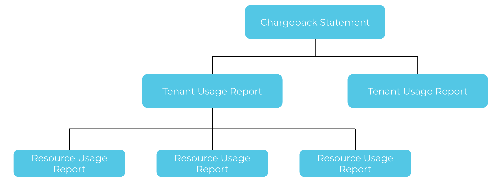

> **Note:** Cost management capabilities described below are only available with the meshStack FinOps module.

## Key Components

### Chargeback Statements

Chargeback statements provide transparency around costs incurred in one project over a month. Chargeback statements are generated with the information provided by the integrated and used platforms. Chargeback statements include one or more tenant usage reports. Chargeback statements are available in the admin area and workspace manager in meshPanel and can be exported for further analysis.

### Tenant Usage Reports

Tenant usage reports provide detailed insights into resource consumption and associated costs for a tenant. These reports help teams understand their cloud usage patterns, identify cost drivers, and optimize spending. Usage reports are available in the admin area and workspace area in meshPanel.

### Resource Usage Reports

 Resource usage reports are optional and can be included into tenant usage reports via API. Use the "meshResourceUsageReport" endpoint to provide cost data from external systems to meshStack. A resource usage report will be picked up by the metering system of meshStack and subsequently included into regular tenant usage reports. Use this if you want to provide cost information to meshStack and use a platform without native metering support.

### Payment Methods

Just like you pay for a new t-shirt online via your credit card, application teams "reference" payment methods for cost allocation of their environments. Payment methods are used for allocating cost from projects.

Payment methods are created per workspace and can be customized via the admin area under tags to reflect organization information such as cost centers, department information, etc.

Additionally, it is possible to provide a euro amount to a payment method for budgeting purposes.

---

Below is an example diagram illustrating financial reports:

---

## Related Resources
- [Payment Methods Concept](./new-concept-payment-methods.md)
- [meshStack Chargeback Statements Documentation](../meshcloud.chargeback-v2.md)
- [meshStack Tenant Usage Reports Documentation](../meshcloud.project-metering.md)
- [How to Manage a Workspace](./new-guide-how-to-manage-a-workspace.md)
- [How to Manage a Project](./new-guide-how-to-manage-a-project.md)
