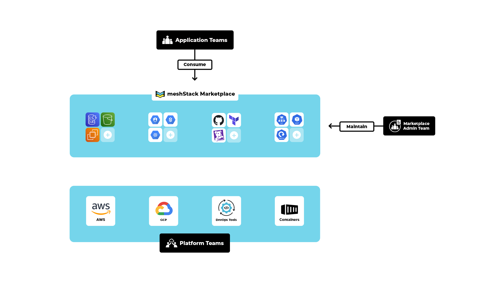

meshStack provides you with an online shopping experience in the enterprise. The marketplace is a central hub for providing and discovering platforms, building blocks and services. It enables platform teams to offer standardized, reusable components to application teams in self-service.

The service catalog presents application teams with details, prices, and documentation for all available platforms, building blocks and services, allowing them to effortlessly add them to their Projects.

---

Below is an example diagram illustrating the marketplace concept:

