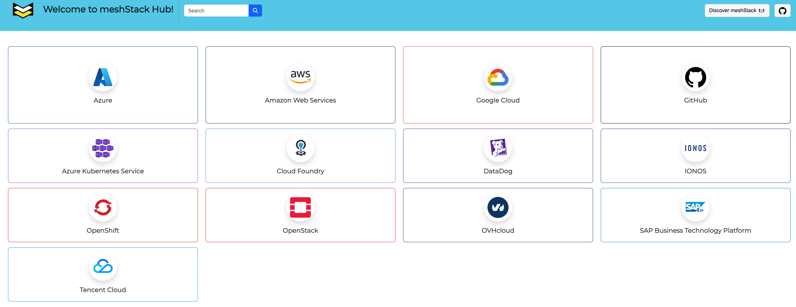

[meshStack Hub](https://hub.meshcloud.io/all) serves as a central repository for ready-to-use building block definitions. Explore existing building blocks to jump-start your automation journey. The meshStack Hub offers reusable components that can be easily imported into your meshStack environment. You can also clone building block definitions to your own GitHub or GitLab account for customization and extension.

Below is an example diagram illustrating the meshStack Hub:

