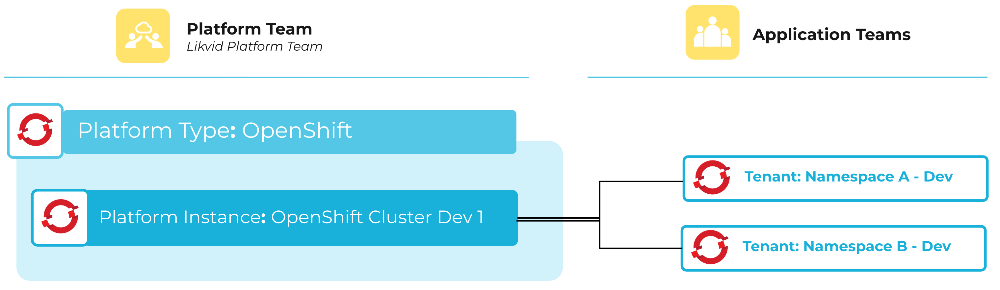

A Platform represents a connected platform that can be managed and integrated with the meshStack. Platforms are registered and configured by administrators and provide the foundation for provisioning tenants.

## Platform Types and Instances

A **Platform Type** refers to the general category of platform, such as AWS, Azure, GCP, OpenStack, or Cloud Foundry.

A **Platform Instance** is associated with a platform type:

- **Public Cloud**: e.g. Azure (platform type) and Azure Tenant (platform instance). You may use multiple instances of the same platform type to represent different business units within your organization.

- **Private Cloud**: e.g. OpenShift (platform type) and OpenShift Dev Cluster (platform instance).

## Supported Platforms

meshStack supports various platforms out of the box:

- **Amazon Web Services (AWS)**
- **Microsoft Azure**
- **Azure Resource Groups**
- **Google Cloud Platform (GCP)**
- **OpenStack**
- **Cloud Foundry**
- **Kubernetes**
- **OpenShift**
- **AKS (Azure Kubernetes Service)**
- **GKS (Google Kubernetes Service)**

Furthermore we provide the option to onboard you very own platforms. For more information on how to establish a custom platform, refer to the [How to Establish a Custom Platform](new-guide-how-to-establish-a-custom-platform.md) guide.

## Restricted Platforms

A **Restricted Platform** is a platform instance that has limited access or usage within meshStack. Only authorized application teams or workspaces can provision tenants of restricted platforms. Platform Engineers can configure the workspaces individually under the platform settings in the platform builder.

---

Below is an example diagram illustrating the platform concept:

## Related Resources
