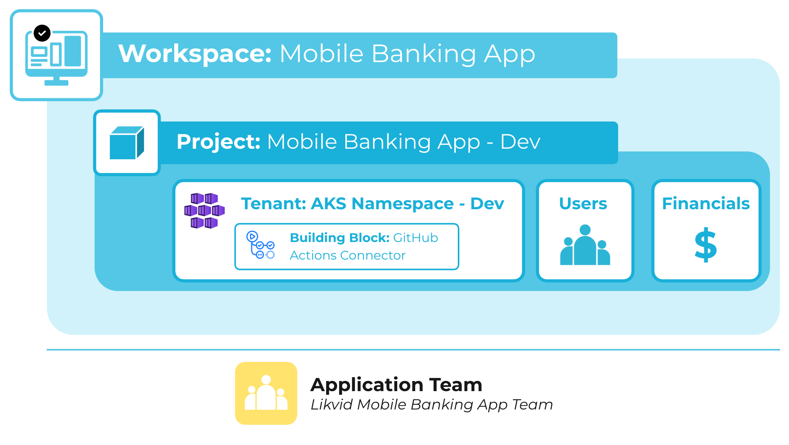

Projects enable clear separation of environments—such as development, testing, or production—within a workspace. Each project belongs to a workspace and can be managed by workspace users with Workspace Owner and Workspace Manager permissions.

Projects allow you to:

- Manage user access to the associated tenants and resources within each environment.
- Gain financial insights into the costs incurred by the project, supporting budgeting and cost control allocation.
- Provide organizational context via tags, which can be replicated to platform resources.

---

Below is a visual example of how projects are structured in meshStack:

## Related Resources