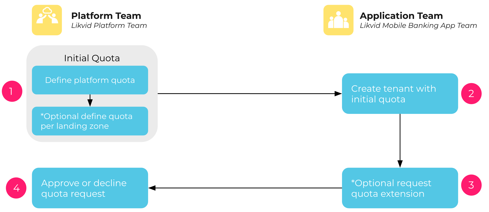

> **Note:** Resource quota management is supported for Cloud Foundry, OpenStack, and Kubernetes based platforms.

Resource quotas control the amount of resources a tenant can consume within a platform, helping ensure fair usage and prevent resource exhaustion. Quotas typically limit usage such as CPU, memory, storage, or other platform-specific resources.

- **Quota Definition**: Platform engineers can define resource quotas through meshStack using the landing zone and platform configuration in platform builder.
- **Quota Changes**: Application teams can request additional resources or quota increases through the meshStack workspace manager.
- **Quota Approval**: Platform engineers review and approve these requests based on resource availability via the tenant screen in the platform builder.
- **Quota Enforcement**: meshStack replicates and enforces these quotas as part of the desired state, ensuring tenants remain within their allocated limits.

For details on requesting more quota, see [How to Request More Tenant Quota](./new-guide-how-to-request-more-tenant-quota.md).

---

Below is an example diagram illustrating resource quota management:

---

<!--
## Related Resources
- [Tenant Concept](./new-concept-tenant.md)
- [How to Request More Tenant Quota](./new-guide-how-to-request-more-tenant-quota.md)
-->
