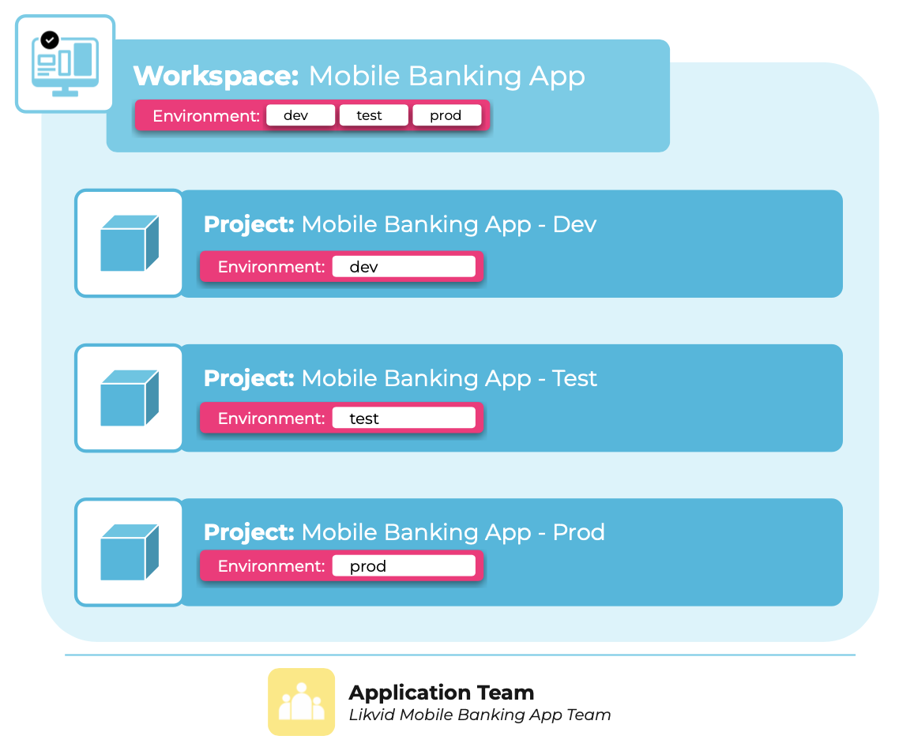

Tags are key-value labels in meshStack that add business context to enable reporting, and support automation by attaching metadata to cloud resources. Use tags for cost allocation, compliance, ownership tracking, and policy enforcement.

Tags are visible throughout meshStack and can be referenced in policies for automated governance. Tags can only be configured in the admin area.

## Available Configuration Options

- **Display Name**: Human-readable label shown in the UI.
- **Name**: This name used for uniquely identifying the tag and when exporting it or when using it within a landing zone. The name cannot be changed later.
- **Description**: Explains the tag's purpose or usage to the workspace users.
- **Tag Type**: There are a wide variety of tag types available in meshStack, including:
  - **Single Select**: Allows only one value to be selected from a predefined list.
  - **Multi Select**: Allows multiple values to be selected from a predefined list.
  - **Text**: Free-form text input.
  - **Number**: Numeric input.
  - **Date**: Date input.
  - **Boolean**: True/False selection.
- **Restricted**: Editable only by admins.
- **Immutable**: Set during creation and cannot be changed later.
- **Replicated**: Automatically copied to all relevant resources or environments.
- **Mandatory**: Must be provided when creating or updating resources.
- **Default Value**: Pre-filled value used if no value is provided during resource creation.
- **Regular Expression**: Pattern that tag values must match to be considered valid.

## Tag Length

Tag values can be up to 255 characters. Ensure your tags configured as replicated meet the requirements of each platform.

## Example

## Related Resources

- [How to Provide Security Contact Information in Tenants](./new-guide-how-to-provide-security-contact.md)
- [How to Provide Organization Context to the Platform](./new-guide-how-to-provide-organization-context.md)
