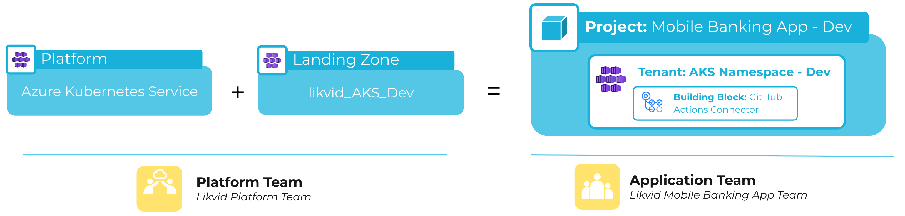

A tenant represents an isolated segment within a platform. Each tenant is an instantiation of a platform resource, providing a dedicated environment for a specific use case. Resources can be added to a tenant via meshStack building blocks or directly through the platform's native capabilities.

Each tenant belongs to a project and can be accessed by users assigned to that project.

## Platform mapping

Here is a mapping of the term "tenant" across different platforms:

| Platform                | Tenant Equivalent         |
|-------------------------|--------------------------|
| AWS                     | Account                  |
| Microsoft Azure         | Subscription             |
| Google Cloud            | Project                  |
| Kubernetes & OpenShift & AKS | Namespace                |
| OpenStack               | Project                  |
| CloudFoundry            | Space                    |

:::info 💡Note
If you provide your own platform, you can define the tenant equivalent via the modular building blocks in the landing zone. See [How to Provide Your Own Platform Guide](new-guide-how-to-provide-your-own-platform.md).
:::

## Desired State of a Tenant

meshStack brings together the project context such as tags and users, the landing zone configuration, and platform settings (managed by platform engineers via the platform builder) to define the desired state of a tenant. 

- meshStack regularly checks and updates tenants to match the desired state.  
- This process is called replication and ensures all tenants managed by meshStack are always in the correct state.  
- The default frequency is set to once per day, but this can be adjusted by contacting support@meshcloud.io.

## Tenant Status
The tenant status provides insight into the current state of the environment within the platform. It helps identify integration issues or configuration mismatches. The available statuses are:

- **Successful**: The desired state has been applied, and the tenant is synchronized with the platform.
- **In Progress**: Changes to the tenant are being processed, such as creation, update, or deletion. The final state may take some time to be reflected.
- **Failed**: An error occurred while applying the desired state to the tenant.
- **Requires Approval**: The tenant is pending approval for deletion. This status is visible only in the admin area and platform builder.
- **Deleted**: The tenant has been removed and is no longer accessible. This status is visible only in the admin area and platform builder.

## Unmanaged Tenants

meshStack also enables you to view tenants discovered in integrated platforms that have not yet been added to meshStack. This helps identify unmanaged environments and facilitates their onboarding into meshStack for consistent governance and management.

## Related Resources

### Concepts

- [Platform](new-concept-platform.md)
- [Project](new-concept-project.md)

### Guides

- [How to Manage a Tenant](new-guide-how-to-manage-a-tenant.md)
- [How to Manage a Platform](new-guide-how-to-manage-a-platform.md)
- [How to Provide Your Own Platform](new-guide-how-to-provide-your-own-platform.md)
- [How to Enforce Resource Quotas in a Tenant](new-guide-how-to-enforce-resource-quotas-in-a-tenant.md)
