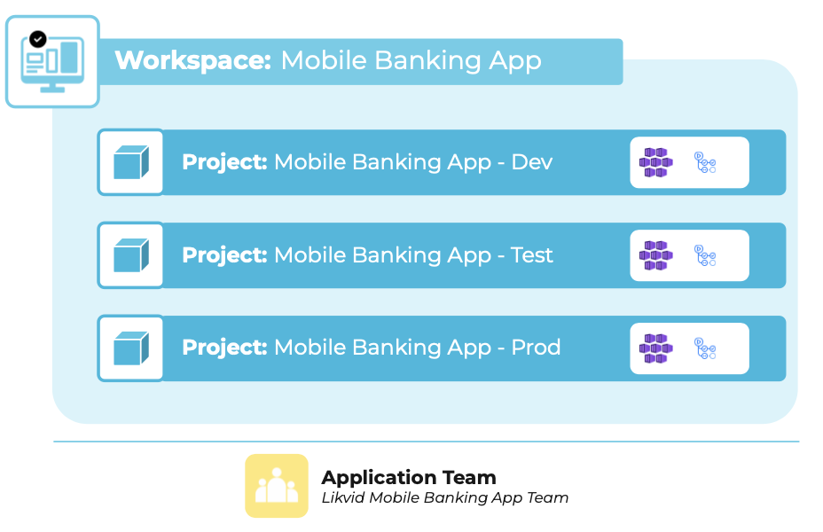

Workspaces can be used by:

- Application teams to manage one or more business applications and their teams via the workspace manager.
- Platform teams to provide platforms and building blocks for application teams via the platform builder, and to test and operate their services via the workspace manager.

Workspaces can be accessed via the top navigation bar. You only have access to workspaces you're a member of, and you can switch between them easily using the drop-down menu.

Workspace creation can be configured in two ways:

- **Self-service**: Users can create workspaces directly through meshPanel in self-service mode.
- **API-based**: If you use an ITSM solution such as ServiceNow, you can initiate workspace creation through an API, enabling integration with existing approval workflows. This approach allows the creation process to be externalized and automated according to your organization's requirements.

Each workspace includes a [Workspace Manager](new-concept-meshstackareas#workspace-manager) and [Platform Builder](new-concept-meshstackareas#platform-builder).

---
Below is a visual example of how workspaces are structured in meshStack:

## Related Resources

### Concepts

- [meshStack Areas](./new-concept-meshstackareas)
- [Workspace Users and Permissions](./new-concept-users-and-groups#workspace-users-and-permissions)

### Guides

- [How to Manage Workspaces](./new-guide-how-to-manage-a-workspace)
- [How to Onboard your Team to a Workspace](./new-guide-how-to-onboard-your-team)
- [How to Limit Workspace Resources](./new-guide-how-to-limit-workspace-resources)

