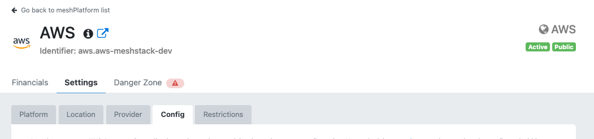
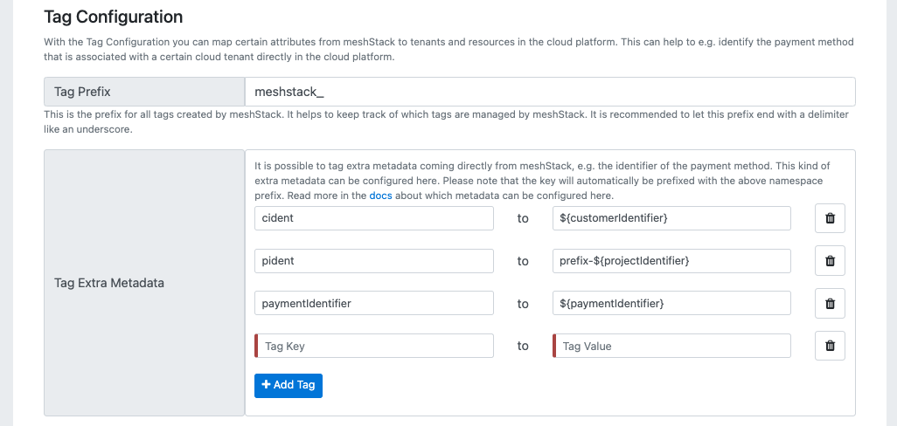

:::note What is this guide about?
This guide shows you how to use tags in meshStack to provide organizational context to teams, applications and environments.
:::

:::note Best Practice Tip
We advise you to choose tag names that work for all platforms you use. This way, you can ensure that the tags are consistently applied.
:::

## Create a Central Tag Catalog

:::note
Please be aware that central tag characteristics e.g. type can't be changed after the first creation.
:::

### Prerequisites

- You have access to meshStack as an organization admin.

### Step by Step Guide 

1. **Navigate to the Tags Section**
   - Go to the admin area of meshStack.
   - Click on **Tags** in the left sidebar.
2. **Create a New Tag**
   - Click **Create Tag**.
   - Save your new tag.
3. **Rollout Tags**
   - Use the meshPanel or API to apply tags to existing resources.
   - Set tags up as mandatory if you want them to be required for new resources.

## Modify Existing Tags

:::warning
Changes to existing tags are not automatically propagated to existing resources. You need to update the resources manually via meshPanelor via API.
:::

### Prerequisites

- You have access to meshStack as an organization admin.

### Step by Step Guide

1. **Navigate to the Tags Section**
   - Go to the admin area of meshStack.
   - Click on **Tags** in the left sidebar.
2. **Select the Tag to Modify**
   - Click on the tag you want to modify.
3. **Edit Tag Properties**
   - Update the tag properties as needed.
   - Save your changes.
4. **Update Existing Resources**
   - Use the meshPanel or API to apply the updated tag to existing resources.

## Delete Existing Tags

### Prerequisites

- You have access to meshStack as an organization admin.
- Tag in scope of deletion is not part of a policy

### Step by Step Guide

### Step by Step Guide

1. **Navigate to the Tags Section**
    - Go to the admin area of meshStack.
    - Click on **Tags** in the left sidebar.
2. **Delete the Tag**
    - Click the trash icon in the 'Actions' column for that tag.
3. **Confirm Deletion**
    - Once deletion is finalized, the list of active tags will be updated.

## Exposing Tags to Platforms

### Prerequisites

- You have access to meshStack as an organization admin.
- You have defined tags in the admin area that you want to expose to platforms.

### Step by Step Guide

1. **Navigate to the Landing Zone Section**
   - Go to the admin area of meshStack.
   - Click on **Landing Zone** in the left sidebar.
2. **Select the Landing Zone**
   - Click on the landing zone where you want to expose tags.
3. **Configure Tag Replication**
   - In the landing zone settings, add the tag keys you want to expose.
4. **Save Changes**
   - Save the landing zone configuration.
5. **Verify Tag Replication**
    - Check the platform to ensure that the tags are replicated correctly.

:::note Handling Tag Conflicts
It's possible that these objects have tags with the same tag key. For example, both the meshWorkspace and
meshProject could contain a `cmdb-id` tag. Setting the `cmdb-id` tag value on the
meshWorkspace provides it as a "default" value to all tenants owned by that meshWorkspace. A user can then override
this default value on an individual meshProject by providing a value for the optional `cmdb-id` tag on the meshProject.

When merging the tag sources for a meshTenant, meshStack therefore applies the following precedence rule:

```text
meshProject tags > payment method tags > meshWorkspace tags
```

You can find an example in the table below which explains this behavior:

| meshObject        | Tag Name | Tag Value |
| ----------------- | -------- | --------- |
| meshWorkspace     | cmdb-id  | 12        |
| meshPaymentMethod | cmdb-id  | 34        |
| meshProject       | cmdb-id  | 56        |

This example would result in `cmdb-id` being equal to `56` as the meshProject has the highest priority.
:::

### HTTP Header Interface

Some Landing Zone assets like [GCP Cloud Functions](meshstack.gcp.landing-zones.md) or [Azure Functions](meshstack.azure.landing-zones.md) receive metadata tags from meshStack using HTTP Headers. meshStack invokes these Landing Zone assets using the following HTTP headers:


| HTTP Header Name                 | Description                                                                                                                   |
|----------------------------------|:------------------------------------------------------------------------------------------------------------------------------|
| `x-mesh-customer-identifier`     | meshWorkspace Identifier                                                                                                      |
| `x-mesh-project-identifier`      | meshProject identifier                                                                                                        |
| `x-mesh-costcenter` *deprecated* | If available, ID of the CostCenter selected for this meshProject. Please use `x-mesh-tag-cost-center` or another tag instead. |
| `x-mesh-tenant-platform-number`  | A increasing sequence number for a meshProject tenant on a specific platform.                                                 |
| `x-mesh-landing-zone-identifier` | landing zone identifier                                                                                                       |
| `x-mesh-tag-${format(tagName)}`  | metadata tags as defined in the tags screen in the admin area                                                                 |

Headers for *metadata tags* are formatted to an http-header name by converting `camelCase` tag names into a dashed string i.e. `camel-case` and prefixing them with `x-mesh-tag-`.
As a full example, a tag named `myCustomerTag` would be provided as an HTTP header with name `x-mesh-tag-my-customer-tag`.

## Tags in Cloud Tenants

Beside having tags in meshStack, it is also useful for cloud-native users to be aware of the metadata within e.g. Azure. This is why meshStack
supports the ability to "replicate" the tags into the actual cloud platforms. The entire lifecycle of these tags can be managed by meshStack. This means tags on the cloud platform are updated and removed depending on the underlying metadata of the replicated meshProject. meshStack manages all tags of a prefixed namespace (e.g. the `meshstack_` prefix in the tag label `meshstack_costcenter:12345` indicates that this is a meshStack managed tag).

Use the config tab in the [platform control plane](administration.platforms.md#platform-control-plane) and the [tag definition user interface](#how-to-define-a-new-tag) to enable automatic replication of tags to cloud tenants.





Every platform might have different limitations about the tag names and values, which are described in the following sections.

### Extra metadata

The tag definition configuration describes on a per-platform basis how these tags are extracted and transformed into cloud platform tags.
The following extra metadata can be used in such a tag definition configuration:

| Tag Key                       | Description                                                                                                                                               |
| ----------------------------- | :-------------------------------------------------------------------------------------------------------------------------------------------------------- |
| `${projectIdentifier}`        | The project identifier                                                                                                                                    |
| `${workspaceIdentifier}`      | The project's workspace identifier                                                                                                                        |
| `${workspaceName}`            | The projects's workspace name                                                                                                                             |
| `${projectName}`              | The project display name                                                                                                                                  |
| `${landingZoneName}`          | The name of the applied [landing zone](meshcloud.landing-zones.md). It contains `no-landingzone` if the tenant does not have a landing zone applied       |
| `${landingZoneIdentifier}`    | The identifier of the applied [landing zone](meshcloud.landing-zones.md). It contains `no-landingzone` if the tenant does not have a landing zone applied |
| `${paymentIdentifier}`        | The identifier of the payment method that is assigned to the project                                                                                      |
| `${paymentName}`              | The display name of the payment method that is assigned to the project                                                                                    |
| `${paymentExpirationDate}`    | The expiration date of the payment method that is assigned to the project. It contains `none` if no expiration date is set for the payment method         |
| `${paymentAmount}`            | The amount of the assigned payment method. It is `none` if no payment method is set                                                                       |
| `${contactMail}`              | The email of workspace owner of this project. It is `none` if no owner is set                                                                             |
| `${ownerUsername}`            | The username of the workspace owner of this project. It is `none` if no owner is set                                                                      |
| `${ownerFirstName}`           | The first name of the workspace owner of this project. It is `none` if no owner is set                                                                    |
| `${ownerLastName}`            | The last name of the workspace owner of this project. It is `none` if no owner is set                                                                     |
| `${additionalOwnerUsername}`  | The username of the additional workspace owner of this project. It is `none` if no additional owner is set                                                |
| `${additionalOwnerFirstName}` | The first name of the additional workspace owner of this project. It is `none` if no additional owner is set                                              |


## Provide Information as an Application Team

:::note 
The tags available on an objects are defined by the meshStack admins via the admin area. Application teams can provide values for these tags in the workspace or project configuration.
:::

### Prerequisites

- You have access to a workspace in meshStack.
- You have workspace owner or admin permissions.

### Step by Step Guide for Workspace Tags

1. **Navigate to the Workspace**
   - Log in to meshStack and select your workspace from the top navigation bar.
2. Navigate to the **Tags** section under **Settings**.
3. **Add Values to Tags**
   - Click on the tag you want to update.
   - Enter the required information in the tag value field.
   - Save your changes.

### Step by Step Guide for Project Tags

1. **Navigate to the Workspace**
   - Log in to meshStack and select your workspace from the top navigation bar.
2. **Select the Project**
    - Within the workspace, choose the relevant project.
3. Navigate to the **Tags** section under **Settings**.
4. **Add Values to Tags**
   - Click on the tag you want to update.
   - Enter the required information in the tag value field.
   - Save your changes.

## Related Resources

- [Tag Concept](new-concept-tag)
- [How to Manage a Workspace](new-guide-how-to-manage-a-workspace)