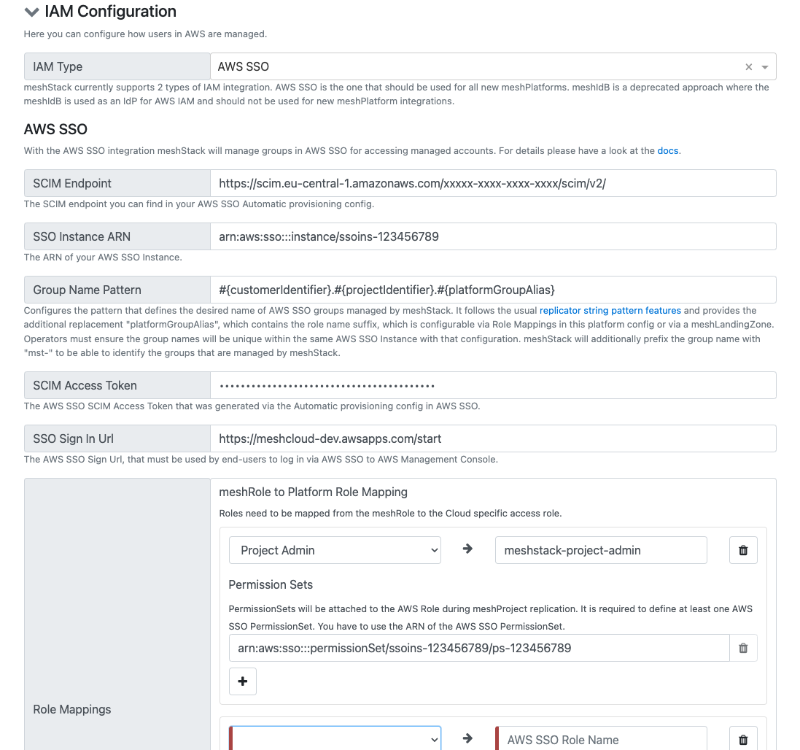
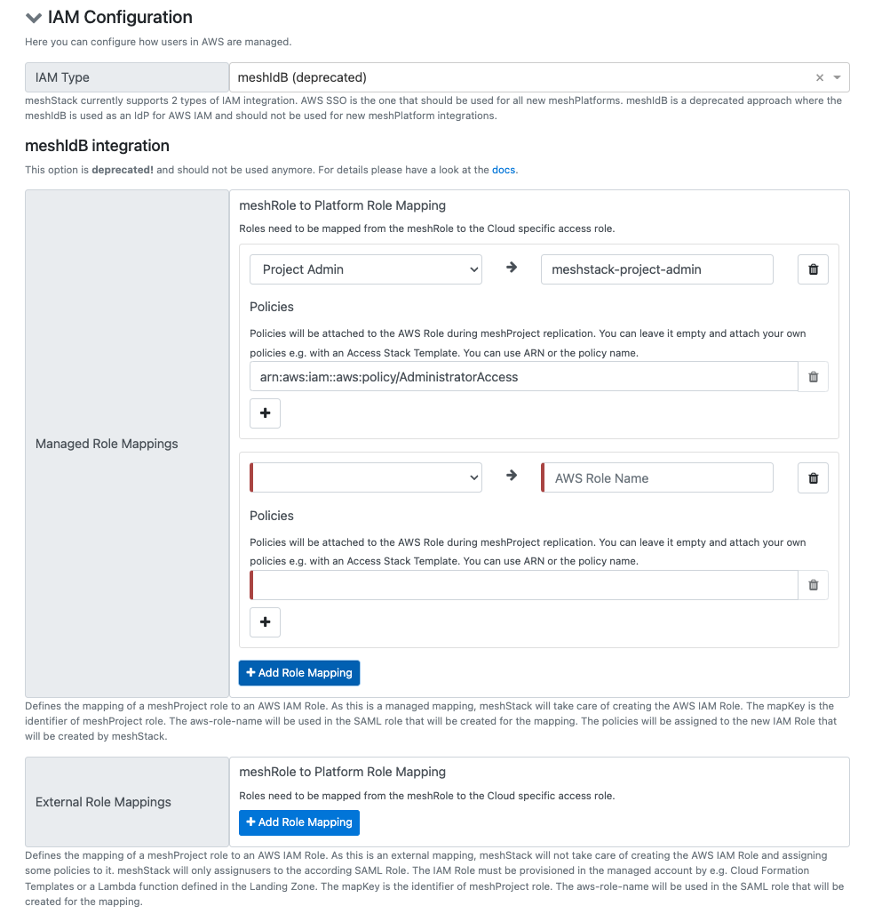
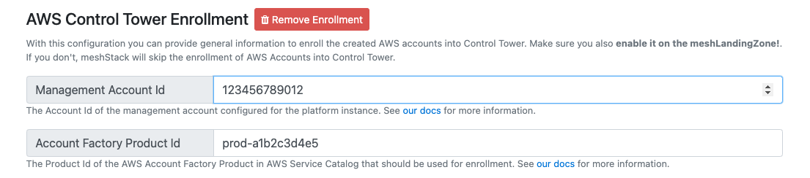
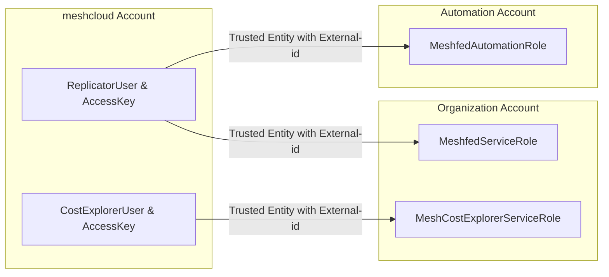

:::note What is this guide about?
This guide shows you how to integrate your AWS platform into meshStack. This is a required step to provide AWS accounts in self-service, metering and billing, and to manage AWS authorization in meshStack.
:::

## Prerequisites

- Access to a platform builder
- Access to the AWS Management Console

## Best Practice Integration

The recommended way to set up AWS as a meshPlatform is via the public terraform [AWS platform module](https://github.com/meshcloud/terraform-aws-meshplatform). The steps below are not needed if you decide to use it.

## Step by Step Guide For Manual Integration

### 1. Set up AWS Account 1: meshcloud

The meshStack AWS Connector uses a dedicated set of IAM credentials to work with AWS APIs on behalf of meshStack. To create these credentials, create a user in IAM with these specifications:

* User name: `meshfed-service-user`
* AWS access type: Programmatic access - with an access key

This user should have the following policy attached to assume the respective roles in the management account and in the automation account. Replace the MANAGEMENT_ACCOUNT_ID, AUTOMATION_ACCOUNT_ID and EXTERNAL_ID placeholders accordingly.

```json
{
    "Version": "2012-10-17",
    "Statement": [
        {
            "Sid": "",
            "Effect": "Allow",
            "Action": "sts:AssumeRole",
            "Resource": "arn:aws:iam::<<MANAGEMENT_ACCOUNT_ID>>:role/MeshfedServiceRole",
            "Condition": {
                "StringEquals": {
                    "sts:ExternalId": "<<EXTERNAL_ID>>"
                }
            }
        },
        {
            "Sid": "",
            "Effect": "Allow",
            "Action": "sts:AssumeRole",
            "Resource": "arn:aws:iam::<<AUTOMATION_ACCOUNT_ID>>:role/MeshfedAutomationRole",
            "Condition": {
                "StringEquals": {
                    "sts:ExternalId": "<<EXTERNAL_ID>>"
                }
            }
        }
    ]
}
```

Platform engineers should generate a unique and random value for `EXTERNAL_ID`, e.g. a GUID. meshStack AWS Connector will supply this [ExternalId](https://docs.aws.amazon.com/IAM/latest/UserGuide/id_roles_create_for-user_externalid.html) only when accessing organization member accounts from a privileged (system) context. Using the ExternalId therefore increases the security of member accounts in your organization.

Platform engineers need to securely inject the generated credentials and `EXTERNAL_ID` into the configuration of the AWS Connector.

**Workload Identity Federation**

Instead of using explicit credentials you can also configure identity federation to allow specific identities representing meshStack access to the role assumption policy you created in the previous step.

First, setup an identity provider in the meshcloud AWS account (IAM → access management → identity providers).
Select "OpenID Connect" and enter "provider URL" (issuer) and "audience" values as they are shown by meshStack when selecting "Workload Identity Federation" for authentication during AWS platform config.

Create a role with the role assumption policy from the previous step and assign the following trust policy.
We'll call it the identity federation role:

```json
{
    "Version": "2012-10-17",
    "Statement": [
        {
            "Effect": "Allow",
            "Principal": {
                "Federated": "<meshStack identity provider ARN>"
            },
            "Action": "sts:AssumeRoleWithWebIdentity",
            "Condition": {
                "StringEquals": {
                    "<meshStack identity provider name>:sub": "<replicator subject from meshStack>",
                    "<meshStack identity provider name>:aud": "<audience from meshStack>"
                }
            }
        }
    ]
}
```

This allows one specific identity (the replicator subject) with a specific audience to assume this role.

### 2. Set up AWS Account 2: Management

> Security Note: The demonstrated IAM Policies implement the minimum of configuration required to produce
> a working AWS integration using meshStack AWS Connector. This setup is based on the [default AWS Organization configuration](https://docs.aws.amazon.com/organizations/latest/userguide/orgs_manage_accounts_access.html).
> We advise platform engineers to determine the specific needs and requirements for their usage of AWS and implement more restrictive
> roles and policies.

This `MeshfedServiceRole` should be created in the management account with the following policy attached.

```json
{
    "Version": "2012-10-17",
    "Statement": [
        {
            "Sid": "StsAccessMemberAccount",
            "Effect": "Allow",
            "Action": "sts:AssumeRole",
            "Resource": "arn:aws:iam::*:role/MeshstackAccountAccessRole"
        },
        {
            "Sid": "OrgManagementAccess1",
            "Effect": "Allow",
            "Action": [
                "organizations:UntagResource",
                "organizations:TagResource",
                "organizations:MoveAccount",
                "organizations:ListTagsForResource",
                "organizations:ListParents",
                "organizations:ListOrganizationalUnitsForParent",
                "organizations:DescribeOrganizationalUnit",
                "organizations:DescribeAccount",
                "organizations:CreateOrganizationalUnit"
            ],
            "Resource": [
                "arn:aws:organizations::<<MANAGEMENT_ACCOUNT_ID>>:root/o-*/r-*",
                "arn:aws:organizations::*:ou/o-*/ou-*",
                "arn:aws:organizations::*:account/o-*/*"
            ]
        },
        {
            "Sid": "OrgManagementAccess2",
            "Effect": "Allow",
            "Action": [
                "organizations:ListRoots",
                "organizations:ListAccounts",
                "organizations:DescribeCreateAccountStatus",
                "organizations:CreateAccount"
            ],
            "Resource": "*"
        },
        {
            "Sid": "OrgManagementAccessSSO",
            "Effect": "Allow",
            "Action": [
                "sso:ListAccountAssignments",
                "sso:CreateAccountAssignment",
                "sso:DescribeAccountAssignmentCreationStatus"
            ],
            "Resource": [
              "<<AWS_SSO_INSTANCE_ARN>>",
              "arn:aws:sso:::permissionSet/*/*",
              "arn:aws:sso:::account/*"
            ]
        }
    ]
}
```

In order to enable meshStack to close AWS accounts as part of [tenant deletion](administration.delete-tenants.md), please also include the following statement. We strongly recommend you constrain the permission to close accounts to those OUs you use in your landing zones using an [ResourceOrgPath](https://docs.aws.amazon.com/IAM/latest/UserGuide/access_policies_access-advisor-view-data-orgs.html#access_policies_access-advisor-viewing-orgs-entity-path).

```json
{
    "Action": "organizations:CloseAccount",
    "Condition": {
        "ForAnyValue:StringLike": {
            "aws:ResourceOrgPaths": [
                "o-orgid/r-rootid/ou-ouid/*"
            ]
        }
    },
    "Effect": "Allow",
    "Resource": "arn:aws:organizations::*:account/o-*/*",
    "Sid": "OrgManagementAccessCloseAccount"
},
  ```

The following trust relationship needs to be attached to the MeshfedServiceRole so that the meshfed-service-user can assume the role.

```json
{
  "Version": "2012-10-17",
  "Statement": [
    {
      "Sid": "",
      "Effect": "Allow",
      "Principal": {
        "AWS": "arn:aws:iam::<<MESHCLOUD_ACCOUNT_ID>>:user/meshfed-service-user"
      },
      "Action": "sts:AssumeRole",
      "Condition": {
        "StringEquals": {
          "sts:ExternalId": "<<EXTERNAL_ID>>"
        }
      }
    }
  ]
}
```

> When using workload identity federation the principal must be set to the identity federation role instead: `arn:aws:iam::<<MESHCLOUD_ACCOUNT_ID>>:role/<IDENTITY_FEDERATION_ROLE>`


Replace `MESHCLOUD_ACCOUNT_ID` with the dedicated meshcloud AWS account id where the `meshfed-service-user` lives. Replace `EXTERNAL_ID` accordingly as well.

> For Enrollment with AWS Control Tower, the `MeshfedServiceRole` needs to have extra permissions to invoke the Account Factory.
> More information on that can be found at [AWS Guide](https://docs.aws.amazon.com/servicecatalog/latest/adminguide/controlling_access.html#permissions-end-users-console).
> To make use of these permissions, there must be an available launch path defined in AWS Service Catalog, as stated also in the [prerequisites](#aws-control-tower-integration).

### 3. Set up AWS Account 3: Automation

The automation account should contain a `MeshfedAutomationRole`.

The following policy and trust relationship should be attached to the role so that `meshfed-service-user` can assume it in order to roll out CloudFormation stack instances in the newly provisioned accounts or to invoke a Lambda that would trigger account bootstrapping.

<!--DOCUSAURUS_CODE_TABS-->
<!--Policy-->
```json
{
    "Version": "2012-10-17",
    "Statement": [
        {
            "Sid": "AutomationPolicy",
            "Effect": "Allow",
            "Action": [
                "lambda:InvokeFunction",
                "cloudformation:UpdateStackInstances",
                "cloudformation:ListStackInstances",
                "cloudformation:DescribeStackSet",
                "cloudformation:CreateStackInstances"
            ],
            "Resource": "*"
        }
    ]
}
```
<!--Trust relationship-->
```json
{
  "Version": "2012-10-17",
  "Statement": [
    {
      "Sid": "",
      "Effect": "Allow",
      "Principal": {
         "AWS": "arn:aws:iam::<<MESHCLOUD_ACCOUNT_ID>>:user/meshfed-service-user"
      },
      "Action": "sts:AssumeRole",
      "Condition": {
        "StringEquals": {
          "sts:ExternalId": "<<EXTERNAL_ID>>"
        }
      }
    }
  ]
}
```
<!--END_DOCUSAURUS_CODE_TABS-->

> When using workload identity federation the trusted principal must be set to the identity federation role instead: `arn:aws:iam::<<MESHCLOUD_ACCOUNT_ID>>:role/<IDENTITY_FEDERATION_ROLE>`

In order to roll out CloudFormation Stack Instances in the newly provisioned accounts, create the `AWSCloudFormationStackSetAdministrationRole` as specified in the [documentation](https://docs.aws.amazon.com/AWSCloudFormation/latest/UserGuide/stacksets-prereqs-self-managed.html) and attach the following policy and trust relationship.

<!--DOCUSAURUS_CODE_TABS-->
<!--Policy-->
```json
{
    "Version": "2012-10-17",
    "Statement": [
        {
            "Sid": "AllowAssumeCloudFormationExecutionOnAllAccounts",
            "Effect": "Allow",
            "Action": "sts:AssumeRole",
            "Resource": "arn:aws:iam::*:role/AWSCloudFormationStackSetExecutionRole"
        }
    ]
}
```
<!--Trust relationship-->
```json
{
  "Version": "2012-10-17",
  "Statement": [
    {
      "Sid": "",
      "Effect": "Allow",
      "Principal": {
        "Service": "cloudformation.amazonaws.com"
      },
      "Action": "sts:AssumeRole"
    }
  ]
}
```
<!--END_DOCUSAURUS_CODE_TABS-->

### 4. Set up IAM

Currently meshStack supports 2 different ways of integrating AWS IAM with meshStack, either via [AWS SSO](#aws-sso) or [meshIdB](#meshidb-deprecated) (deprecated). The AWS SSO integration is the preferred integration as it allows using your company's central IdP to log in to AWS. This simplifies integration with meshStack, gives you more control over the AuthN part and improves UX for end-users when logging in to AWS.

**Option 1: Using AWS SSO (recommended)**

The integration with AWS SSO basically works like this: AuthN is done via the company's IdP. Additionally users will be synced via AWS SSO Automated Provisioning (SCIM) to AWS SSO. meshStack takes care of AuthZ. That means meshStack will create groups for every project role on a meshTenant in AWS SSO. meshStack will assign the according users to these groups. As a last step, meshStack assigns the created groups to the respective AWS account with configured PermissionSets.

Details about what needs to be configured inside AWS SSO can be found [here](meshstack.aws.sso-setup.md).

> An important precondition, regarding the automated user provisioning to AWS SSO, is that the userName in AWS SSO has to be set to the [euid](meshstack.identity-federation.md#externally-provisioned-identities). This limitation is caused by AWS SSO only allowing to filter userNames to find users. If an AAD is used as the IdP, that means the userPrincipalName in the AAD must be set to the [euid](meshstack.identity-federation.md#externally-provisioned-identities), as AAD will always set the userName in AWS SSO to its userPrincipalName.

The following configuration options are available in the AWS [Platform Connection Config](administration.platforms.md#platform-connection-config):



**Option 2: Using meshIdB (deprecated)**

As AWS SSO is a rather new AWS feature, meshStack integrated IAM for AWS differently in the past. This AWS IAM integration should not be used
for new integrations anymore. During replication meshStack configures meshIdB as an IdP within the managed account. Additionally according IAM
roles are created during replication (dependent on configuration either my meshStack or by a CF template or a lambda function that are configured.
in the Landing Zone). meshStack also sets up a trust relationship to meshIdB in order to allow SSO for the project users.
meshStack additionally creates according roles in the meshIdB so the AuthZ information on which accounts can be accessed
by which user are then part of the SAML token AWS receives after logging in via meshIdB.

The following configuration options are available in the AWS [Platform Connection Config](administration.platforms.md#platform-connection-config):



### 5. Decide on Naming Patterns

You can define naming patterns based on the [String Templating](meshstack.replication-configuration.md#string-templating) syntax of meshStack for the following properties:

* Account Email Address: Please make sure to consider that this is limited to 64 characters
* Account Alias Pattern: The account alias must be unique across all of AWS. Platform engineers should therefore consider using a company-specific prefix together with a combination of meshWorkspace and meshProject identifier. You can decide if you want to enforce setting the account alias on every replication via a flag in the configuration.

### 6. Identifier Configuration

Platform engineers that want to use AWS must configure their deployment to restrict identifier lengths to meet AWS requirements. The maximum allowed lengths are:

```yaml
customer_identifier_length: 16
project_identifier_length: 30
```

### 7. Integrate AWS Control Tower

(also refer to [AWS Management Account Setup](#aws-management-account-setup))

A `PlatformInstance` can be configured to integrate with an existing AWS Control Tower setup.
In order to manage accounts created by meshStack with AWS Control Tower, these need to be "enrolled".
AWS Control Tower utilizes an Account Factory, to provide new accounts or enroll other accounts with it.
AWS Control Tower will create an Account Factory Product in AWS Service Catalog, that will be invoked to enroll accounts.
meshStack can be enabled to trigger the Account Factory via AWS Service Catalog.
The correct Id of the Account Factory Product needs to be specified in the enrollment configuration besides the management account Id.
meshStack will create new accounts as usual and in a later step will enroll them via the Account Factory with AWS Control Tower.

The following configuration options are available in the AWS [Platform Connection Config](administration.platforms.md#platform-connection-config):



> In order to enroll created accounts with AWS Control Tower, **a Landing Zone must be configured**. The `Target Organization Unit Id` from the Landing Zone
> configuration must belong to a OU that is already enrolled with AWS Control Tower.
> Refer to [Landing Zone Configuration](meshstack.aws.landing-zones.md#target-organization-unit-id) for more information.

The following prerequisites must be fulfilled for the enrollment to work:

1. A configured AWS Control Tower Service
2. All [AWS prerequisites](https://docs.aws.amazon.com/controltower/latest/userguide/enroll-account.html)
3. AWS Service Catalog needs to have an AWS Control Tower Account Factory Portfolio
4. The portfolio needs to contain an AWS Control Tower Account Factory Product
5. The AWS Control Tower Account Factory Product needs to have at least one active Provisioned Artifact (active version)
6. There needs to be a launch path with permissions to invoke the AWS Account Factory Product for meshStack access
7. `MeshfedServiceRole` requires the attached policies `AWSServiceCatalogEndUserFullAccess` and `AWSServiceCatalogAdminReadOnlyAccess` and in addition some extra permissions. These are also described in the [AWS Docs](https://docs.aws.amazon.com/controltower/latest/userguide/roles-how.html). We recommend attaching another custom policy to the `MeshfedServiceRole` that contains the following permissions:

```json
{
  "Version": "2012-10-17",
  "Statement": [
    {
      "Sid": "AWSControlTowerAccountFactoryAccess",
      "Effect": "Allow",
      "Action": [
        "sso:GetProfile",
        "sso:CreateProfile",
        "sso:UpdateProfile",
        "sso:AssociateProfile",
        "sso:CreateApplicationInstance",
        "sso:GetSSOStatus",
        "sso:GetTrust",
        "sso:CreateTrust",
        "sso:UpdateTrust",
        "sso:GetPeregrineStatus",
        "sso:GetApplicationInstance",
        "sso:ListDirectoryAssociations",
        "sso:ListPermissionSets",
        "sso:GetPermissionSet",
        "sso:ProvisionApplicationInstanceForAWSAccount",
        "sso:ProvisionApplicationProfileForAWSAccountInstance",
        "sso:ProvisionSAMLProvider",
        "sso:ListProfileAssociations",
        "sso-directory:ListMembersInGroup",
        "sso-directory:AddMemberToGroup",
        "sso-directory:SearchGroups",
        "sso-directory:SearchGroupsWithGroupName",
        "sso-directory:SearchUsers",
        "sso-directory:CreateUser",
        "sso-directory:DescribeGroups",
        "sso-directory:DescribeDirectory",
        "sso-directory:GetUserPoolInfo",
        "controltower:CreateManagedAccount",
        "controltower:DescribeManagedAccount",
        "controltower:DeregisterManagedAccount",
        "s3:GetObject",
        "organizations:describeOrganization",
        "sso:DescribeRegisteredRegions"
      ],
      "Resource": "*"
    }
  ]
}
```

> During the enrollment process, we create a new role in the tenant account that grants permissions to management
> account to perform AWS Control Tower execution steps. You have to make sure that there is no Service Control Policy (SCP)
> enabled in AWS Organizations that prevents that.


### 8. Set Minimum Access Rights on Provisioned Accounts

When provisioning a new account, a default role with administration privileges will be created in the new account. This role is by default named [OrganizationAccountAccessRole](https://docs.aws.amazon.com/organizations/latest/userguide/orgs_manage_accounts_access.html)
but the name can be configured via meshStack. The MeshfedServiceRole will assume this newly created role in the provisioned account to perform tasks such as setting the account alias or setting up the user roles. meshStack has the capability to self downgrade this role's permissions to a minimum. This can be configured via the `self-downgrade-access-role` configuration flag.
The downgraded role will have the following final policy attached (Note that the `accountId` and `accessRole` placeholders need to be populated with the value of the current account id and the configured access role name).

```json
{
      "Version": "2012-10-17",
      "Statement": [
        {
          "Effect": "Allow",
          "Action": [
            "iam:CreateSAMLProvider",
            "iam:GetSAMLProvider",
            "iam:UpdateSAMLProvider",
            "iam:DeleteSAMLProvider",
            "iam:ListSAMLProviders"
          ],
          "Resource": [
            "arn:aws:iam::{accountId}:saml-provider/*",
            "arn:aws:cloudformation:*:{accountId}:stack/meshstack-cf-access*"
          ]
        },
        {
          "Effect": "Allow",
          "Action": [
            "iam:ListAttachedRolePolicies",
            "iam:CreateAccountAlias",
            "iam:ListAccountAliases",
            "iam:DeleteAccountAlias",
            "iam:GetRole",
            "iam:CreateRole",
            "iam:AttachRolePolicy",
            "iam:UpdateAssumeRolePolicy"
          ],
          "Resource": "*"
        },
        {
          "Effect": "Allow",
          "Action": [
            "cloudformation:DescribeStacks"
          ],
          "Resource": "*"
        },
        {
          "Effect": "Allow",
          "Action": [
            "iam:DetachRolePolicy",
            "iam:DeleteRolePolicy",
            "iam:PutRolePolicy",
            "iam:ListRolePolicies"
          ],
          "Resource": "arn:aws:iam::{accountId}:role/{accessRole}"
        }
      ]
    }
```

As you can see, meshStack has the permissions to upgrade this role if needed. This is to ensure that any new features added to the product will have the required permissions. Any newly added permissions will be notified via the product release notes.

If you prefer that meshStack does not have the capability to upgrade its own role, you can choose to implement your own role downgrade mechanism, for example via a Lambda call, which is also supported by meshLandingZones. In this case the role auto downgrade feature can be disabled.

If you would like to audit the actions taken by this role, you can enable AWS CloudTrail on all the accounts provisioned by meshStack by using an AWS CloudFormation StackSet, which is also supported by meshLandingZones. With the auditing enabled, it will always be possible to identify at which point in time meshStack added additional rights to its role. It will help to easily identify that meshStack was only able to do certain actions given the rights assigned at a certain point in time.

### 9. Set up IAM User for Metering



For the purpose of metering, meshStack requires a user created in the `meshcloud` AWS account (same process as [here](#set-up-aws-account-1-meshcloud)).
A role  should be created in the AWS `management account` which has the following policies attached (This role will be referred to as `MeteringRole` from now on).

1. **MeshCostExplorerServiceRole's Access Policy**: This policy allows the Metering IAM user to call the AWS Cost Explorer API to read data required for metering. Note that Savings Plan and Reserved Instance related permissions are needed only if you have specific meshWorkspaces buying those directly, and you need to implement a cash-flow based Chargeback process for those. See [Reserved Reserved Instances & Savings Plans Guide](meshstack.aws.reserved-instance-guide.md) for more details.
2. **CostExplorerUser's Assume Role Policy**: This policy allows CostExplorerUser IAM user to assume the IAM Role `MeshCostExplorerServiceRole`

<!--DOCUSAURUS_CODE_TABS-->
<!--Organization Account MeshCostExplorerServiceRole's Access Policy-->
```json
{
    "Version": "2012-10-17",
    "Statement": [
        {
            "Sid": "",
            "Effect": "Allow",
            "Action": [
                "ce:GetSavingsPlansUtilizationDetails",
                "ce:GetSavingsPlansUtilization",
                "ce:GetSavingsPlansCoverage",
                "ce:GetReservationUtilization",
                "ce:GetReservationCoverage",
                "ce:GetDimensionValues",
                "ce:GetCostAndUsage",
                "organizations:ListAccounts"
            ],
            "Resource": "*"
        }
    ]
}
```

<!--Meshcloud Account CostExplorerUser's Assume Role Policy-->
```json
{
  "Version": "2012-10-17",
  "Statement": [
    {
      "Sid": "",
      "Effect": "Allow",
      "Principal": {
        "AWS": "arn:aws:iam::<<ORGANIZATION_ACCOUNT_ID>>:role/MeshCostExplorerServiceRole"
      },
      "Action": "sts:AssumeRole",
      "Condition": {
        "StringEquals": {
          "sts:ExternalId": "<<EXTERNAL_ID>>"
        }
      }
    }
  ]
}
```
<!--END_DOCUSAURUS_CODE_TABS-->


## 10. Leverage Reserved Instances & Savings Plans (optional)

This section applies only if your application teams (represented by meshWorkspaces) pay you (the Cloud Foundation team), upfront to purchase Reserved Instances
and Savings Plans directly on their AWS accounts, which give them priority for consuming the RI or SP.
If this is the case, you can enable `reservedInstanceFairChargeback` and `savingsPlanFairChargeback` feature
flags to achieve the following. See [Reserved Reserved Instances & Savings Plans Guide](meshstack.aws.reserved-instance-guide.md) for more details.

The upfront payments will be shown as line items in the tenant usage report for the month on which the Reserved Instance or Savings Plan starts.

meshStack also adds a discount which is equal to the `amortized upfront cost` to the relevant tenant usage report.
This line item will be added to the report every month until the end of the Reserved Instances or Savings Plan period.

To achieve this, meshStack collects the information about Reserved Instances and Savings Plans via the cost explorer API.

## 11. Set UP AWS Tenant Import (optional)

To import an unmanaged AWS account into a workspace and project, the account must be configured for meshStack integration. This configuration involves setting up an IAM role with a trust relationship to the root or master account of the AWS organization to which the account belongs.

Create the IAM role named `MeshstackAccountAccessRole` in the unmanaged account and assign the AWS managed IAM Policy `AdministratorAccess` to it. Once the account import is complete, the IAM role's permissions will be reduced to the required level.

Add the following trust relationship to the IAM role `MeshstackAccountAccessRole`, substituting `ROOT_ACCOUNT_ID` with the AWS account ID of the organization's master or root account.

```json
{
  "Version": "2012-10-17",
  "Statement": [
    {
      "Effect": "Allow",
      "Principal": {
        "AWS": "arn:aws:iam::<ROOT_ACCOUNT_ID>:role/MeshfedServiceRole"
      },
      "Action": "sts:AssumeRole"
```json
{
  "Version": "2012-10-17",
  "Statement": [
    {
      "Effect": "Allow",
      "Principal": {
        "AWS": "arn:aws:iam::<ROOT_ACCOUNT_ID>:role/MeshfedServiceRole"
      },
      "Action": "sts:AssumeRole"
    }
  ]
}
```

Once the role is established, the unmanaged AWS account can be assigned to a project, allowing you to proceed with the steps outlined above.