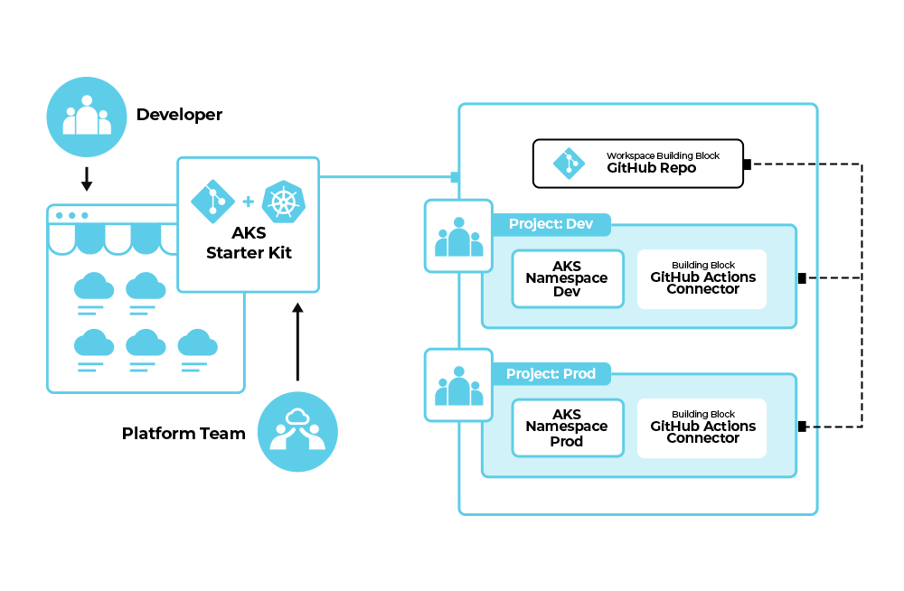

# meshKube

This document provides an overview of meshKube for users interested in how it works under the hood.
meshKube is designed to give platform teams new to meshStack an out-of-the-box internal developer platform implementation meant for Kubernetes.
This internal developer platform enables users to provision a ready-to-use, best-practice environment on Azure Kubernetes Service (AKS) with minimal setup.

## What is meshKube?

At its core, meshKube is an automated starterkit powered by composable Terraform modules.
It provisions a standard set of resources that an application team needs to start
developing and deploying containerized applications on Kubernetes.

When you launch a new meshKube environment, it creates the following components:

* **Two Kubernetes Namespaces**: Isolated `development` and `production` namespaces are created on your organization's AKS platform. This allows for a clear separation of environments.
* **Git Repository**: A private GitHub repository is created to host your application's source code.
* **CI/CD Pipeline**: A pre-configured CI/CD pipeline using GitHub Actions is set up in the repository. This pipeline is configured to build and deploy your application to the `dev` and `prod` namespaces.
* **Secure Container Registry Integration**: The pipeline includes secure integration with your organization's container registry.

## What do you need?

meshKube is designed to be very easy to set up and use.

We provide the Azure Kubernetes Service (AKS) cluster and Azure Container Registry as part of the environment.

The only requirement for you is to integrate a **GitHub organization** of your choice.
This allows meshKube to automatically create repositories and CI/CD pipelines within
your selected GitHub organization.

## How It's Built

meshKube is implemented as a Terraform module that uses the `meshstack` provider to orchestrate the creation of
resources across different platforms like GitHub and Azure.

The key resources managed by the module are:

* `meshstack_tenant_v4`: Provisions the `dev` and `prod` namespaces on the target AKS platform.
* `meshstack_project`: Creates corresponding `dev` and `prod` projects within meshStack to group and manage all associated resources.
* `meshstack_building_block_v2`: This generic resource is used to provision both the GitHub repository and the GitHub Actions connectors for the CI/CD pipeline.
* `meshstack_project_user_binding`: Automatically grants the user who created the environment administrative access to the newly created projects.

## Configuration & Outputs

To create a new instance of the application starter kit, the module requires a few key inputs:

* A `name` for the new application, which is used for the projects, namespaces, and repository.
* The `creator`'s identity to grant initial admin access. This is automatically set to the user who initiates the creation by meshStack.
* Identifiers for the target AKS platform and GitHub organization.

Once the provisioning is complete, the module provides several outputs to help you get started immediately:

* The URL of the newly created GitHub repository.
* A summary of the created resources and guidance on the next steps.

If you are interested in the code implementation, you can find the Starterkit module on [meshStack Hub](https://hub.meshcloud.io/platforms/aks/definitions/aks-starterkit).
