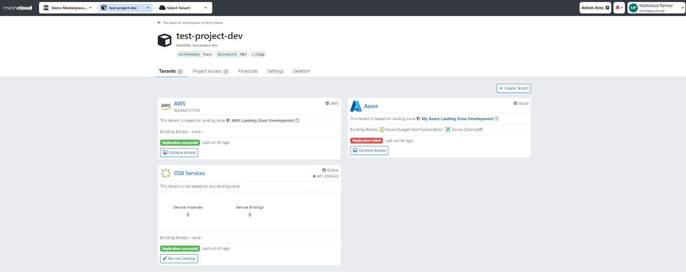
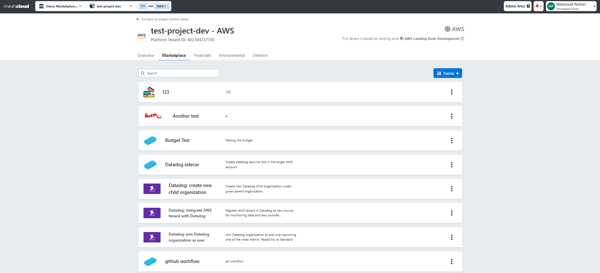

## Platform Services

Platform Service within meshStack refers to any platform (e.g., Cloud or any other platform like GitHub) or service (e.g., Azure VNet) that can be  developed, executed, and managed by platform engineers with ease. Platform engineers offer services and platforms that enable applications to build, deploy, and scale without concerns about the underlying infrastructure. The type of a Platform Service in meshStack depends on whether it can be developed as a [Building Blocks](administration.building-blocks.md), [Platform](administration.platforms.md), or [OSB Service](marketplace.service-instances.md).

## Marketplace

meshStack provides you with an online shopping experience in the Enterprise. Via the Service Catalog providers inside the organization can offer consumers their services in a standardized and automated way.  Application teams (consumers) can brows a united portfolio that is located in the Marketplace tab of the Workspace.

The Service Catalog presents application teams with details, prices, and documentation for all available Platform Services, allowing them to effortlessly add them to their Projects. Through the Service Catalog, Workspace Owners and Managers can provision Platform Services for both new and existing Projects and Tenants. Here you can find a [guide](meshstack.how-to.add-platformservice.md) for adding different Platform Services from the Service Catalog.

You can access the Service Catalog not only through the Workspace panel but also directly from your meshTenant. Smart filtering is applied in the meshTenant control view, ensuring that only relevant Platform Services are displayed based on the specific meshTenant. For example, Azure meshTenant services, such as Azure Vnet, will be shown. 

To navigate to the Tenant Marketplace, choose a Tenant from the Project overview panel, click on the Tenant, and then select the Marketplace tab.

>In the next phase of upgrades for the Service Catalog, we'll be introducing tags for Platform Services that will enable you to effortlessly filter and find the specific Platform Service you're looking for.
