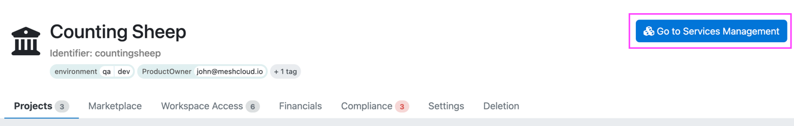
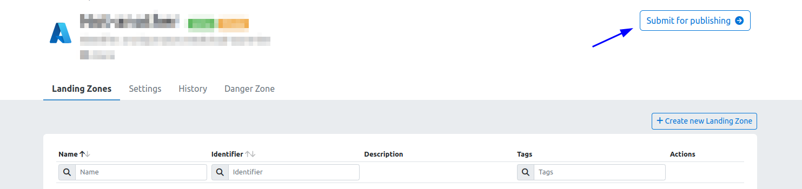
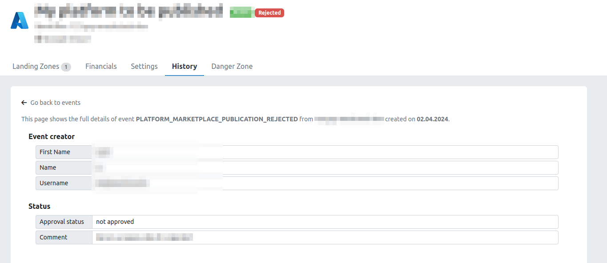

> Please note that the following functionality is only available to meshStacks that have the **Service Economy** module activated.
> Reach out to your Customer Success representative if you are interested in using this module.

## Introduction

The Service Management Area can be used by workspaces to offer their [platform services](./marketplace.index.md#platform-services) to the rest of the organization.
For example, the Azure team in your organization could set up a workspace to offer their Azure [Platform](./administration.platforms.md) from there to
the rest of the organization. Or the Networking team might want to offer their best-practice Cloud Network [Building Blocks](./administration.building-blocks.md)
to Application Teams.

Anyone in the organization can offer their valuable services to the rest of the organization through the
Service Management Area as long as it is approved by someone in the [Admin Area](./administration.index.md).

The Service Management Area can at any time be opened up from the Workspace Control Plane by clicking the
"Go to Services Management" button as depicted below.

If you would like to go back again to the regular Workspace View, click on "Go to Workspace Management".

## Getting Access

If you do not see the button to open the Service Management Area your workspace most likely does not 
have it activated yet. As can be seen in the screenshot, open your Workspace Settings and toggle "Enable Service Management Area".
Hit "Save" and you should see the "Go to Services Management" button now.

[!Getting Access](assets/service-management-area/getting-access.png)

## Types of Platform Services

The following three types of platform services can be created and offered in the Service Management Area:

1. [Platforms](./administration.platforms.md). Platforms are a high-level concept in meshStack where users can book
   their own isolated tenant (environment) in a given cloud platform. meshStack has a handful of first-party supported
   platforms, but it also offers the ability to [create your own platforms](./meshstack.how-to.create-your-own-platform.md)
   with the use of Terraform.
2. [Building Blocks](./administration.building-blocks.md). Building Blocks are standardized extensions to cloud tenants that users
   can book and roll out. These can be either rolled out using Terraform, or manually. Example use cases are an on-premise
   connectivity to a cloud tenant.
3. [Service Brokers](./administration.service-brokers.md). Service Brokers are self-hosted components that can execute
   automation and provision workloads using the Open Service Broker API that can be booked by users in the meshStack.
   As the automation is fully managed by someone it can provision and do anything that you would like.

## Development & Testing

By default, anything that you create in your Service Management Area will be available to you inside the workspace and 
not directly published in the Service Catalog.
For development & testing purposes you can consume any of your created platform services mentioned above in
**your own workspace**. They will be marked as "Private". This will give you an idea of the user experience and allows you
to debug any potential issues with the Platform Configuration or Terraform code.

## Publishing

After you are done with the development & testing phase, you can go the Control Plane of your provided service in the Service Management Area and submit it for publication by clicking the "Submit for publishing" button.

Once approved by your cloud foundation team, it will become accessible to all workspaces within the organization.
If your publication request gets rejected, you can easily identify the reason by hovering over the rejected label or checking the rejection comment in the history.

Once you've addressed the identified issues, you can resubmit it for publishing.

> If you are an administrator and want to know how
> to manage and approve workspaces service you can learn more [here](./administration.workspace-services.md).
