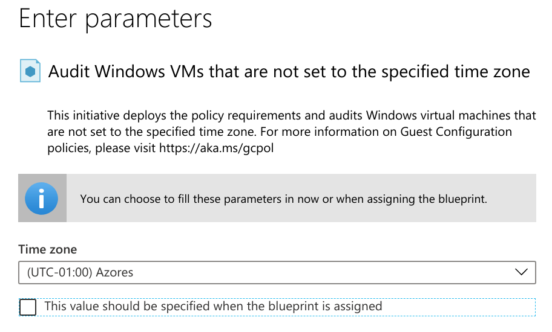
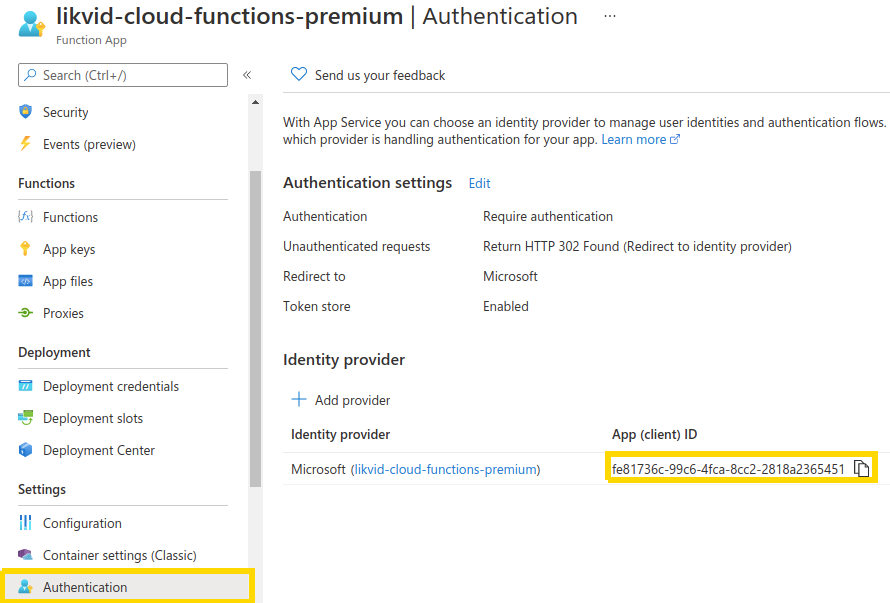
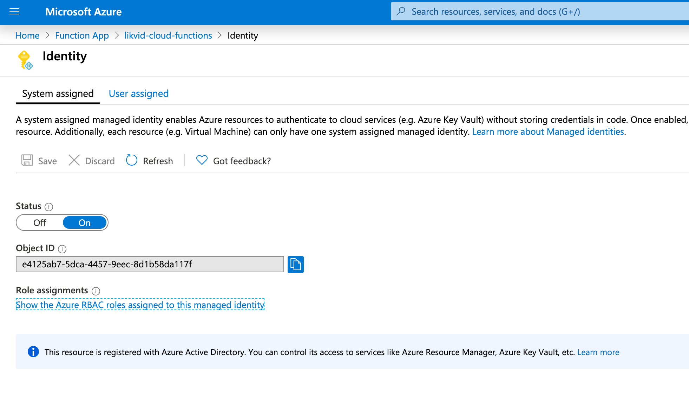
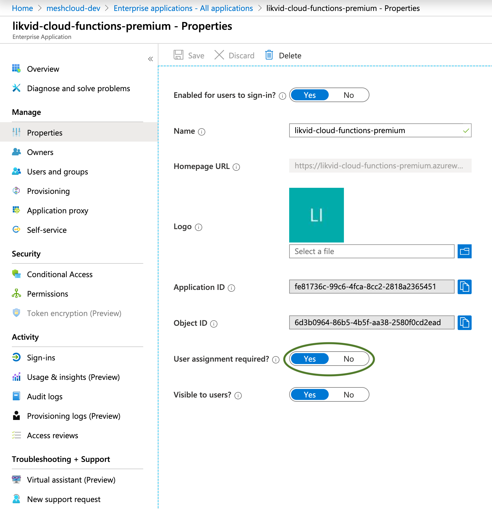
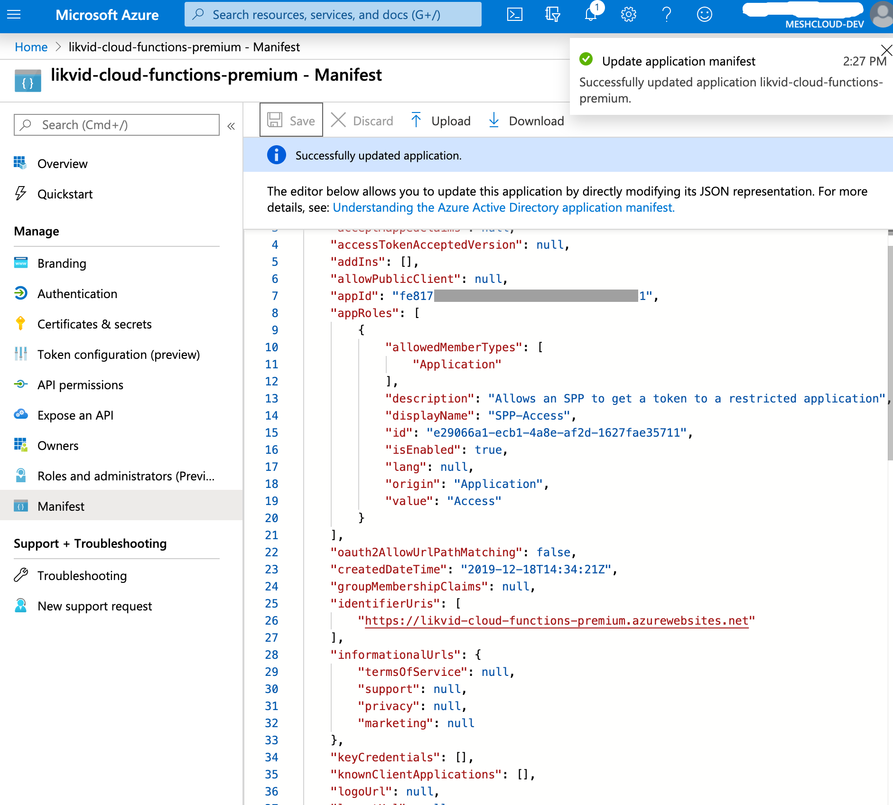
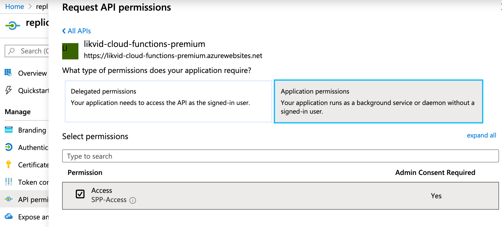

In Azure, a [Landing Zone](./meshcloud.landing-zones.md) is defined via a Management Group the Subscription for the project will be assigned to. Policies can be applied to these Management Groups. Optionally a Blueprint can also be defined. Via an Azure Blueprint default resources can be deployed to the Subscription and additional specific policies can be defined. A Blueprint can be configured to decline users to change or delete the resources and policies created by the Blueprint.

Platform engineers can define and configure [Landing Zone](./meshcloud.landing-zones.md) in the `Administration` section. If a user configures a meshProject to use an Azure meshPlatform, the user must pick from one of the available Landing Zones available. This Landing Zone defines platform specific configuration that is automatically applied and reconciled by the meshStack replicator.

The next section describe the individual building blocks that platform engineers can configure in an Azure Landing Zone.

## Azure Subscription

The following description targets the regular Azure Subscription based integration.

### Management Group Assignment

All newly created [meshProjects](./meshcloud.project.md) get their corresponding Subscription assigned to this [Management Group](https://learn.microsoft.com/en-us/azure/governance/management-groups/overview). **Please use the Management Group ID** (not its name), when setting it up in the Landing Zone. When the name is used, the group can not be found during the replication process.

> Management Groups used in different Azure [Landing Zones](./meshcloud.landing-zones.md) should not overlap or be nested into one another. A flatter Management Group hierarchy is significantly less complex to manage and thereby greatly reduces the risk of security issues through misconfiguration. However, you can nest Landing Zone Management Groups in other Management Groups controlled outside of meshStack to share common policies between landing zones.

### Blueprint Assignment

Platform engineers can optionally define one or more [Blueprints](https://docs.microsoft.com/en-us/azure/governance/blueprints/overview)
 which meshStack will assign to managed Subscriptions.

#### Blueprint Name

The name of the Blueprint which gets assigned to the tenant. If left empty, meshProject replication will not create any Blueprint assignments. Changing the name of the Blueprint will also change the resulting Blueprint Assignment name in Azure. If you change the name of a Blueprint e.g. to point to another Blueprint, this will result in two assignments. The old assignment is not automatically removed from the Subscription and must be removed manually.

#### Blueprint Management Group

Blueprints must reside inside a Management Group. It is assumed it is in the same group as the group where to put the Subscriptions by default. If the Blueprint is located in another group it can be configuered here.

Platform engineers must ensure to create these Management Groups in the meshcloud AAD Tenant before configuring them for use in a meshLanding Zone.

#### Available Blueprint Parameters

The following parameter can be used in the Blueprint:

| Parameter          | Description                                                                               |
|--------------------|:------------------------------------------------------------------------------------------|
| workspaceIdentifier | Workspace Identifier                                                                       |
| projectIdentifier  | The project identifier                                                                    |
| SubscriptionId     | The ID of the Azure Subscription associated with this meshProject                         |
| tagCostCenter      | Example for a  [metadata tags](./meshstack.metadata-tags.md) named `costCenter`           |

As the example `tagCostCenter` in the above table indicates, any payment settings, project tags or workspace tags can also be used in the Blueprints.
The following modifications are applied to metadata tag keys by meshstack before making them available as parameters:

- Parameters are prefixed with `tag`
- First letter of metadata tag key is capitalized

In the example, the value of the tag `costCenter` will be made available via the key `tagCostCenter`.
See [metadata tags](./meshstack.metadata-tags.md) for more information.

> If you are planning on converting any of the Blueprint parameters into Azure tags, please be aware of the limits and requirements
> that Azure has [described in their docs](https://docs.microsoft.com/en-us/azure/azure-resource-manager/management/tag-resources#limitations).
>
> Key takeaways here:
>
> - A resource can have a maximum of 50 tags.
> - The characters < > % & \ ? / are not allowed in tag keys.

**Please Note:** there are some specialities to keep in mind when dealing with Azure parameters. Resource group names and locations can not be parameterised via meshStack.

When parameters are marked as static in the Azure Panel, they can not be replaced or overwritten during replication. Usually default parameter should not be marked as static in the Azure Blueprint panel because doing so prevents their replacement by meshStack specific variables.



#### Max. Auto Upgrade Blueprint Version

Blueprints are versioned in Azure and can be managed via the Azure Portal. To avoid the accidental assignment of new (and possibly faulty) Blueprints, platform engineers can configure the `Max. Auto Upgrade Blueprint Version` field. If you enter a version identifier here which corresponds to a existing Blueprint version in the Azure portal:

- Existing projects with this Landing Zone will get their Blueprint updated to this version on the next [replication](./meshcloud.tenant.md)
- Newly created projects will get the latest Blueprint version assigned (possibly higher then the version configured here)

#### Managed Identity

##### Using System Assigned Managed Identity (SAMI)

In order to assign [Blueprints](https://docs.microsoft.com/en-us/azure/governance/blueprints/overview), the meshStack replicator needs to be configured with the service principal id of the `Azure Blueprints` app provided by Microsoft.
Please refer to the [Azure Configuration Reference](./meshstack.azure.index.md#configuration-reference) for details.

##### Use User Assigned Managed Identity (UAMI)

This flag allows you to use a User Assigned Managed Identity (UAMI) instead of the standard System Assigned Managed Identity (SAMI) during the assignment of your Blueprint. For more details on their differences, refer to the [Azure Documentation](https://docs.microsoft.com/en-us/azure/active-directory/managed-identities-azure-resources/overview#how-does-the-managed-identities-for-azure-resources-work)).

Currently we only recommend to use this flag if you want to create resources that require permissions outside of the meshcloud managed Subscription. A good example is if you want to connect a meshcloud managed Subscription to a central log workspace. In order to do this, you require permissions in both the meshcloud managed Subscription and the Subscription your central Log Workspace App resides in.

>**Please note**: meshStack can not handle permissions outside of the Subscriptions it manages. You need to make sure the Managed Identity has the correct permissions to access/create the resources your Blueprint requires. Additionally you must also give the replicator service principal the following permission on the target resource the Managed Identity lives in (e.g. the Subscription of the Managed Identitiy).
>
> ```Microsoft.ManagedIdentity/userAssignedIdentities/*/assign/action```
>

The following parameters are required:
| Parameter              | Description                                                                                                                                                                                                                                                            |
|------------------------|:-----------------------------------------------------------------------------------------------------------------------------------------------------------------------------------------------------------------------------------------------------------------------|
| UAMI Azure Resource ID | Azure Resource ID of the identity; has the following form: `/subscriptions/[subscriptionId]/resourceGroups/[yourRG]/providers/Microsoft.ManagedIdentity/userAssignedIdentities/[userIdentity]`. When opening the UAMI in Azure Portal you can obtain this from the URL |
| UAMI Object ID         | Object ID of the identity; When opening the UAMI in Azure Portal you can obtain this from the `Object ID` field                                                                                                                                                        |

#### Locking Mode

Blueprint assignments are performed with a specific [resource locking mode](https://docs.microsoft.com/en-us/azure/governance/blueprints/concepts/resource-locking) which determines if locked resources managed by Blueprints can be deleted and/or modified.

| Locking Mode            | Description                                                                               |
|-------------------------|:------------------------------------------------------------------------------------------|
| None                    | Resources are not protected                                                               |
| AllResourcesReadOnly    | Locked resource groups are read only and other locked resources can't be modified at all. |
| AllResourcesDoNotDelete | Locked resources can be modifiede but not deleted.                                        |

## Azure Resource Group

The following description targets the Azure integration based on Resource Groups.

### Resource Group Location

The newly created Resource Group for the meshProjects will get assigned to this location. Please take care that the entered location must be all lower case and without spaces (e.g. eastus2 for East US 2).
In order to list the available locations you can use `az account list-locations --query "[*].name" --out tsv | sort`.

## Shared Configuration

These options are shared between both Azure Subscription & Azure Resource Group configuration.

### meshRole to Platform Role Mapping

The meshProject roles must be mapped to Azure specific roles. You can control this by setting up the meshProject role to Azure group suffix mapping. However depending on your configuration of the [AAD group name generation](./meshstack.azure.index.md#aad-group-name), this setting is used or not.

The Azure Role Definition is the RBAC ID of the Azure role you want to use. You can either create your own roles or use the [predefined global IDs](https://docs.microsoft.com/en-us/azure/role-based-access-control/built-in-roles) from Azure.

If you like you can also add an ABAC condition to role assignments done by meshStack as part of the role mapping configuration.
Azure allows for all kinds of advanced conditions on these role assignments.
For more information on this topic please refer to the [Azure documentation](https://learn.microsoft.com/en-us/azure/role-based-access-control/conditions-overview).

### Azure Function Invocation

Platform engineers can configure an Azure Function invocation to trigger a small piece of code in the cloud whenever meshStack's replicator reconciliates the Landing Zone definition against the Subscription. Currently this function is invoked via a `POST` request and receives parameters from meshStack via HTTP header values.

Please review the [HTTP header interface documentation](./meshstack.metadata-tags.md#http-header-interface) for metadata meshStack makes available to Azure Functions.

In addition to the headers referenced above, meshStack provides the following Azure-specific HTTP headers:


| HTTP Header Name           | Description                                                       |
|----------------------------|:------------------------------------------------------------------|
| x-mesh-subscription-id     | The ID of the Azure Subscription associated with this meshProject |

#### Azure Function URL

Enter the URL of your Azure Function here. This is typically a value like `https://my-function-app.azurewebsites.net/myfunc`.

#### Azure Function Scope

To securely call an Azure Function, meshStack uses Microsoft's [App Authentication](https://docs.microsoft.com/en-us/azure/app-service/app-service-authentication-how-to) feature.

This means that behind the scenes meshStack is fetching a JWT token uniquely scoped to your function and passes it during the Azure Function call.

In order for meshStack to fetch the right token, it needs to know the unique ID of the Azure Enterprise Application your function belongs to. You can obtain this ID by navigating to your Azure Function App, click on your Cloud Function and then select `Authentication` (you need to upgrade from the 'Classic Authentication Experience' to the latest version in order to get the `Client ID`). In the new view you can directly see the `App (client) ID` which is the ID required for the Landing Zone "Azure Function Scope" parameter.




#### Required Platform Configuration

In order to make an Azure Function only accessible via the replicator's Service Principal, follow these steps:

> If these steps are automated via Terraform you end up with a non working Azure Function. Until Terraform solves this problem, please perform the setup steps manually in the Azure panel.

1. Create a SAMI or UAMI for your function (this is only required if you need the function to have permissions for Azure based resources like starting VMs, connecting Log Workspaces etc).

    

2. Lock down your function to only allow assigned users in the `Properties` section of the Enterprise Application created for the SAMI or UAMI in step 1.

    

3. Modify the Manifest of the Enterprise Application from step 2. Create a custom [Application Role](https://docs.microsoft.com/en-us/azure/architecture/multitenant-identity/app-roles). It's only possible to assign real users and unfortunatly no Service Principals directly to the function so this additional steps are required. Edit the Application Roles manifest like in this JSON:

    ```json
    {
      "allowedMemberTypes": [
        "Application"
      ],
      "description": "Allows an SPP to get a token to a restricted application",
      "displayName": "SPP-Access",
      "id": "<RANDOM_UUID>",
      "isEnabled": true,
      "lang": null,
      "origin": "Application",
      "value": "Access"
    }
    ```

    

4. Now modify the API permissions of the **App Registration** belonging to the **replicator Service Principal**. This will allow meshStack's replicator to invoke the Azure Function. Open the `API permissions` screen and add the newly created `SPP-Access` Application Role. Don't forget to grant admin consent again afterwards.

    

5. _Optional_ In case you see an authorization error when the replicator wants to invoke the function try to set `"accessTokenAcceptedVersion" : "2"` in the app registration manifests of the replicator service principal and the app registration manifest of the Azure Function.

After these steps, the meshStack replicator should be able to fetch a token scoped to this Application Role so it can invoke the Azure Function using App Authentication.
