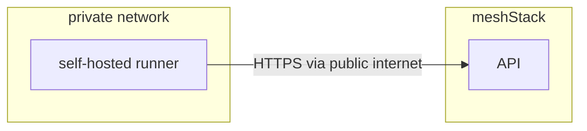

> Self-hosted runners are not GA yet. This documentation is an early draft until self-hosted runners are GA.

You can host your own runners and customize the environment used to execute building blocks.

Self-hosted runners offer more control of hardware, operating system, and software tools than meshcloud-hosted runners provide. Self-hosted runners can be physical, virtual, in a container, on-premises, or in a cloud.

Your runner connects to meshStack via meshStack API. 

## Differences between meshcloud-hosted and self-hosted runners

meshcloud-hosted runners offer a quicker, simpler way to execute your building blocks, while self-hosted runners are a highly configurable way to execute building blocks in your own custom environment.

### meshcloud-hosted runners

- Receive automatic updates for the operating system, preinstalled packages and tools, and the self-hosted runner application.
- Are managed and maintained by meshcloud.
- Support the natively available implementation types.

### Self-hosted runners

- Can use cloud services or local machines that you already pay for.
- Are customizable to your hardware, operating system, software, and security requirements.
- Support workload identity federation.
- Support custom implementation types.

## Requirements for self-hosted runner machines

You can use any machine as a self-hosted runner as long at it meets these requirements:

- The machine can reach your meshStack instance API.
- The machine can reach APIs involved in executing building blocks.
- The machine has enough hardware resources for the type of building blocks you plan to run.

## Communication between self-hosted runners and meshcloud

The self-hosted runner connects to meshcloud to receive building block executions.

Since the self-hosted runner opens a connection to your meshStack, you do not need to allow meshStack to make inbound connections to your self-hosted runner.

Additionally, self-hosted runner may need to download additional binaries. For example, the terraform runner reference implementation will download the terraform binary for the version defined in the building block definition.

## Self-hosted runner security

To eliminate the need for long lived credentials, you can set up workload identity federation for communication with cloud provider APIs for your self-hosted runners.
